### Como subir um novo post para o blog:

#### Pré-requisitos:

- Ter o Git e o Hugo instalados na máquina.

#### 1. Clonar o repositório na máquina local

|Não tem a pasta na máquina local|Tem a pasta na máquina|
|--------------------------------|---------------------------------------------------|
|`git clone <link repositorio>`|Antes de fazer alterações, sincronize o repositório local com o remoto usando:   `git pull origin main`.|

#### 2. Abra a pasta clonada no VS Code.
#### 3. Montar a worktree da pasta `public` para o branch `gh-pages`:

`git worktree add -B gh-pages public origin/gh-pages`

> ⚠️ Se der erro, pode apagar a pasta public e recriar o worktree com:

`rm -rf public`

`git worktree prune`

`git worktree add -B gh-pages public origin/gh-pages`

> 💡 Isso não é um problema, pois a pasta public será sobrescrita sempre que o site for buildado (atualizado) novamente.

#### 4. Criar posts:

- CVEs: na pasta content/post
- Artigos: na pasta content/articles

- Navegue até a pasta respectiva
- Crie uma nova pasta com o título do post, exemplo: CVE-2025-12345

> 💡 Dica: para facilitar, copie e cole a pasta de um post anterior com a mesma severidade (se for um artigo, copie a pasta de um artigo) e exclua as imagens. Nao esqueça de alterar os metadados do topo: titulo, image, description etc, de acordo com seu post.

- Edite o conteúdo do `index.md`:

Altere os dados que forem necessários, exemplo:

- `title` (título do post, exemplo: CVE-2025-12345)
- `date` (CVE: dia da publicação da CVE / Artigo: dia da alteração do arquivo)
- `image` (capa do post)
- Conteúdo principal do post

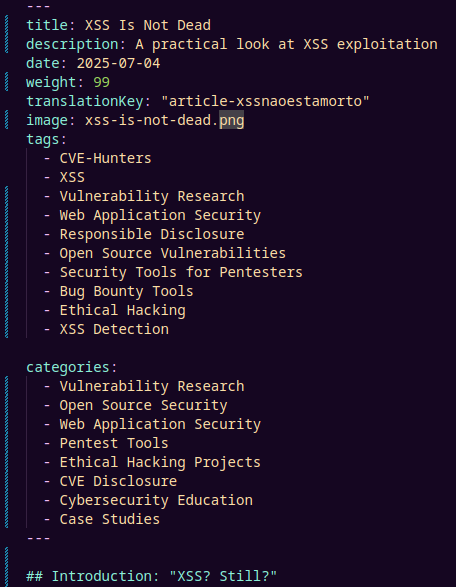

##### 🖼️ Capa para o post:

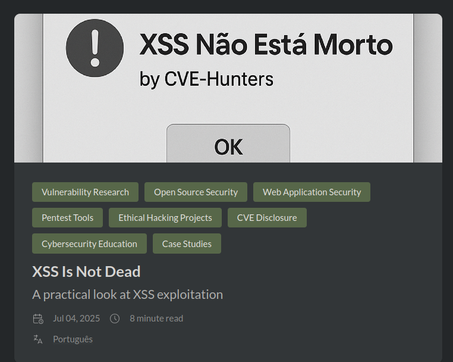

- As imagens de capa devem ter o tamanho: 1200px (largura) x 600px (altura), necessitando ajustes conforme necessário, repare que o retangulo cobre exatamente a área que fica visível como capa:

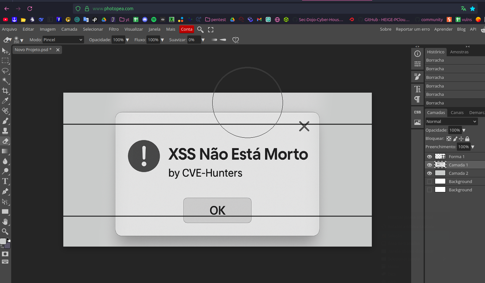

- Ferramenta online para ajustes: https://www.photopea.com/

Você pode usar o modelo base da capa para o post (`template-capa-post.psd`), pode abrir no photoshop ou no photopea

****Nao altere o arquivo `template-capa-post.psd`, deixe salvo e use em outra pasta para nao alterar o modelo do repositorio.****

- Se a imagem tiver texto, precisa ser ajustada conforme os idiomas, use o modelo base (`template-capa-post.psd`)

- Voce pode buscar por fontes correspondentes em ferramentas online como: https://www.myfonts.com/pages/whatthefont
    - a fonte correspondente a ser usada precisa:
        - photoshop: ser instalada no sistema
        - photopea (ferramenta online): carregada do computador (apenas baixe)

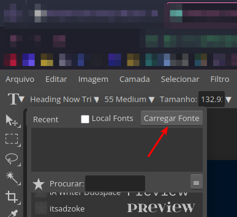

##### 🧱 Fixar um post:

- Use o parâmetro `weight` para fixar o post em uma posição específica.
    - Verifique o valor do parâmetro `weight` nos artigos que **NÃO** sejam sobre CVEs:
        - `weight` menor que 99 aparece acima do primeiro post fixado.
        - `weight` maior que 100 aparece abaixo do último post fixado.

- Caso queira mudar a ordem dos posts fixados, sinta-se livre, entre em suas pastas respectivas e altere o parâmetro `weight`.
    - Atualmente a ordem é por data de postagem.

> Se não quiser um post fixado, apenas apague a linha do parâmetro `weight`

##### 🌐 Caso queira adicionar o conteúdo também em português:

- Altere o nome de `index.md` para `index.en.md`
- Adicione o parametro `translationKey` onde alterou o titulo, data etc
- O parametro `translationKey` deve ser exatamente o mesmo no conteudo em ingles e em portugues

> ***Exemplo na pasta: "XSS Nao Esta Morto"***

- Espaços (" ") não são aceitos nos parametros `title`, `date`, `translationKey` etc, substitua por "-", quando houver necessidade.
- O arquivo do conteudo em portugues deve estar na **mesma** pasta do post em ingles com o nome `index.pt.md`
- O texto alternativo [alt text] das imagens coladas são interpretadas como legendas e só devem ser preenchidos quando for necessário explicação, caso contrário é só apagar. 

Evitar:

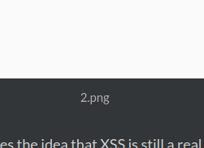

Top das Galaxias:

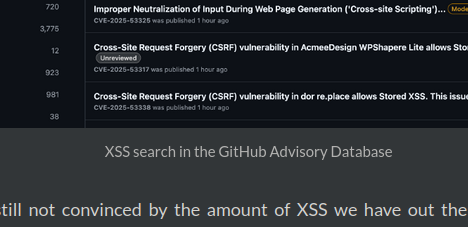

- Arquivos de imagens não devem conter espaços, se nao quebra. 
    - Use por exemplo: image-1.png, não image 1.png.

##### 🧠 Boas práticas ao escrever os posts

A maior parte da formatação dos artigos deve ser feita em HTML, para evitar problemas de parsing do Hugo (erro comum).

|Propósito|HTML recomendado|Tradução do Markdown|
|--------------------------------|---------------------------------------------------|---------------------------------------------------|
|Parágrafo justificado|`
Texto
`|nao é possivel justificar texto com markdown|
|Negrito|`<b>texto</b> ou <strong>texto</strong>`|`**texto**` / **texto**|
|Itálico|`<i>texto</i> ou <em>texto</em>`|`*texto*` / *texto*|
|Código em linha|`<code>código</code>`|`código`|

- Caso seja necessario adicionar um link no meio do parágrafo em HTML, use a tag ``:
    - `<a href="link-aqui" target="_blank">Palavra que quiser que refira ao site aqui</a>`
    > target="_blank" é um parâmetro para que a aba do link abra automaticamente em uma nova aba, ao invés de apenas redirecionar o link da página atual

- Após o bloco de metadados (no topo do arquivo, onde fica o titulo, data etc), nunca use --- (hifens) novamente. Use apenas markdown ou HTML, pois o Hugo pode interpretar isso como um novo bloco de metadados e quebrar o post:

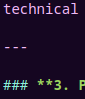

- Nao precisa colocar numero nos indices, eles sao acicionados automaticamente:

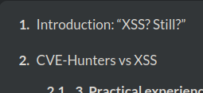

Evitar: 

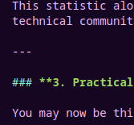

Top das galaxias:

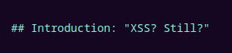

### Vale lembrar que todas as alterações podem ser vistas em tempo real utilizando o servidor local do Hugo com comando: `hugo server -D`.

> ***sempre verifique se a versão do Hugo está atualizada, caso contrário, pode dar erros.***

### Para parar de rodar o servidor local e fazer outras operações no terminal, use `ctrl+c`.

##### Terminei de escrever o post e agora?

- Sempre revise: titulo, data, descrição etc, tanto no inglês quanto no português. Muitos erros comuns de quebra do site vêm de copiar/colar o topo do arquivo e esquecer de ajustar os valores conforme o idioma.

#### 5. Adicionar as mudanças:

- Na raiz do projeto (branch `main`), rode:

`git add .`

#### 6. Fazer o commit das alterações:

`git commit -m "Add: post <nome-do-post>"`

#### 7. Enviar para o repositório remoto:

`git push origin main`

#### 8. Buildar o site com Hugo:

`hugo --minify`

Isso irá gerar os arquivos estáticos atualizados na pasta `public`.

> ***⚠️ Não commit a pasta `public` na branch `main`***

> ***A pasta public está ligada à branch `gh-pages` via worktree, então não comite ela na `main`.***

#### 9. Publicar no GitHub Pages:

| Script Automatizado                         | Manual                                         |
|--------------------------------|---------------------------------------------------|
|Rode o script de deploy: `./deploy.sh`|Navegue até a pasta `public` vinculada à branch `gh-pages`: `cd public`                    |
| 💡 Esse script muda para a pasta `public` (vinculada à branch `gh-pages`), faz o `git add`, `commit`, `push` e retorna para a raiz do projeto vinculada à branch `main`. Se tiver o erro comum de rejected ele força o push.         | Adicione as mudanças: `git add .`    |
|         | Faça o commit: `git commit -m "blog build <# ultima versao + 1>"` ou `git commit -m "blog build <mes, dia>"`  |
|         | Envie as mudanças para o repositório remoto: `git push origin gh-pages`  |
|         | Retorne para a raiz do projeto vinculada à branch `main`: `cd ..`|
|         | **Se der erro comum de rejected:** Navegue até a pasta `public` vinculada à branch `gh-pages`: `cd public`  |
|         | Force o push: `git push -f origin gh-pages`|
|         | Retorne para a raiz do projeto vinculada à branch `main`: `cd ..`|

##### Caso ocorra erro no push:

Se houver erro no push (ex: conflito ou rejeição):

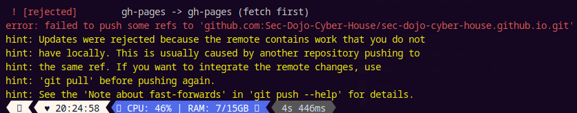

> é muito comum, mas não tem problema forçar porque o conteudo da branch `gh-pages` sempre é substituido quando o site atualiza

`cd public`

`git push -f origin gh-pages  # forçar o push`

#### 10. Confirmar se o post foi publicado

- Vá até o repositório no GitHub.
- Verifique se:
    - A branch `main` está com seu commit.
    - A branch `gh-pages` recebeu o push corretamente (ícone ✅).
- Acesse a URL do blog para ver o novo post no ar.

> ***Se algum erro inesperado acontecer, você pode descrever o problema e usar uma IA para te ajudar (soluciona na maior parte das vezes) ou entrar em contato com a Karina ou Natan.***