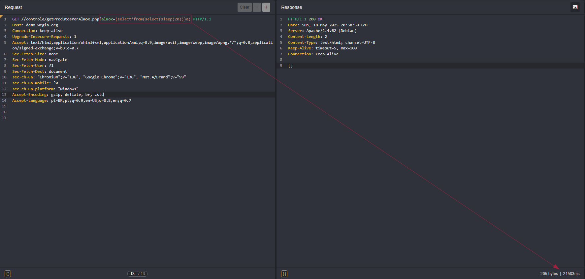

## CVE-2025-53091: Unauthenticated Time-Based SQL Injection Vulnerability in `almox` Parameter

> *CVE Publication: https://www.cve.org/CVERecord?id=CVE-2025-53091*

## Summary

A Time-Based Blind SQL Injection vulnerability was discovered in the <code>almox</code> parameter of the <code>/controle/getProdutosPorAlmox.php</code> endpoint. This issue allows any unauthenticated attacker to inject arbitrary SQL queries, potentially leading to unauthorized data access or further exploitation depending on database configuration.

## Details

The application fails to properly sanitize user-supplied input in the almox parameter. As a result, specially crafted SQL payloads are interpreted directly by the backend database. This specific vulnerability is blind in nature and was confirmed using time-based inference (SLEEP() function).

The vulnerable request does not require any form of authentication (no cookies, tokens, or headers required), making it especially critical.

## PoC

Below are two working proof-of-concept HTTP requests that demonstrate the vulnerability. The difference in response time clearly confirms the execution of the SLEEP() function in the backend:

## Impact

  <ul>
    <li>Unauthorized access to sensitive data (e.g., users, passwords, logs).</li>
    <li>Database enumeration (schemas, tables, users, versions).</li>
    <li>Escalation to RCE depending on DB configuration (e.g., xp_cmdshell, UDFs).</li>
    <li>Full compromise of the application if chained with other vulnerabilities.</li>
    <li>This issue affects all users and environments, as it does not require authentication and is reachable via a public endpoint.</li>
  </ul>

## Reference

[https://github.com/LabRedesCefetRJ/WeGIA/security/advisories/GHSA-pmf9-2rc3-vvxx#advisory-comment-130861](https://github.com/LabRedesCefetRJ/WeGIA/security/advisories/GHSA-pmf9-2rc3-vvxx#advisory-comment-130861)

## Finder

 [Natan Maia Morette](https://www.linkedin.com/in/nmmorette)

## Contributor

 [Marcelo Queiroz](http://www.linkedin.com/in/marceloqueirozjr)

> *By: [CVE-Hunters](https://github.com/Sec-Dojo-Cyber-House/cve-hunters)*