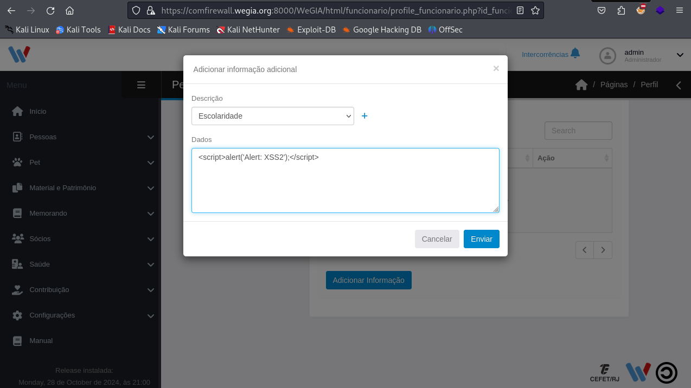
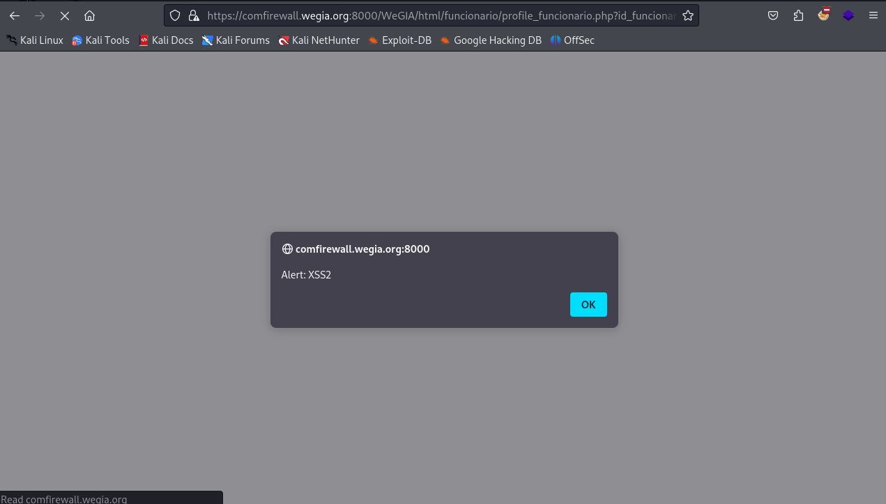

## CVE-2024-57033: Cross-Site Scripting (XSS) Stored in `documentos_funcionario.php` parameter `dados_addInfo`

> *CVE Publication: https://www.cve.org/CVERecord?id=CVE-2024-57033*

## Vendor

<p style="text-align: justify;"> WeGIA (Web Gerenciador Institucional) is an integrated management system licensed under the GNU GPL v3.0, designed to enhance administration, control, and transparency for institutions. </p>

[https://www.wegia.org](https://www.wegia.org/)

[https://sol.sbc.org.br/index.php/latinoware/article/view/31544](https://sol.sbc.org.br/index.php/latinoware/article/view/31544)

## Affected Product Code Base

WeGIA < v3.2.0

## Vulnerability Description

<p style="text-align: justify;">A stored Cross-Site Scripting (XSS) vulnerability was identified in the WeGIA application. This vulnerability allows unauthorized scripts to be executed within the user's browser context. Stored XSS is particularly critical, as the malicious code is permanently stored on the server and executed whenever a compromised page is loaded, affecting all users accessing this page.</p>

## POC

<p style="text-align: justify;">To reproduce the issue, insert the following payloads into the vulnerable field of the URL and save the changes:</p>

```javascript
<script>alert('Alert: XSS2');</script>
```

<p style="text-align: justify;">After saving the input, the injected script will be stored on the server and automatically executed for any user accessing the <strong>html/geral/documentos_funcionario.php</strong>, confirming the stored XSS.</p>

File: `documentos_funcionario.php`

Payload: 

```javascript
<script>alert('Alert: XSS2');</script>
```

Trigger in: `funcionario/profile_funcionario.php?id_funcionario=1`

Endpoint: `dados_addInfo`





## References

[https://github.com/nilsonLazarin/WeGIA/issues/816](https://github.com/LabRedesCefetRJ/WeGIA/issues/816)

[https://www.wegia.org](https://www.wegia.org/)

[https://github.com/LabRedesCefetRJ/WeGIA/](https://github.com/LabRedesCefetRJ/WeGIA/)

## Discoverer

[](https://www.linkedin.com/in/nmmorette) [Natan Maia Morette](https://www.linkedin.com/in/nmmorette)

> *By: [CVE Hunters](https://github.com/Sec-Dojo-Cyber-House/cve-hunters)*