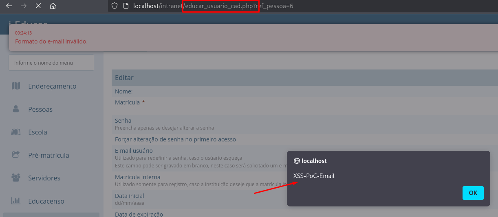

## CVE-2025-10099: Múltiplos Cross-Site Scripting (XSS) Armazenado no endpoint `educar_usuario_cad.php`

> ***CVE Publication: https://www.cve.org/CVERecord?id=CVE-2025-10099***

## Resumo

<p style="text-align: justify;">Uma vulnerabilidade de XSS (Cross-Site Scripting Refletido) foi identificada no endpoint <code>educar_usuario_cad.php</code> do aplicativo i-Educar. Essa vulnerabilidade permite que invasores injetem scripts maliciosos nos parâmetros <code>email</code>, <code>data_inicial</code> e <code>data_expiracao</code>.</p>

## Detalhes

Endpoint Vulnerável: `educar_usuario_cad.php`

Parâmetros: `email`, `data_inicial` e `data_expiracao`

<p style="text-align: justify;">O aplicativo reflete essa entrada diretamente na resposta. Embora o servidor aplique a sanitização antes de armazenar os dados ou retorná-los posteriormente, o payload é executado imediatamente no navegador da vítima após a reflexão, permitindo que um invasor execute JavaScript arbitrário na sessão do usuário.</p>

## PoC

### Payloads:

#### Parâmetro `email`

```html
">
```

#### Parâmetros `data_inicial` e `data_expiracao`

```html
3E%3Cimg%20src%3Dx%20onerror%3Dalert('XSS-PoC3')%3E
```



## Impacto

<p style="text-align: justify;">
    <ul>
        <li>Roubo de cookies de sessão: Invasores podem usar cookies de sessão roubados para sequestrar a sessão de um usuário e executar ações em seu nome.</li>
        <li>Baixar malware: Invasores podem induzir os usuários a baixar e instalar malware em seus computadores.</li>
        <li>Sequestro de navegadores: Invasores podem sequestrar o navegador de um usuário ou aplicar exploits baseados nele.</li>
        <li>Roubo de credenciais: Invasores podem roubar as credenciais de um usuário.</li>
        <li>Obter informações confidenciais: Invasores podem obter informações confidenciais armazenadas na conta de um usuário ou em seu navegador.</li>
        <li>Desfigurar sites: Invasores podem desfigurar um site alterando seu conteúdo.</li>
        <li>Desorientar usuários: Invasores podem alterar as instruções fornecidas aos usuários que visitam o site alvo, desorientando seu comportamento.</li>
        <li>Prejudicar a reputação de uma empresa: Invasores podem prejudicar a imagem de uma empresa ou espalhar desinformação desfigurando um site corporativo.</li>
    </ul>
</p>

## Referência

***[https://github.com/marcelomulder/CVE/blob/main/i-educar/CVE-2025-10099.md](https://github.com/marcelomulder/CVE/blob/main/i-educar/CVE-2025-10099.md)***

## Encontrado por

[](http://www.linkedin.com/in/marceloqueirozjr) [Marcelo Queiroz](http://www.linkedin.com/in/marceloqueirozjr)

> ***By: [CVE-Hunters](https://github.com/CVE-Hunters/cve-hunters)***