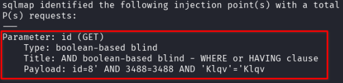
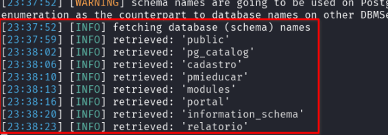

## CVE-2025-10846: SQL Injection (Boolean-Based) Vulnerability in `id` Parameter on `module/ComponenteCurricular/edit` Endpoint

> *CVE Publication: https://www.cve.org/CVERecord?id=CVE-2025-10846*

## Summary

<p style="text-align: justify;">A SQL Injection vulnerability was discovered in the <code>id</code> parameter of the <code>module/ComponenteCurricular/edit</code> endpoint. This issue allows any unauthenticated attacker to inject arbitrary SQL queries, potentially leading to unauthorized data access or further exploitation depending on database configuration.</p>

## Details

<p style="text-align: justify;">The application fails to properly sanitize user-supplied input in the <code>id</code> parameter. As a result, specially crafted SQL payloads are interpreted directly by the backend database.</p>

## PoC

Vulnerable Endpoint: `module/ComponenteCurricular/edit`

Parameter: `id`

### Payload:

```terminal
sqlmap -u "http://localhost:8086/module/ComponenteCurricular/edit?id=8" --cookie="i_educar_session=bnTu3HZ4Jk5a0JxRERNMd03ZAr1TUGvXZTDs9DdE" --batch --dbs --dbms=postgresql
```





## Impact

<p style="text-align: justify;">
  <ul>
    <li>Unauthorized access to sensitive data (e.g., users, passwords, logs).</li>
    <li>Database enumeration (schemas, tables, users, versions).</li>
    <li>Escalation to RCE depending on DB configuration (e.g., xp_cmdshell, UDFs).</li>
    <li>Full compromise of the application if chained with other vulnerabilities.</li>
    <li>This issue affects all users and environments, as it does not require authentication and is reachable via a public endpoint.</li>
  </ul>
</p>

## Reference

***[https://github.com/KarinaGante/KG-Sec/blob/main/CVEs/i-Educar/CVE-2025-10846.md](https://github.com/KarinaGante/KG-Sec/blob/main/CVEs/i-Educar/CVE-2025-10846.md)***

## Finder

[](https://www.linkedin.com/in/karina-gante/) [Karina Gante](https://www.linkedin.com/in/karina-gante/)

> ***By: [CVE-Hunters](https://github.com/CVE-Hunters/cve-hunters)***