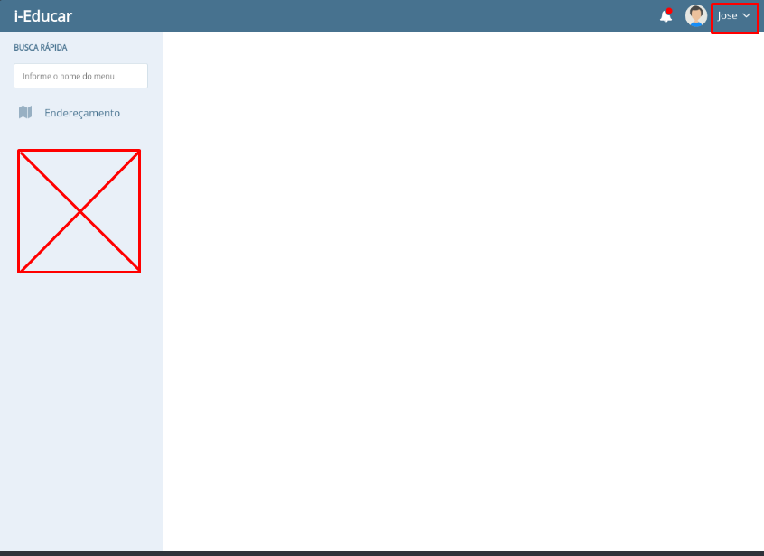
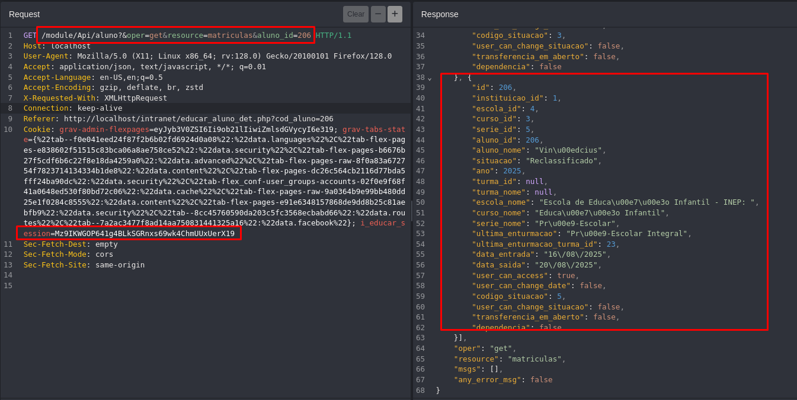

## CVE-2025-11047: Broken Object Level Authorization (BOLA) permite a enumeração de registros de alunos via `/module/Api/aluno`

> ***CVE Publication: https://www.cve.org/CVERecord?id=CVE-2025-11047***

## Resumo

<p style="text-align: justify;">Uma vulnerabilidade de Broken Object Level Authorization (BOLA) foi identificada no endpoint <code>/module/Api/aluno</code> do aplicativo i-Educar. Essa falha permite que um usuário sem as devidas permissões consulte o endpoint e recupere ** informações da turma** manipulando parâmetros de solicitação.</br></br>Essa falha permite que usuários com poucos privilégios (por exemplo, contas padrão de alunos/responsáveis) recuperem informações de matrícula (<b>matrículas</b>) de alunos fora de seu escopo, expondo Informações de Identificação Pessoal (PII) sem as devidas verificações de autorização.</p>

## Detalhes

<p style="text-align: justify;"><b>Endpoint vulnerável:</b> <code>GET /module/Api/aluno</code></br></br>O aplicativo não consegue aplicar a <b>autorização em nível de objeto</b> ao manipular este endpoint. Como resultado, qualquer usuário autenticado pode manipular os valores da solicitação para acessar informações confidenciais (nomes, IDs, status de matrícula) dos alunos.</p>

<p style="text-align: justify;"><b>Comportamento esperado:</b><ul><li>Somente funções autorizadas (por exemplo, administradores, coordenadores, professores vinculados à turma) devem ter acesso a esses dados.</li><li>Usuários não autorizados devem receber a mensagem 403 "Proibido" ou uma resposta vazia.</li></ul></p>

<p style="text-align: justify;"><b>Comportamento observado:</br></b><ul><li>Qualquer usuário autenticado (mesmo contas com privilégios baixos) pode acessar este endpoint e recuperar informações confidenciais sobre turmas acadêmicas.</li></ul></p>

## PoC

<p style="text-align: justify;"><ul><li>Autentique como um usuário sem privilégios (por exemplo, aluno, professor).</li></ul></p>




<p style="text-align: justify;"><ul><li>Envie a seguinte requisição:</li></ul></p>

```terminal
GET /module/Api/aluno?&oper=get&resource=matriculas&aluno_id=206 HTTP/1.1
Host: localhost
User-Agent: Mozilla/5.0 (X11; Linux x86_64; rv:128.0) Gecko/20100101 Firefox/128.0
Accept: application/json, text/javascript, */*; q=0.01
Accept-Language: en-US,en;q=0.5
Accept-Encoding: gzip, deflate, br, zstd
X-Requested-With: XMLHttpRequest
Connection: keep-alive
Referer: http://localhost/intranet/educar_aluno_det.php?cod_aluno=206
Cookie: i_educar_session=[LOW PRIVILEGED COOKIE]
Sec-Fetch-Dest: empty
Sec-Fetch-Mode: cors
Sec-Fetch-Site: same-origin
```



<p style="text-align: justify;"><ul><li>Pudemos observar que informações sobre classes foram retornadas.</li></ul></p>

## Impacto

<p style="text-align: justify;">Esta vulnerabilidade é um problema de Broken Object Level Authorization (BOLA) (OWASP API Top 10 - 2023, A01), permitindo a exposição de dados sensíveis. Qualquer usuário autenticado pode acessar informações pessoais de outros usuários. Isso pode levar a:
<ul>
<li>Acesso não autorizado a PII sensíveis;</li>
<li>Violação das leis de proteção de dados (por exemplo, LGPD, GDPR);</li>
<li>Possível abuso de dados do usuário ou personificação;</li>
<li>Enumeração de usuários.</li>
</ul>
</p>

## Referência

***[https://github.com/marcelomulder/CVE/blob/main/i-educar/CVE-2025-11047.md](https://github.com/marcelomulder/CVE/blob/main/i-educar/CVE-2025-11047.md)***

## Encontrado por

[](http://www.linkedin.com/in/marceloqueirozjr) [Marcelo Queiroz](http://www.linkedin.com/in/marceloqueirozjr)

> ***Por: [CVE-Hunters](https://github.com/CVE-Hunters/cve-hunters)***