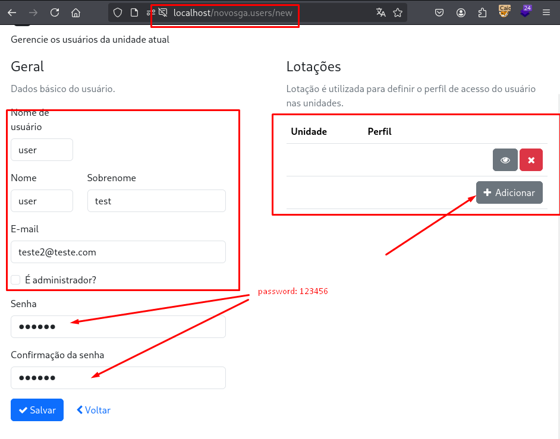
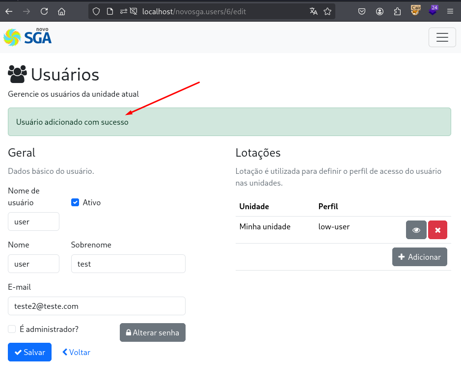

## CVE-2025-11322: Vulnerabilidade de Política de Senhas Fraca na função Criar novos Usuários

> *Publicação CVE: https://www.cve.org/CVERecord?id=CVE-2025-11322*

## Resumo

Uma vulnerabilidade de Política de Senhas Fracas foi identificada na funcionalidade de registro de usuários do aplicativo Novosga. Essa vulnerabilidade permite a criação de contas com senhas extremamente fracas e previsíveis, como <code>123456</code>. Isso expõe a plataforma a ataques de força bruta e preenchimento de credenciais.

## Detalhes

<
O aplicativo não consegue impor uma política de senhas fortes. Como resultado, os usuários podem registrar contas com senhas fracas, comuns e conhecidas, comprometendo a segurança da autenticação da plataforma.

Componente vulnerável: `Registro de usuário / criação de senha`

### PoC

<ul>
<li>Acesse a página de registro do usuário após efetuar login com a conta de Administrador.</li>
<li>Crie uma nova conta de usuário com a senha <code>123456</code>.</li>
<li>O aplicativo aceita a senha fraca sem restrições e cria a conta com sucesso.</li>
</ul>

## Impacto

  <ul>
    <li>Aumento do risco de ataques de força bruta e de preenchimento de credenciais.</li>
    <li>Acesso não autorizado a contas de usuários ou administrativas.</li>
    <li>Aumento de privilégios por meio de contas comprometidas.</li>
    <li>Postura geral de segurança do aplicativo reduzida.</li>
</ul>

## Referência

***[https://github.com/marcelomulder/CVE/blob/main/NovoSga/CVE-2025-11322.md](https://github.com/marcelomulder/CVE/blob/main/NovoSga/CVE-2025-11322.md)***

## Encontrado por

 [Marcelo Queiroz](http://www.linkedin.com/in/marceloqueirozjr)

> ***By: [CVE-Hunters](https://github.com/CVE-Hunters/cve-hunters)***