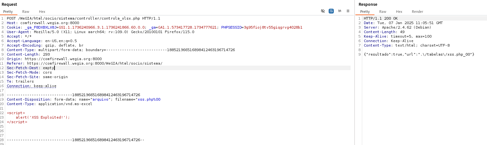
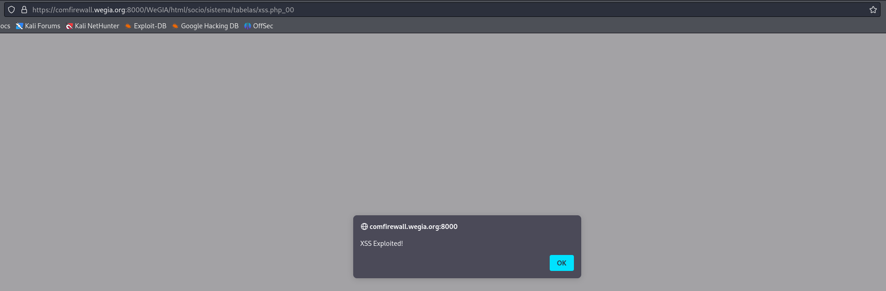

## CVE-2025-22132: Cross-Site Scripting (XSS) in File Upload Field

> *CVE Publication: https://www.cve.org/CVERecord?id=CVE-2025-22132*

## Vendor

<p style="text-align: justify;"> WeGIA (Web Gerenciador Institucional) is an integrated management system licensed under the GNU GPL v3.0, designed to enhance administration, control, and transparency for institutions. </p>

[https://www.wegia.org](https://www.wegia.org/)

[https://sol.sbc.org.br/index.php/latinoware/article/view/31544](https://sol.sbc.org.br/index.php/latinoware/article/view/31544)

## Affected Product Code Base

WeGIA < v3.2.0

## Vulnerability Description

<p style="text-align: justify;">A Cross-Site Scripting (XSS) vulnerability was identified in the file upload functionality of the following endpoint:</p>

`/WeGIA/html/socio/sistema/controller/controla_xlsx.php`

## POC

<p style="text-align: justify;">After capturing the file upload request from /WeGIA/html/socio/sistema/controller/controla_xlsx.php, simply change the uploaded file type to <strong>.php%00</strong>, insert the payload into the content and send the request.</p>

```javascript
<script>
    alert('XSS Exploited!');
</script>
```



Once uploaded, open the file in `/WeGIA/html/socio/sistema/tabelas/xss.php_00`



## Reference

[https://www.cve.org/CVERecord?id=CVE-2025-22132](https://www.cve.org/CVERecord?id=CVE-2025-22132)

## Discoverer

[](https://www.linkedin.com/in/nmmorette) [Natan Maia Morette](https://www.linkedin.com/in/nmmorette)

> *By: [CVE-Hunters](https://github.com/Sec-Dojo-Cyber-House/cve-hunters)*