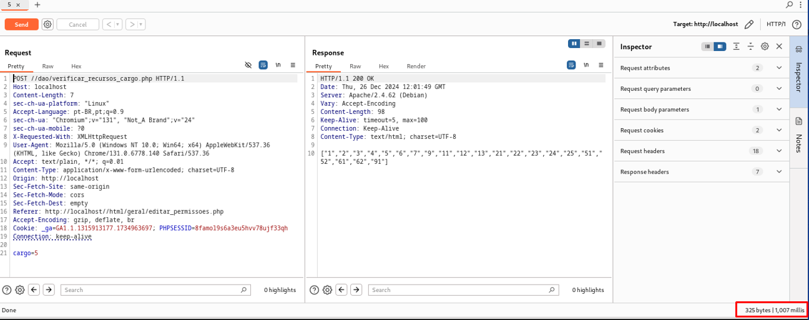
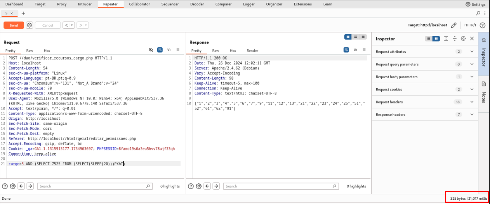

## CVE-2025-22141: SQL Injection (Blind Time-Based) endpoint 'verificar_recursos_cargo.php' parameter 'cargo'

> *CVE Publication: https://www.cve.org/CVERecord?id=CVE-2025-22141*

## Summary

<p style="text-align: justify;">A SQL Injection vulnerability was identified in the <strong>/dao/verificar_recursos_cargo.php</strong> endpoint, specifically in the <strong>cargo</strong>  parameter. This vulnerability allows attackers to execute arbitrary SQL commands, compromising the confidentiality, integrity, and availability of the database.</p>

## Details

Vulnerable Endpoint: `/dao/verificar_recursos_cargo.php`

Parameter: `cargo`

<p style="text-align: justify;">The application fails to properly validate and sanitize user inputs in the <strong>cargo</strong> parameter. This allows attackers to inject malicious SQL payloads that are executed directly by the database. This could result in unauthorized access to sensitive information, data manipulation, and operational disruptions.</p>

## POC

### Payload:

````sql
  AND (SELECT 7525 FROM (SELECT(SLEEP(20)))PXhT)
````

<p style="text-align: justify;">This payload introduces a time delay, demonstrating the ability to execute arbitrary SQL queries.</p>





<p style="text-align: justify;">Observe the time delay in the server response, indicating the successful execution of the SQL payload.</p>

## Impact

- Data exfiltration
- Unauthorized access
- Data manipulation
- Application disruption
- Reconnaissance and enumeration
- Compromising user credentials
- Business impact

## Reference

[https://github.com/LabRedesCefetRJ/WeGIA/security/advisories/GHSA-w7hp-2w2c-p636](https://github.com/LabRedesCefetRJ/WeGIA/security/advisories/GHSA-w7hp-2w2c-p636)

## Finder

[](https://www.linkedin.com/in/elisangelasilvademendonca/) [Elisângela Mendonça](https://www.linkedin.com/in/elisangelasilvademendonca/) 

## Contributors

[](https://www.linkedin.com/in/diegocbcastro/) [Diego Castro](https://www.linkedin.com/in/diegocbcastro/) 

[](https://www.linkedin.com/in/nmmorette) [Natan Maia Morette](https://www.linkedin.com/in/nmmorette) 

> *By: [CVE Hunters](https://github.com/Sec-Dojo-Cyber-House/cve-hunters)*