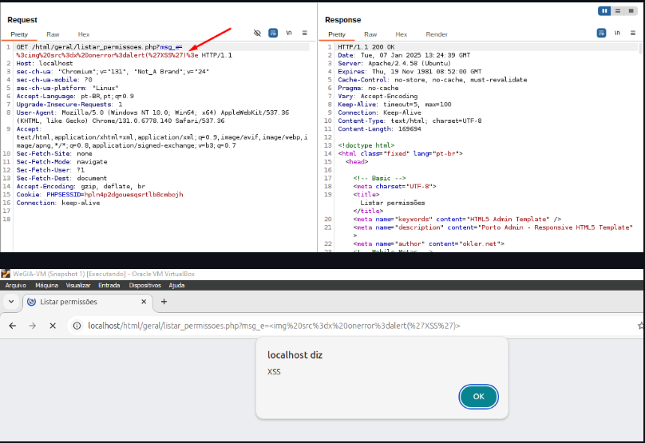

## CVE-2025-22143: Cross-Site Scripting (XSS) Reflected endpoint `listar_permissoes.php` parameter `msg_e`

> *CVE Publication: https://www.cve.org/CVERecord?id=CVE-2025-22143*

## Summary

<p style="text-align: justify;">A Reflected Cross-Site Scripting (XSS) vulnerability was identified in the <code>listar_permissoes.php</code> endpoint of the WeGIA application. This vulnerability allows attackers to inject malicious scripts in the <code>msg_e</code> parameter.</p>

## Details

Vulnerable Endpoint: `GET /html/geral/listar_permissoes.php`

Parameter: `msg_e`

<p style="text-align: justify;">The application fails to validate and sanitize user inputs in the <code>msg_e</code> parameter. This lack of validation permits the injection of malicious payloads, which are reflected back to the user's browser in the server's response and executed within the context of the victim's browser.</p>

## POC

### Payload:

````javascript
  
````


## Impact

<p style="text-align: justify;"> Reflected cross-site scripting (XSS) attacks can have serious consequences, including:
  <ul>
    <li>User actions: Attackers can perform any action the user can, such as viewing, modifying, or initiating interactions with other users.</li>
    <li>Data theft: Attackers can exfiltrate data or install malware on the user's machine.</li>
    <li>Account compromise: Attackers can manipulate or steal cookies, or compromise confidential information.</li>
    <li>Malicious code: Attackers can execute malicious code on the user's system.</li>
    <li>Business reputation damage: Attackers can deface a corporate website or spread misinformation.</li>
    <li>Misdirection: Attackers can change the instructions given to users, which can be dangerous if the target is a government website or provides vital resources.</li>
  </ul>
</p>

## Reference

[https://github.com/LabRedesCefetRJ/WeGIA/security/advisories/GHSA-gxh2-8jxp-m59h](https://github.com/LabRedesCefetRJ/WeGIA/security/advisories/GHSA-gxh2-8jxp-m59h)

## Finder

[](https://www.linkedin.com/in/elisangelasilvademendonca/) [Elisângela Mendonça](https://www.linkedin.com/in/elisangelasilvademendonca/) 

## Contributors

[](https://www.linkedin.com/in/diegocbcastro/) [Diego Castro](https://www.linkedin.com/in/diegocbcastro/) 

[](https://www.linkedin.com/in/nmmorette) [Natan Maia Morette](https://www.linkedin.com/in/nmmorette) 

> *By: [CVE-Hunters](https://github.com/Sec-Dojo-Cyber-House/cve-hunters)*