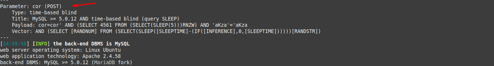

## CVE-2025-23219: SQL Injection endpoint `adicionar_cor.php` parameter `cor`

> *CVE Publication: https://www.cve.org/CVERecord?id=CVE-2025-23219*

## Summary

<p style="text-align: justify;">A SQL Injection vulnerability was identified in the WeGIA application, specifically in the <code>adicionar_cor.php</code> endpoint. This vulnerability allows attackers to execute arbitrary SQL commands in the database, allowing unauthorized access to sensitive information. During the exploit, it was possible to perform a complete dump of the application's database, highlighting the severity of the flaw.</p>

## Details

Vulnerable Endpoint: `POST /dao/pet/adicionar_cor.php`

Parameter: `cor`

<p style="text-align: justify;">The application does not perform proper validation or sanitization on the id parameter, allowing an attacker to manipulate SQL queries directly. This flaw makes it possible to execute malicious statements in the database. During testing, the extraction of sensitive data through the exploit was confirmed.</p>

## POC

### Payload (sqlmap):

````terminal
  sqlmap -u "http://localhost/dao/pet/adicionar_cor.php" --data="cor=cor" --dbms=mysql --cookie="PHPSESSID=thaicee00su2lhvlceu9r9v66v" --dump
````



<p style="text-align: justify;">It was possible to identify the database <code>wegia</code>.</p>


<p style="text-align: justify;">It was possible to fully dump the <code>pessoa</code> table.</p>


## Impact

<p style="text-align: justify;">
  <ul>
    <li>Unauthorized access to sensitive data: An attacker can access confidential information such as credentials, personal or financial data.</li>
    <li>Compromise of user accounts: Using stolen credentials, attackers can gain full access to the application and perform actions on behalf of legitimate users.</li>
    <li>Data exfiltration: Possibility of stealing large volumes of information by dumping entire database tables.</li>
    <li>Reputational damage: Exposing customer data or business information can significantly harm the organization's image.</li>
    <li>Execution of chain attacks: Obtained information can be used to carry out new attacks, such as targeted phishing or attacks on interconnected systems.</li>
  </ul>
</p>

## Reference

[https://github.com/LabRedesCefetRJ/WeGIA/security/advisories/GHSA-h2mg-4c7q-w69v](https://github.com/LabRedesCefetRJ/WeGIA/security/advisories/GHSA-h2mg-4c7q-w69v)

## Finder

[](https://www.linkedin.com/in/elisangelasilvademendonca/) [Elisangela Mendonça](https://www.linkedin.com/in/elisangelasilvademendonca/) 

## Contributors

[](https://www.linkedin.com/in/diegocbcastro/) [Diego Castro](https://www.linkedin.com/in/diegocbcastro/) 

[](https://www.linkedin.com/in/nmmorette) [Natan Maia Morette](https://www.linkedin.com/in/nmmorette) 

[](https://www.linkedin.com/in/rafael-corvino/) [Rafael Corvino](https://www.linkedin.com/in/rafael-corvino/)

> *By: [CVE-Hunters](https://github.com/Sec-Dojo-Cyber-House/cve-hunters)*