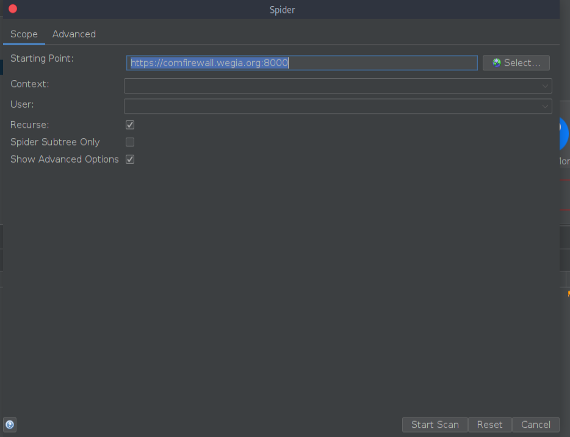
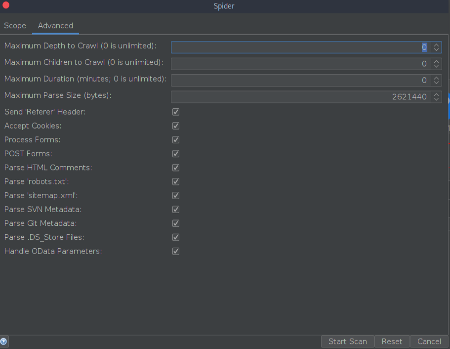
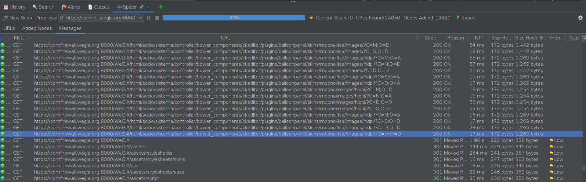

## CVE-2025-27419: Denial of Service (DoS) in WeGIA due to Recursive Crawling of Dynamic URLs

> *CVE Publication: https://www.cve.org/CVERecord?id=CVE-2025-27419*

## Summary

<p style="text-align: justify;">A Denial of Service (DoS) vulnerability exists in WeGIA. This vulnerability allows any unauthenticated user to cause the server to become unresponsive by performing aggressive spidering using tools like OWASP ZAP. The vulnerability is caused by recursive crawling of dynamically generated URLs and insufficient handling of large volumes of requests.</p>

## Details

<p style="text-align: justify;">The issue occurs when the OWASP ZAP Spider scans the application and recursively crawls URLs with dynamic parameters. The Spider generates an excessive number of requests due to:
  <ul>
    <li>The presence of parameters like <code>?C=M;O=D</code> that create multiple unique URLs.</li>
    <li>Access to directories exposing static files, such as <code>bower_components</code> and related assets.</li>
    <li>No rate limiting or restrictions on dynamically generated URLs at the server level.</li>
  </ul>
</p>

<p style="text-align: justify;">The problem is exacerbated by:
  <ul>
    <li>Unlimited depth crawling by the Spider.</li>
    <li>Recursive exploration of similar URLs with slight variations.</li>
    <li>Overwhelming the server with a high frequency of requests, which eventually causes it to stop responding.</li>
  </ul>
</p>





<p style="text-align: justify;">This behavior was observed in multiple tests, consistently resulting in server downtime.</p>

## POC

<p style="text-align: justify;">Steps to reproduce the issue:
  <ol type="1">
    <li>Install OWASP ZAP (version 2.15.0 or higher).</li>
    <li>Set the Spider configuration as follows:</li>
      <ul>
        <li>Starting Point: <code>https://comfirewall.wegia.org:8000/</code></li>
        <li>Recurse: Enabled.</li>
        <li>Maximum Depth to Crawl: Unlimited (default: 0).</li>
        <li>Process Forms: Enabled.</li>
      </ul>
    <li>Start the Spider and monitor the server behavior.</li>
    <li>After a few seconds:</li>
      <ul>
        <li>The server becomes unresponsive or starts returning HTTP 5xx errors.</li>
        <li>Logs show repeated requests to resources like <code>bower_components/ckeditor/plugins</code> and dynamic URLs with parameters.</li>
      </ul>
  </ol>
</p>



<video width="100%" height="100%" controls>
  <source src="404407716-dcac56f8-3531-4769-9c50-8598a3fb2a94.mp4" type="video/mp4">
</video>

## Affected URLs

```terminal
https://comfirewall.wegia.org:8000/WeGIA/html/socio/sistema/controller/bower_components/ckeditor/plugins/balloonpanel/skins/moono-lisa/images/hidpi/?C=M;O=D
https://comfirewall.wegia.org:8000/WeGIA/html/socio/sistema/controller/bower_components/select2/src/js/select2/data/?C=M;O=D
```

## Impact

<p style="text-align: justify;">This is a Denial of Service vulnerability. Any unauthenticated user with access to tools like OWASP ZAP can exploit this issue to make the server unresponsive. This affects the availability of the application and could disrupt business operations. The lack of rate limiting and recursive crawling restrictions increases the risk and makes the vulnerability exploitable by low-skilled attackers.</p>

## Reference

[https://github.com/LabRedesCefetRJ/WeGIA/security/advisories/GHSA-9rp6-4mqp-g4p8](https://github.com/LabRedesCefetRJ/WeGIA/security/advisories/GHSA-9rp6-4mqp-g4p8)

## Finder

[](https://www.linkedin.com/in/rafael-corvino/) [Rafael Corvino](https://www.linkedin.com/in/rafael-corvino/)

## Contributors

[](https://www.linkedin.com/in/diegocbcastro/) [Diego Castro](https://www.linkedin.com/in/diegocbcastro/) 

[](https://www.linkedin.com/in/nmmorette) [Natan Maia Morette](https://www.linkedin.com/in/nmmorette) 

> *By: [CVE-Hunters](https://github.com/Sec-Dojo-Cyber-House/cve-hunters)*