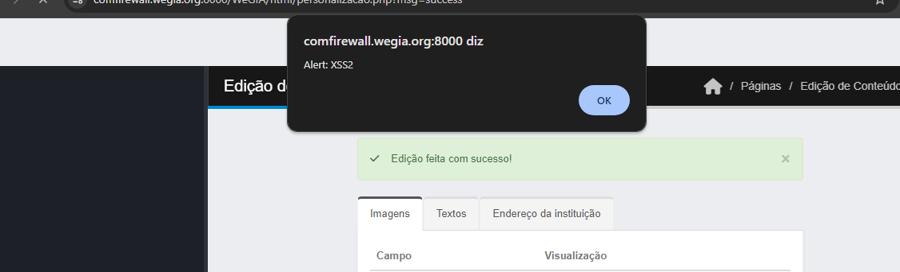

## CVE-2025-30366: Multiples Stored XSS in `personalizacao.php`

> *CVE Publication: https://www.cve.org/CVERecord?id=CVE-2025-30366*

## Summary

<p style="text-align: justify;">Multiples stored Cross-Site Scripting (XSS) vulnerability was identified in the WeGIA application. This vulnerability allows unauthorized scripts to be executed within the user's browser context. Stored XSS is particularly critical, as the malicious code is permanently stored on the server and executed whenever a compromised page is loaded, affecting all users accessing this page.</p>

[https://github.com/LabRedesCefetRJ/WeGIA/security](https://github.com/LabRedesCefetRJ/WeGIA/security)

## Details

Vulnerable Endpoint: `html/personalizacao.php`

Parameters: `Titulo`, `Subtitulo`, `Conheça`, `Objetivo`, `Rodape`

## POC

<p style="text-align: justify;">To reproduce the issue, insert the following payloads into the vulnerable field of the URL and save the changes:</p>

````javascript
  <script>alert('Alert: XSS');</script>
````

<p style="text-align: justify;">After saving the input, the injected script will be stored on the server and automatically executed for any user accessing the <code>home page</code> and <code>personalizacao.php</code>, confirming the stored XSS.</p>

File: `html/personalizacao.php`

Payload: 

````javascript
  <script>alert('Alert: XSS');</script>
````

Trigger in: `Home Page` and `personalizacao.php`

Parameters: `titulo`, `subtitulo`, `conheça`, `objetivo`, `rodape`



## Impact

<p style="text-align: justify;">
All users accessing the affected pages (<code>home page</code> and <code>personalizacao.php</code>), as the malicious script is stored on the server and executed automatically in their browsers. </br>

Administrators who interact with the vulnerable fields may also be affected, potentially leading to account takeover if sensitive cookies or session tokens are stolen.</br>

The application itself, as attackers can use XSS to deface content, redirect users, or perform actions on behalf of authenticated users.
</p>

## Reference

[https://github.com/LabRedesCefetRJ/WeGIA/security/advisories/GHSA-pwr9-fr8r-8h48](https://github.com/LabRedesCefetRJ/WeGIA/security/advisories/GHSA-pwr9-fr8r-8h48)

## Reporter

[](https://www.linkedin.com/in/nmmorette) [Natan Maia Morette](https://www.linkedin.com/in/nmmorette) 

> *By: [CVE-Hunters](https://github.com/Sec-Dojo-Cyber-House/cve-hunters)*