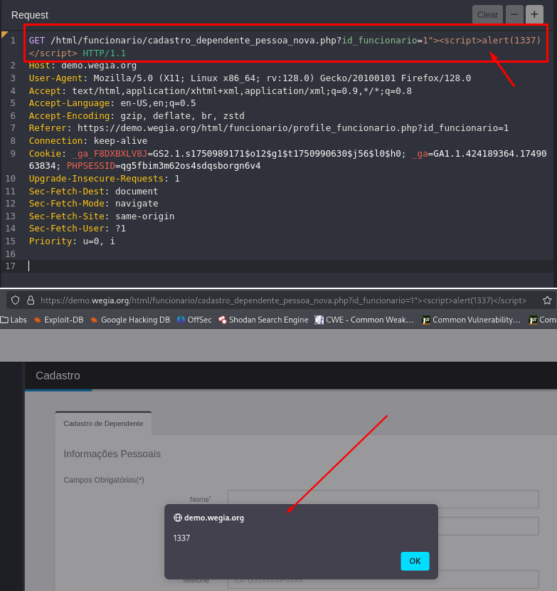

## CVE-2025-53377: Cross-Site Scripting (XSS) Refletido no endpoint `cadastro_dependente_pessoa_nova.php` parâmetro `id_funcionario`

> *Publicação CVE: https://www.cve.org/CVERecord?id=CVE-2025-53377*

## Resumo

<p style="text-align: justify;">Uma vulnerabilidade de XSS (Cross-Site Scripting Refletido) foi identificada no endpoint <code>cadastro_dependente_pessoa_nova.php</code> do aplicativo WeGia. Essa vulnerabilidade permite que invasores injetem scripts maliciosos no parâmetro <code>id_funcionario</code>.</p>

## Detalhes

Endpoint Vulnerável: `GET /html/funcionario/cadastro_dependente_pessoa_nova.php`

Parâmetro: `id_funcionario`

<p style="text-align: justify;">O aplicativo não consegue validar e sanitizar adequadamente as entradas do usuário no parâmetro <code>id_funcionario</code>. Essa falta de validação permite que invasores injetem scripts maliciosos, que são armazenados no servidor. Sempre que a página afetada é acessada, o payload malicioso é executado no navegador da vítima, potencialmente comprometendo os dados e o sistema do usuário.</p>

## PoC

### Payload:

````javascript
  1"><script>alert(1337)</script>
````



## Impacto

<p style="text-align: justify;">
    <ul>
        <li>Roubo de cookies de sessão: Invasores podem usar cookies de sessão roubados para sequestrar a sessão de um usuário e executar ações em seu nome.</li>
        <li>Baixar malware: Invasores podem induzir os usuários a baixar e instalar malware em seus computadores.</li>
        <li>Sequestro de navegadores: Invasores podem sequestrar o navegador de um usuário ou aplicar exploits baseados nele.</li>
        <li>Roubo de credenciais: Invasores podem roubar as credenciais de um usuário.</li>
        <li>Obter informações confidenciais: Invasores podem obter informações confidenciais armazenadas na conta de um usuário ou em seu navegador.</li>
        <li>Desfigurar sites: Invasores podem desfigurar um site alterando seu conteúdo.</li>
        <li>Desorientar usuários: Invasores podem alterar as instruções fornecidas aos usuários que visitam o site alvo, desorientando seu comportamento.</li>
        <li>Prejudicar a reputação de uma empresa: Invasores podem prejudicar a imagem de uma empresa ou espalhar desinformação desfigurando um site corporativo.</li>
    </ul>
</p>

## Referência

[https://github.com/LabRedesCefetRJ/WeGIA/security/advisories/GHSA-qgrq-qjq6-h6gj](https://github.com/LabRedesCefetRJ/WeGIA/security/advisories/GHSA-qgrq-qjq6-h6gj)

## Encontrado por:

[](http://www.linkedin.com/in/marceloqueirozjr) [Marcelo Queiroz](http://www.linkedin.com/in/marceloqueirozjr)

## Colaborador

[](https://www.linkedin.com/in/nmmorette/) [Natan Maia Morette](https://www.linkedin.com/in/nmmorette/)

> *By: [CVE-Hunters](https://github.com/Sec-Dojo-Cyber-House/cve-hunters)*