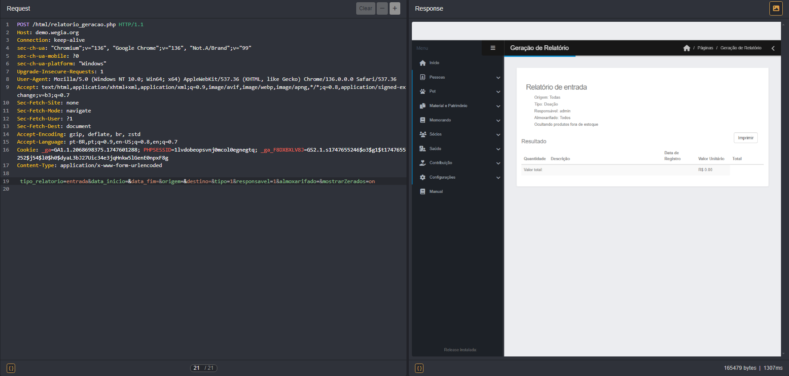
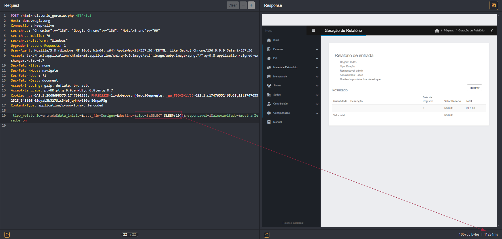
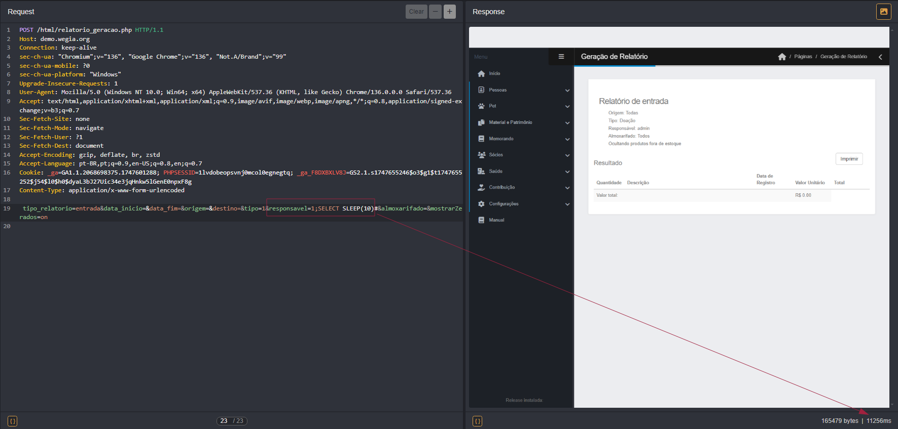

## CVE-2025-53527: Vulnerabilidade de Injeção SQL nos parâmetros `tipo` e `responsavel` do endpoint `relatorio_geracao.php`

> *Publicação CVE: https://www.cve.org/CVERecord?id=CVE-2025-53527*

## Resumo

<p style="text-align: justify;">Uma vulnerabilidade de Injeção SQL foi identificada nos parâmetros <code>tipo</code> e <code>responsavel</code> do endpoint <code>/controle/relatorio_geracao.php</code>. Esta vulnerabilidade permite que invasores manipulem consultas SQL e acessem informações confidenciais do banco de dados, como nomes de tabelas e dados sensíveis.</p>

## Detalhes

Endpoint Vulnerável: `/controle/relatorio_geracao.php`

Parâmetros: `tipo` e `responsavel`

## PoC

### Requisição Normal:



### SQL Injection no parâmetro `tipo`

#### Payload:

```terminal
  ;SELECT SLEEP(10)#
```



### SQL Injection no parâmetro `responsavel`

#### Payload:

```terminal
  ;SELECT SLEEP(10)#
```




## Impacto

<p style="text-align: justify;">
  <ul>
    <li>Acesso não autorizado a dados sensíveis: Um invasor pode acessar informações confidenciais, como credenciais, dados pessoais ou financeiros.</li>
    <li>Comprometimento de contas de usuários: Usando credenciais roubadas, invasores podem obter acesso total ao aplicativo e executar ações em nome de usuários legítimos.</li>
    <li>Exfiltração de dados: Possibilidade de roubo de grandes volumes de informações, despejando tabelas inteiras do banco de dados.</li>
    <li>Danos à reputação: Expor dados de clientes ou informações comerciais pode prejudicar significativamente a Imagem da organização.</li>
    <li>Execução de ataques em cadeia: As informações obtidas podem ser usadas para realizar novos ataques, como phishing direcionado ou ataques a sistemas interconectados.</li>
  </ul>
</p>

## Referência

[https://github.com/LabRedesCefetRJ/WeGIA/security/advisories/GHSA-43xw-c4g6-jgff](https://github.com/LabRedesCefetRJ/WeGIA/security/advisories/GHSA-43xw-c4g6-jgff)

## Encontrado por

[](https://www.linkedin.com/in/nmmorette) [Natan Maia Morette](https://www.linkedin.com/in/nmmorette)

> *Por: [CVE-Hunters](https://github.com/Sec-Dojo-Cyber-House/cve-hunters)*