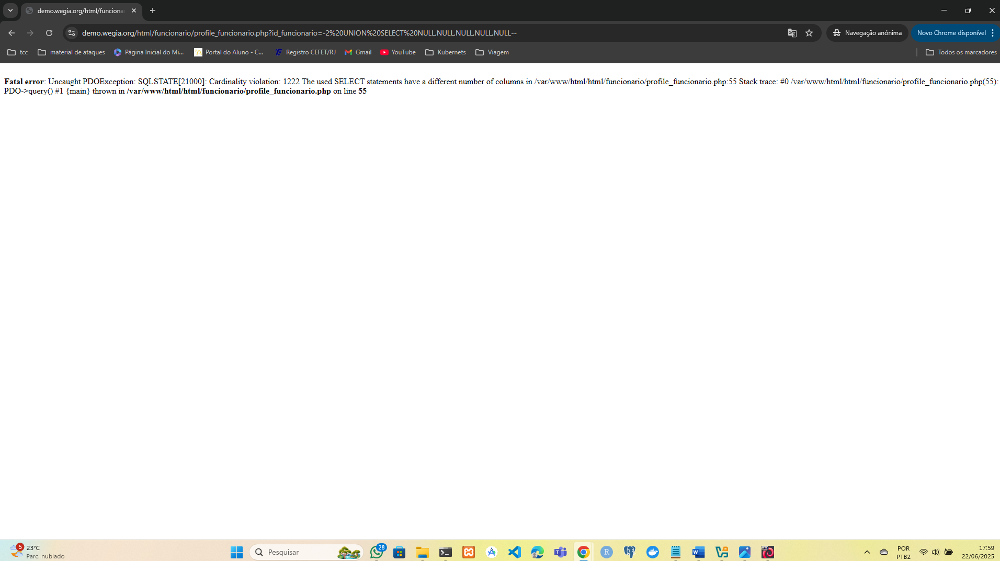

## CVE-2025-53529: SQL Injection Vulnerability in `id_funcionario` Parameter on `profile_funcionario.php` Endpoint

> *CVE Publication: https://www.cve.org/CVERecord?id=CVE-2025-53529*

## Summary

A SQL Injection vulnerability was discovered in the <code>id_funcionario</code> parameter of the <code>html/funcionario/profile_funcionario.php</code> endpoint. This issue allows any unauthenticated attacker to inject arbitrary SQL queries, potentially leading to unauthorized data access or further exploitation depending on database configuration.

## Details

The application fails to properly sanitize user-supplied input in the almox parameter. As a result, specially crafted SQL payloads are interpreted directly by the backend database.

## PoC

Vulnerable Endpoint: `html/funcionario/profile_funcionario.php`

Parameter: `id_funcionario`

  <ul>
    <li>Navigate to: <a href="https://demo.wegia.org/html/funcionario/profile_funcionario.php id_funcionario=1" target="_blank">https://demo.wegia.org/html/funcionario/profile_funcionario.php id_funcionario=1</a>;</li>
    <li>Insert SQL command after <code>id</code> parameter like in the image below:</li>
  </ul>

Observe the Fatal error: <code>Uncaught PDOException: SQLSTATE[HY000]: Cardinality violation: 1222 The used SELECT statements have a different number of columns</code> message, unequivocally confirming SQL Injection.

## Impact

  <ul>
    <li>Unauthorized access to sensitive data (e.g., users, passwords, logs).</li>
    <li>Database enumeration (schemas, tables, users, versions).</li>
    <li>Escalation to RCE depending on DB configuration (e.g., xp_cmdshell, UDFs).</li>
    <li>Full compromise of the application if chained with other vulnerabilities.</li>
    <li>This issue affects all users and environments, as it does not require authentication and is reachable via a public endpoint.</li>
  </ul>

## Reference

[https://github.com/LabRedesCefetRJ/WeGIA/security/advisories/GHSA-rrj6-pj6w-8j2r](https://github.com/LabRedesCefetRJ/WeGIA/security/advisories/GHSA-rrj6-pj6w-8j2r)

## Finder

 [Pedro Lyrio](https://www.linkedin.com/in/pedro-henrique-da-costa-lyrio-020a401a3?utm_source=share&utm_campaign=share_via&utm_content=profile&utm_medium=android_app)

## Contributor

 [Natan Maia Morette](https://www.linkedin.com/in/nmmorette)

> *By: [CVE-Hunters](https://github.com/Sec-Dojo-Cyber-House/cve-hunters)*