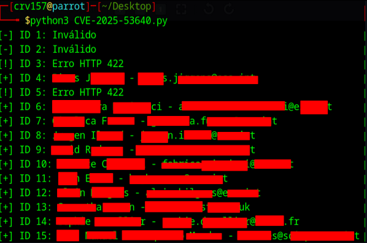
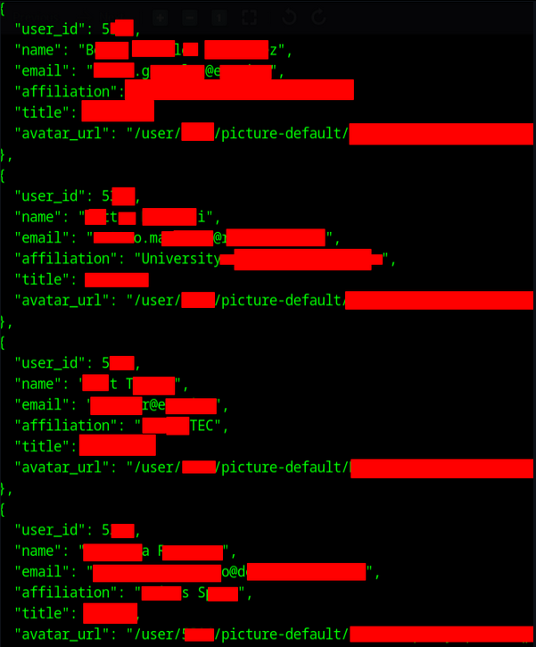

## CVE-2025-53640: User enumeration via API endpoint

> ***CVE Publication: https://www.cve.org/CVERecord?id=CVE-2025-53640***

## Summary

<p style="text-align: justify;">a Broken Object Level Authorization (BOLA) vulnerability in Indico enables authenticated user enumeration via the <code>/api/principals</code> endpoint, exposing names, emails, and affiliations. Includes exploitation script, request analysis, and screenshots. Affects globally deployed Indico instances (European Organization for Nuclear Research (CERN), United Nations (UN), Massachusetts Institute of Technology (MIT), European Space Agency (ESA), among others).</p>

## Details

<p style="text-align: justify;"> A Broken Object Level Authorization (BOLA) vulnerability in the open-source application Indico allows mass user enumeration through the <code>/api/principals</code> endpoint.<br><br>Originally intended to resolve user IDs in specific form fields, this endpoint can be misused to retrieve personal details of <b>any valid user ID:</b><br>
  <ul><li>Full name</li>
  <li>Email address</li>
  <li>Title</li>
  <li>Affiliation</li>
  <li>Avatar URL</li>
</ul>
</p>

## Exploitation Requirements

<p style="text-align: justify;">
  <ul><li>A valid authenticated session is required.</li>
  <li>However, most public Indico instances allow self-registration with no email verification, CAPTCHA, or manual approval.</li>
  <li>This makes the vulnerability <b>practically exploitable by unauthenticated users</b> after trivial account creation.</li>
</ul>
</p>

## PoC

### Exploit

```python
PoC script to be published after responsible disclosure timeline.
```





## Global Impact

<p style="text-align: justify;"> Indico is a widely adopted event and conference management platform developed by CERN (European Organization for Nuclear Research), powering academic and institutional infrastructure globally:
  <ul>
    <li><b>CERN (European Organization for Nuclear Research):</b> Over 900,000 events annually; 200+ rooms booked daily.</li>
    <li><b>Worldwide:</b> Around 145,000 events/year across 300+ institutions.</li>
    <li><b>UN (United Nations):</b> Over 180,000 participants/year.</li>
    <li><b>UNOG (United Nations Office at Geneva):</b> Up to 700,000 users/year.</li>
    <li>Extensively used by universities, laboratories, research institutes, and government agencies.</li>
  </ul>
</p>

<p style="text-align: justify;">Examples of affected public instances:
  <ul>
    <li><b><a href="https://indico.cern.ch/" target="_blank">https://indico.cern.ch/<a></b></li>
    <li><b><a href="https://indico.esa.int/" target="_blank">https://indico.esa.int/<a></b></li>
    <li><b><a href="https://indico.mit.edu/" target="_blank">https://indico.mit.edu/<a></b></li>
  </ul>
</p>

<p style="text-align: justify;">Due to its widespread adoption in <b>scientific, academic, and governmental</b> environments, this vulnerability poses serious risks:
  <ul>
    <li>Identity leakage of researchers, staff, and administrators.</li>
    <li>Large-scale privacy breaches and institutional directory exposure.</li>
    <li>Targeted reconnaissance for phishing or social engineering.</li>
    <li>Potential compromise of sensitive research and policy initiatives.</li>
  </ul>
</p>

## Impact

<p style="text-align: justify;">
  <ul>
    <li>Disclosure of personal data (PII)</li>
    <li>Enumeration of high-privilege users (admins, organizers)</li>
    <li>Supports mass phishing and spear-phishing operations</li>
    <li>Violates regulations such as <b>GDPR, LGPD</b>, and internal institutional policies</li>
    <li>May constitute a reportable breach depending on jurisdiction</li>
  </ul>
</p>

## References

**[https://github.com/CVE-Hunters/CVE/blob/main/Indico/CVE-2025-53640.md](https://github.com/CVE-Hunters/CVE/blob/main/Indico/CVE-2025-53640.md)**

**[https://github.com/indico/indico/security/advisories/GHSA-q28v-664f-q6wj](https://github.com/indico/indico/security/advisories/GHSA-q28v-664f-q6wj)**

## Finder

[](https://www.linkedin.com/in/rafael-corvino/) [Rafael Corvino](https://www.linkedin.com/in/rafael-corvino/)

## Contributor

[](https://www.linkedin.com/in/nmmorette/) [Natan Maia Morette](https://www.linkedin.com/in/nmmorette)

> ***By: [CVE-Hunters](https://github.com/CVE-Hunters/cve-hunters)***