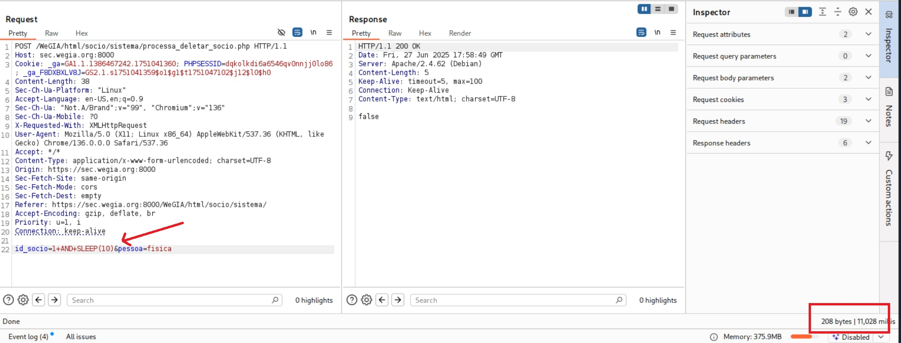

## CVE-2025-53823: Vulnerabilidade de injeção de SQL (baseada em tempo) no parâmetro `id_socio` do Endpoint `processa_deletar_socio.php`

> *Publicação CVE: https://www.cve.org/CVERecord?id=CVE-2025-53823*

## Resumo

<p style="text-align: justify;">Uma vulnerabilidade de injeção de SQL foi descoberta no parâmetro <code>id_socio</code> do endpoint <code>/WeGIA/html/socio/sistema/processa_deletar_socio.php</code>. Esta vulnerabilidade permite a execução de comandos SQL arbitrários, o que pode comprometer a confidencialidade, a integridade e a disponibilidade dos dados armazenados.</p>

## Detalhes

```terminal
POST /WeGIA/html/socio/sistema/processa_deletar_socio.php HTTP/1.1
Host: sec.wegia.org:8000
Cookie: _ga=GA1.1.1386467242.1751041360; PHPSESSID=dqkolkdi6a6546qv0nnjj0lo86; _ga_F8DXBXLV8J=GS2.1.s1751041359$o1$g1$t1751047102$j12$l0$h0
Content-Length: 24
Sec-Ch-Ua-Platform: "Linux"
Accept-Language: en-US,en;q=0.9
Sec-Ch-Ua: "Not.A/Brand";v="99", "Chromium";v="136"
Sec-Ch-Ua-Mobile: ?0
X-Requested-With: XMLHttpRequest
User-Agent: Mozilla/5.0 (X11; Linux x86_64) AppleWebKit/537.36 (KHTML, like Gecko) Chrome/136.0.0.0 Safari/537.36
Accept: /
Content-Type: application/x-www-form-urlencoded; charset=UTF-8
Origin: https://sec.wegia.org:8000
Sec-Fetch-Site: same-origin
Sec-Fetch-Mode: cors
Sec-Fetch-Dest: empty
Referer: https://sec.wegia.org:8000/WeGIA/html/socio/sistema/
Accept-Encoding: gzip, deflate, br
Priority: u=1, i
Connection: keep-alive

id_socio=1&pessoa=fisica
```

## PoC




## Impacto

<p style="text-align: justify;">
  <ul>
    <li>Acesso não autorizado a dados confidenciais (por exemplo, usuários, senhas, registros).</li>
    <li>Enumeração de banco de dados (esquemas, tabelas, usuários, versões).</li>
    <li>Escalonamento para RCE dependendo da configuração do banco de dados (por exemplo, xp_cmdshell, UDFs).</li>
    <li>Comprometimento total do aplicativo se encadeado com outras vulnerabilidades.</li>
    <li>Esse problema afeta todos os usuários e ambientes, pois não requer autenticação e pode ser acessado por meio de um ponto de extremidade público.</li>
  </ul>
</p>

## Referência

[https://github.com/LabRedesCefetRJ/WeGIA/security/advisories/GHSA-p8xr-qg3c-6ww2](https://github.com/LabRedesCefetRJ/WeGIA/security/advisories/GHSA-p8xr-qg3c-6ww2)

## Encontrado por

[](https://www.linkedin.com/in/elisangelasilvademendonca/) [Elisangela Mendonça](https://www.linkedin.com/in/elisangelasilvademendonca/)

## Colaborador

[](https://www.linkedin.com/in/nmmorette) [Natan Maia Morette](https://www.linkedin.com/in/nmmorette)

> *By: [CVE-Hunters](https://github.com/Sec-Dojo-Cyber-House/cve-hunters)*