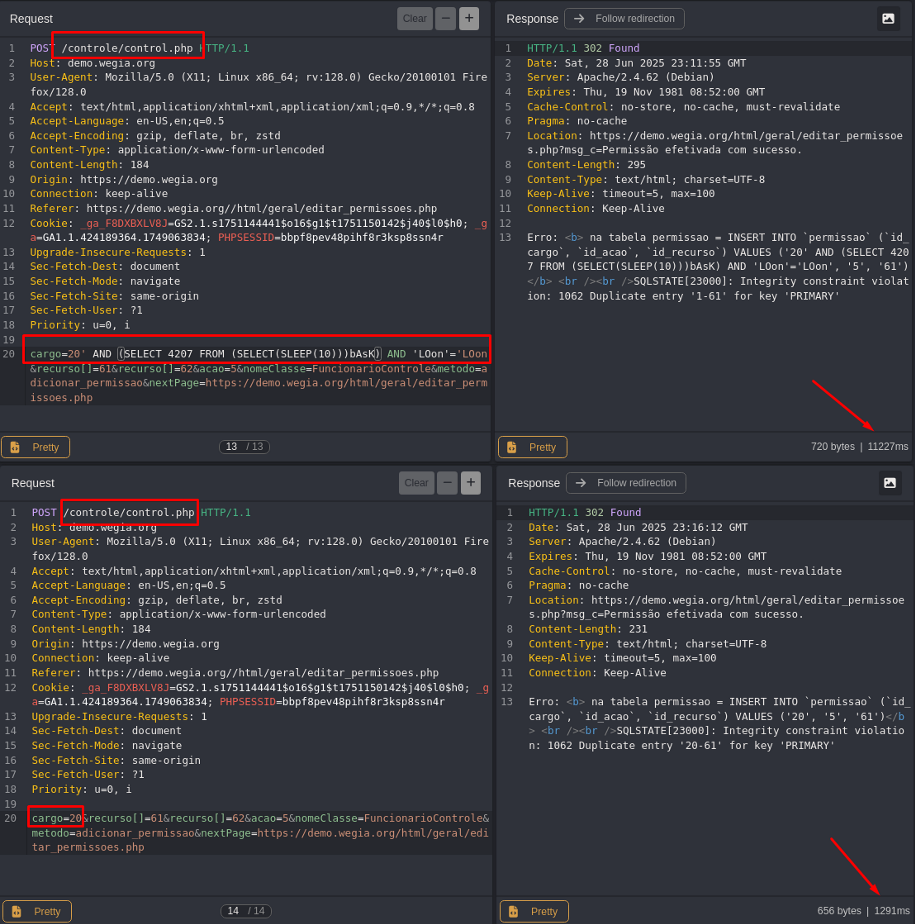

## CVE-2025-53937: SQL Injection (Blind Time-Based) Vulnerability in `cargo` Parameter on `control.php` Endpoint

> *CVE Publication: https://www.cve.org/CVERecord?id=CVE-2025-53937*

## Summary

<p style="text-align: justify;">A SQL Injection vulnerability was discovered in the <code>cargo</code> parameter of the <code>/controle/control.php</code> endpoint. This issue allows any unauthenticated attacker to inject arbitrary SQL queries, potentially leading to unauthorized data access or further exploitation depending on database configuration.</p>

## Details

<p style="text-align: justify;">The application fails to properly sanitize user-supplied input in the <code>cargo</code> parameter. As a result, specially crafted SQL payloads are interpreted directly by the backend database.</p>

## PoC

Vulnerable Endpoint: `/controle/control.php`

Parameter: `cargo`

### Payload:

```terminal
  ' AND (SELECT 4207 FROM (SELECT(SLEEP(10)))bAsK) AND 'LOon'='LOon
```

<p style="text-align: justify;">This payload introduces a time delay, demonstrating the ability to execute arbitrary SQL queries.</p>



<p style="text-align: justify;">Observe the time delay in the server response, indicating the successful execution of the SQL payload.</p>

## Impact

<p style="text-align: justify;">
  <ul>
    <li>Unauthorized access to sensitive data (e.g., users, passwords, logs).</li>
    <li>Database enumeration (schemas, tables, users, versions).</li>
    <li>Escalation to RCE depending on DB configuration (e.g., xp_cmdshell, UDFs).</li>
    <li>Full compromise of the application if chained with other vulnerabilities.</li>
    <li>This issue affects all users and environments, as it does not require authentication and is reachable via a public endpoint.</li>
  </ul>
</p>

## Reference

[https://github.com/LabRedesCefetRJ/WeGIA/security/advisories/GHSA-j3qv-v3m7-73pj](https://github.com/LabRedesCefetRJ/WeGIA/security/advisories/GHSA-j3qv-v3m7-73pj)

## Finder

[](http://www.linkedin.com/in/marceloqueirozjr) [Marcelo Queiroz](http://www.linkedin.com/in/marceloqueirozjr)

## Contributor

[](https://www.linkedin.com/in/nmmorette/) [Natan Maia Morette](https://www.linkedin.com/in/nmmorette/)

> *By: [CVE-Hunters](https://github.com/Sec-Dojo-Cyber-House/cve-hunters)*