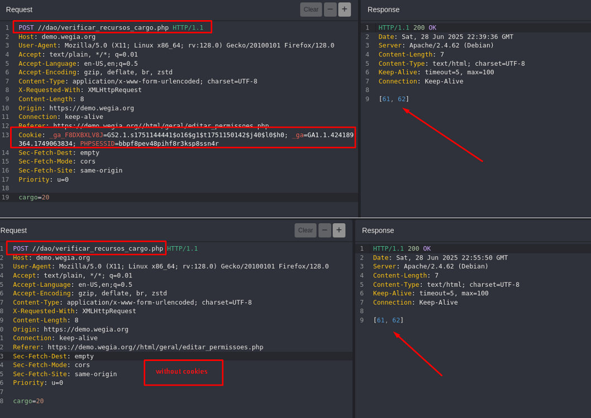

## CVE-2025-53938: Authentication Bypass due to Missing Session Validation in multiple endpoints 

> *CVE Publication: https://www.cve.org/CVERecord?id=CVE-2025-53938*

## Summary

An <b>Authentication Bypass</b> vulnerability was identified in the <code>/dao/verificar_recursos_cargo.php</code> endpoint of the WeGia application. This vulnerability allows <b>unauthenticated users</b> to access protected application functionalities and retrieve sensitive information by sending crafted HTTP requests <b>without any session cookies or authentication tokens</b>.

## Details

### Vulnerable Endpoints:

  <ul>
    <li><code>/dao/verificar_recursos_cargo.php</code></li>
    <li><code>/dao/exibir_cargo.php</code></li>
    <li><code>/dao/verificar_modulos_visiveis.php</code></li>
    <li><code>/dao/exibir_documento.php</code></li>
    <li><code>/dao/adicionar_documento.php</code></li>
  </ul>

### Authentication Required:

- ❌ No

## PoC

## Impact

The lack of session validation in this endpoint can lead to several security risks:

  <ul>
    <li><b>Unauthorized Data Exposure:</b> Unauthenticated users can enumerate or retrieve sensitive internal data.</li>
    <li><b>Privilege Escalation:</b> Attackers might access or infer information intended only for authorized users.</li>
    <li><b>Information Disclosure:</b> Business logic and internal IDs (like user roles or permissions) can be leaked.</li>
    <li><b>Reconnaissance Support:</b> Facilitates attackers in mapping backend structures for more targeted attacks.</li>
  </ul>

## Reference

[https://github.com/LabRedesCefetRJ/WeGIA/security/advisories/GHSA-6p76-7mm4-j5rj](https://github.com/LabRedesCefetRJ/WeGIA/security/advisories/GHSA-6p76-7mm4-j5rj)

## Finder

 [Marcelo Queiroz](http://www.linkedin.com/in/marceloqueirozjr)

## Contributor

 [Natan Maia Morette](https://www.linkedin.com/in/nmmorette/)

> *By: [CVE-Hunters](https://github.com/Sec-Dojo-Cyber-House/cve-hunters)*