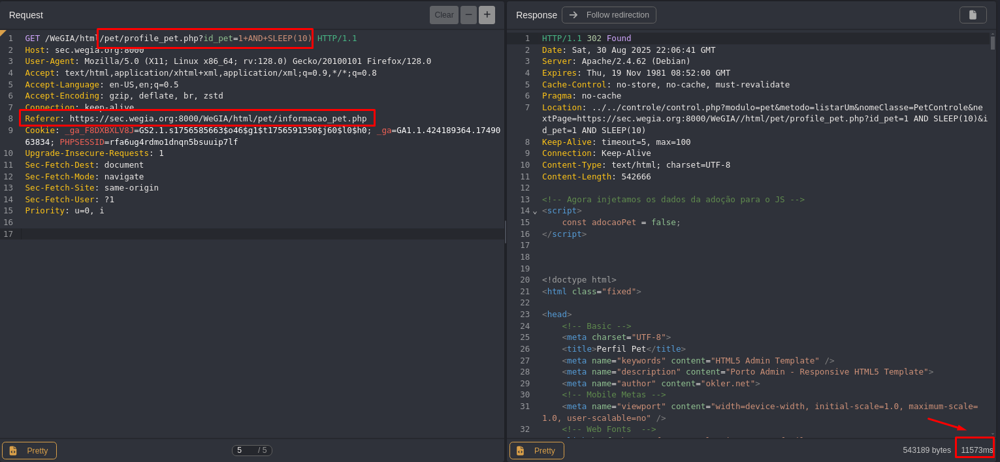

## CVE-2025-61603: SQL Injection (Blind Time-Based) Vulnerability in `id_pet` Parameter on `/pet/profile_pet.php` Endpoint

> *CVE Publication: https://www.cve.org/CVERecord?id=CVE-2025-61603*

## Summary

<p style="text-align: justify;">A SQL Injection vulnerability was discovered in the <code>id_pet</code> parameter of the <code>/pet/profile_pet.php</code> endpoint. This issue allows any unauthenticated attacker to inject arbitrary SQL queries, potentially leading to unauthorized data access or further exploitation depending on database configuration.</p>

## Details

<p style="text-align: justify;">The application fails to properly sanitize user-supplied input in the <code>id_pet</code> parameter. As a result, specially crafted SQL payloads are interpreted directly by the backend database.</p>

## PoC

Vulnerable Endpoint: `/pet/profile_pet.php`

Parameter: `id_pet`

### Payload:

```terminal
+AND+SLEEP(10)
```



<p style="text-align: justify;">Observe the time delay in the server response, indicating the successful execution of the SQL payload.</p>

## Impact

<p style="text-align: justify;">
  <ul>
    <li>Unauthorized access to sensitive data (e.g., users, passwords, logs).</li>
    <li>Database enumeration (schemas, tables, users, versions).</li>
    <li>Escalation to RCE depending on DB configuration (e.g., xp_cmdshell, UDFs).</li>
    <li>Full compromise of the application if chained with other vulnerabilities.</li>
    <li>This issue affects all users and environments, as it does not require authentication and is reachable via a public endpoint.</li>
  </ul>
</p>

## Reference

***[https://github.com/LabRedesCefetRJ/WeGIA/security/advisories/GHSA-8963-9833-gpx7](https://github.com/LabRedesCefetRJ/WeGIA/security/advisories/GHSA-8963-9833-gpx7)***

## Finder

[](http://www.linkedin.com/in/marceloqueirozjr) [Marcelo Queiroz](http://www.linkedin.com/in/marceloqueirozjr)

> ***By: [CVE-Hunters](https://github.com/CVE-Hunters/cve-hunters)***