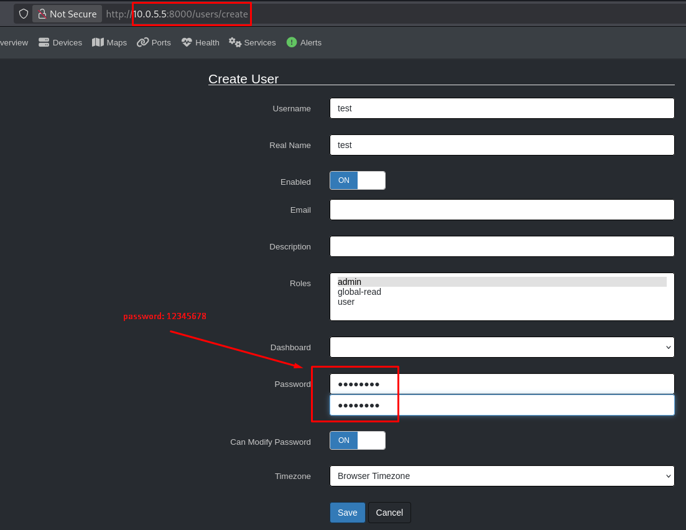
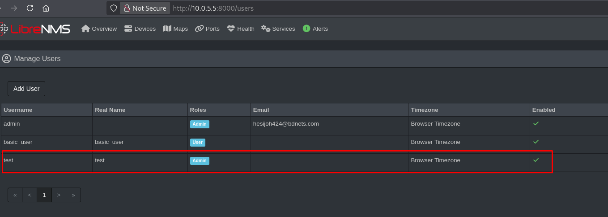

## CVE-2025-65014: Weak Password Policy Vulnerability in User Management Functionality

> *CVE Publication: https://www.cve.org/CVERecord?id=CVE-2025-65014*

## Summary

A Weak Password Policy vulnerability was identified in the user management functionality of the LibreNMS application. This vulnerability allows the creation of accounts with extremely weak and predictable passwords, such as <code>123456</code>. This exposes the platform to brute-force and credential stuffing attacks.

## Details

The application fails to enforce a strong password policy when creating new users. As a result, administrators can define trivial and well-known weak passwords, compromising the authentication security of the system.

Vulnerable Component: `User creation / password definition`

### PoC

  <ul>
    <li>Log in to the application using an <b>Administrator</b> account.</li>
    <li>Navigate to the user management section:</li>
    <li>Create a new user account using the password <code>12345678</code>.</li>
    <li>The application accepts the weak password without restrictions and creates the account successfully.</li>
  </ul>

## Impact

  <ul>
    <li>Increased risk of brute-force and credential stuffing attacks.</li>
    <li>Unauthorized access to user or administrative accounts.</li>
    <li>Privilege escalation through compromised accounts.</li>
    <li>Reduced overall security posture of the application.</li>
  </ul>

## Reference

***[https://github.com/librenms/librenms/security/advisories/GHSA-5mrf-j8v6-f45g](https://github.com/librenms/librenms/security/advisories/GHSA-5mrf-j8v6-f45g)***

## Finder

 [Marcelo Queiroz](http://www.linkedin.com/in/marceloqueirozjr)

> ***By: [CVE-Hunters](https://github.com/CVE-Hunters/cve-hunters)***