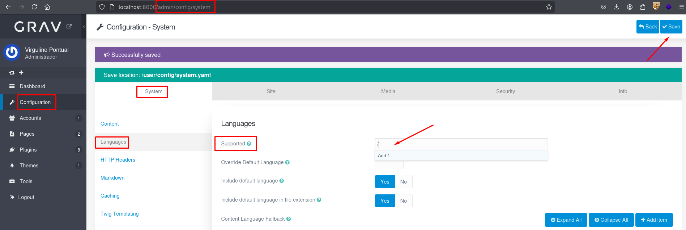
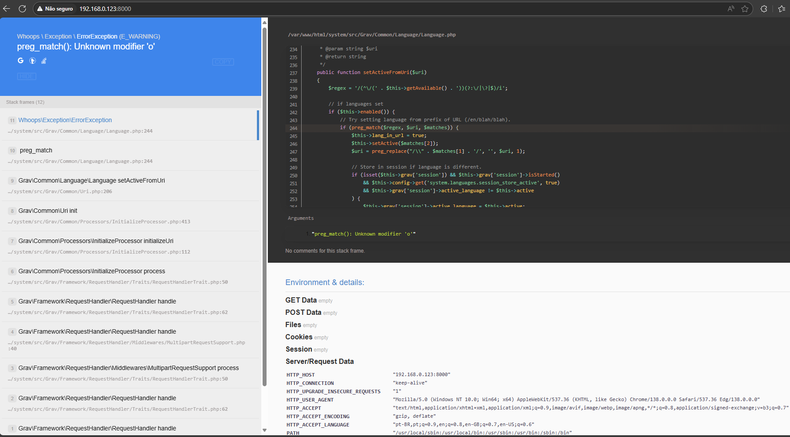

## CVE-2025-66305: Denial of Service via Improper Input Handling in `Supported` Parameter

> *CVE Publication: https://www.cve.org/CVERecord?id=CVE-2025-66305*

## Summary

A Denial of Service (DoS) vulnerability was identified in the <b>"Languages"</b> submenu of the Grav <b>admin configuration panel</b> (<code>/admin/config/system</code>). Specifically, the <code>Supported</code> parameter fails to properly validate user input. If a malformed value is inserted—such as a single forward slash (<code>/</code>) or an XSS test string—it causes a fatal regular expression parsing error on the server.

## Details

The application dynamically constructs a regular expression using the contents of the <code>Supported</code> field without escaping the input using <code>preg_quote()</code> or proper validation. This allows attackers to inject invalid syntax into the regex engine, crashing the application during language resolution.

### Stack trace excerpt:

`Whoops \ Exception \ ErrorException (E_WARNING) preg_match(): Unknown modifier 'o' /system/src/Grav/Common/Language/Language.php244`

## PoC

Vulnerable Endpoint: `POST /admin/config/system`

Submenu: `Languages`

Parameter: `Supported`

  <ul>
    <li>Log into the Grav Admin Panel. 
    <li>Navigate to: <b>Configuration → System → Languages</b>.</li>
    <li>Locate the <code>Supported</code> field.</li>
    <li>Insert a payload (e.g., a single slash <code>/</code>).</li>
    <li>Click <b>Save</b>.</li>
  </ul>

  <ul>
    <li>Observe: All pages in the application begin throwing a fatal error and become inaccessible.</li>
  </ul>

## Impact

  <ul>
    <li>Application-wide Denial of Service (DoS).</li>
    <li>All login and admin views crash with the same error.</li>
    <li>Potentially exploitable by: Admin panel users; CSRF if misconfigured.</li>
  </ul>

## Reference

***[https://github.com/getgrav/grav/security/advisories/GHSA-m8vh-v6r6-w7p6](https://github.com/getgrav/grav/security/advisories/GHSA-m8vh-v6r6-w7p6)***

## Finder

 [Marcelo Queiroz](http://www.linkedin.com/in/marceloqueirozjr)

> ***By: [CVE-Hunters](https://github.com/CVE-Hunters/cve-hunters)***