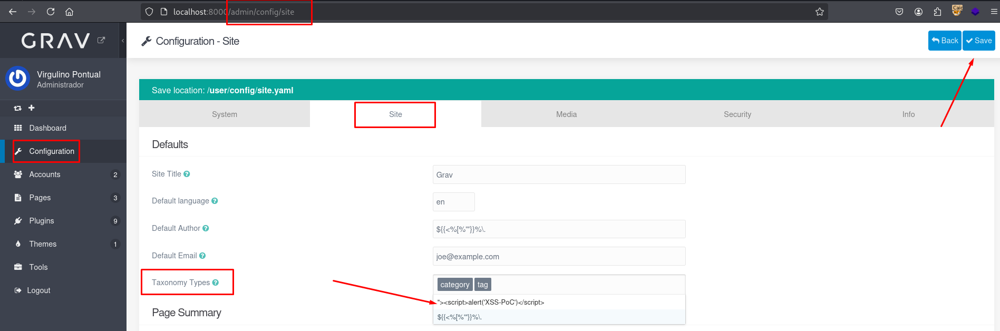
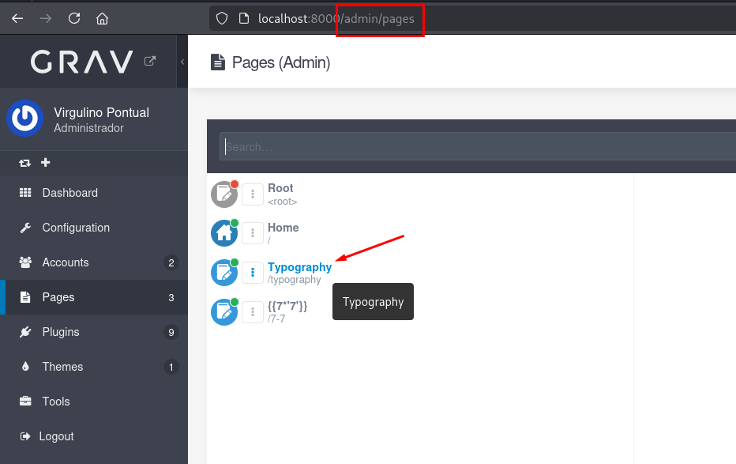
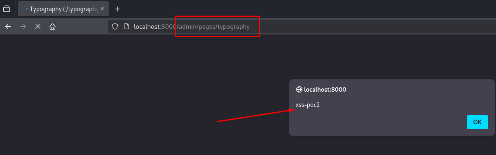
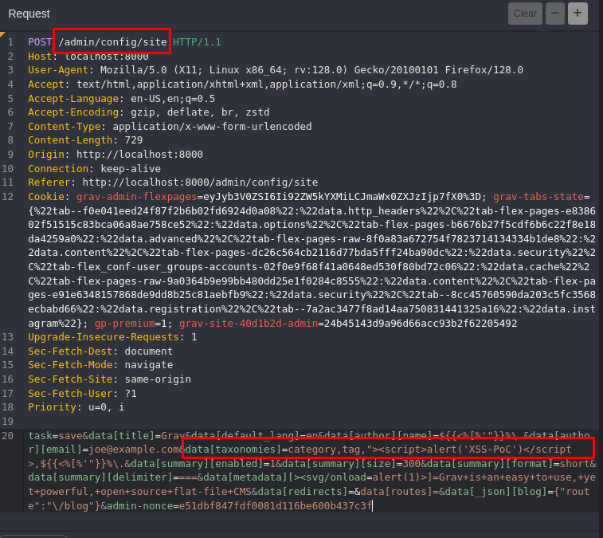

## CVE-2025-66308: Cross-Site Scripting (XSS) Armazenado no Parêmetro `data[taxonomies]` do Endpoint `/admin/config/site`

> ***Publicação CVE: https://www.cve.org/CVERecord?id=CVE-2025-66308***

## Resumo

<p style="text-align: justify;">Uma vulnerabilidade de Cross-Site Scripting (XSS) armazenada foi identificada no endpoint <code>/admin/config/site</code> do aplicativo <i>Grav</i>. Essa vulnerabilidade permite que atacantes injetem scripts maliciosos no parâmetro <code>data[taxonomies]</code>. O payload injetado é armazenado no servidor e executado automaticamente no navegador de qualquer usuário que acesse a configuração do site afetado, resultando em um vetor de ataque persistente.</p>

## Detalhes

Endpoint vulnerável: `POST /admin/config/site`

Parâmetro: `data[taxonomies]`

<p style="text-align: justify;">O aplicativo não valida ou higieniza corretamente a entrada no campo <code>data[taxonomies]</code>. Como resultado, um atacante pode injetar código JavaScript, que é armazenado na configuração do site e posteriormente renderizado na interface administrativa ou na saída do site, causando execução automática no navegador do usuário.</p>

## PoC

### Payload

```
"><script>alert('XSS-PoC')</script>
```

### Passos para reproduzir:

<p style="text-align: justify;">

<ul>

<li>Faça login no Painel de Administração do <i>Grav</i> com permissões suficientes para modificar a configuração do site.</li>

<li>Navegue até <b>Configuração > Site</b>.</li>

<li>No campo <b>Tipos de Taxonomias</b> (que corresponde a <code>data[taxonomies]</code>), insira o payload.</li>

<li>Salve a configuração.</li>

</ul>
</p>



<p style="text-align: justify;">

<ul>

<li>Acesse as Páginas e clique em uma delas.</li>
</ul>
</p>



<p style="text-align: justify;">

<ul>

<li>O payload armazenado é executado imediatamente no navegador, confirmando a vulnerabilidade XSS armazenada.</li>

</ul>
</p>



<p style="text-align: justify;">

<ul>

<li>A requisição HTTP enviada durante este processo contém o parâmetro e o payload vulneráveis:</li>

</ul>
</p>



## Impacto

<p style="text-align: justify;">

<ul>

<li>Sequestro de sessão: Roubo de cookies ou tokens de autenticação para se passar por outros usuários.</li>

<li>Roubo de credenciais: Coleta de nomes de usuário e senhas usando scripts maliciosos.</li>

<li>Distribuição de malware: Distribuição de código indesejado ou prejudicial às vítimas.</li>

<li>Elevação de privilégios: Comprometimento de usuários administrativos por meio de scripts persistentes.</li>

<li>Manipulação ou adulteração de dados: Alteração ou interrupção do conteúdo do site.</li>

<li>Danos à reputação: Erosão da confiança entre usuários e administradores do site.</li>

</ul>
</p>

## Referência

***[https://github.com/getgrav/grav/security/advisories/GHSA-gqxx-248x-g29f](https://github.com/getgrav/grav/security/advisories/GHSA-gqxx-248x-g29f)***

## Encontrado por:

[](http://www.linkedin.com/in/marceloqueirozjr) [Marcelo Queiroz](http://www.linkedin.com/in/marceloqueirozjr)

> ***By: [CVE-Hunters](https://github.com/CVE-Hunters/cve-hunters)***