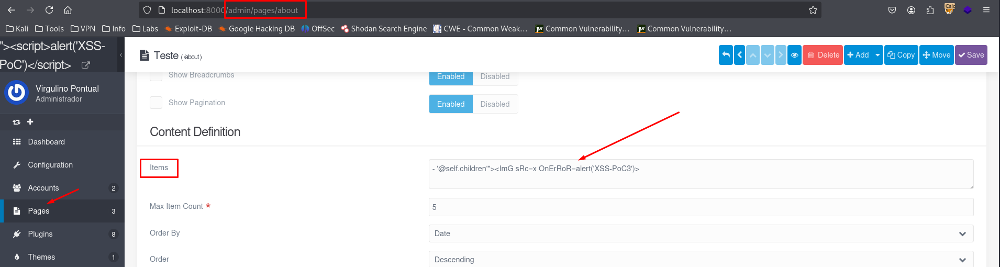
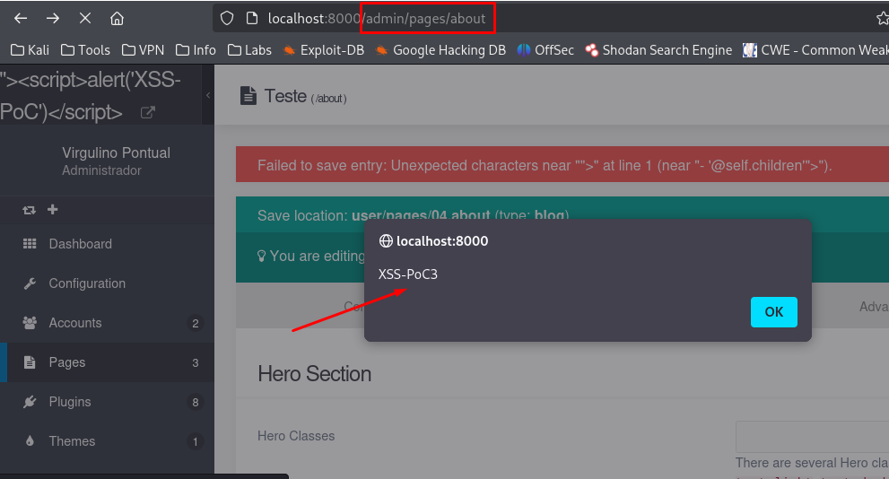

## CVE-2025-66309: Cross-Site Scripting (XSS) Reflected endpoint `/admin/pages/[page]`, parameter `data[header][content][items]`, located in the "Blog Config" tab

> ***CVE Publication: https://www.cve.org/CVERecord?id=CVE-2025-66309***

## Summary

<p style="text-align: justify;">A Reflected Cross-Site Scripting (XSS) vulnerability was identified in the <code>/admin/pages/[page]</code> endpoint of the Grav application. This vulnerability allows attackers to inject malicious scripts into the <code>data[header][content][items]</code> parameter.</p>

## Details

Vulnerable Endpoint: `GET /admin/pages/[page]`

Parameter: `data[header][content][items]`

<p style="text-align: justify;">The application fails to properly validate and sanitize user input in the <code>data[header][content][items]</code> parameter. As a result, attackers can craft a malicious URL with an XSS payload. When this URL is accessed, the injected script is reflected back in the HTTP response and executed within the context of the victim's browser session.</p>

## PoC

### Payload:

```html
">
```

<p style="text-align: justify;">
  <ul>
    <li>Log in to the Grav Admin Panel and navigate to <b>Pages</b>.</li>
    <li>Create a new page or edit an existing one.</li>
    <li>In the <b>Advanced > Blog Config > Items field</b> (which maps to <code>data[header][content][items]</code>), insert the payload above.</li>
  </ul>
</p>



<p style="text-align: justify;">
  <ul>
    <li>Save the page.</li>
    <li>The malicious payload is reflected and rendered by the application without proper sanitization. The JavaScript code is immediately executed in the browser.</li>
  </ul>
</p>



## Impact

<p style="text-align: justify;">
  <ul>
    <li>Stealing session cookies: Attackers can use stolen session cookies to hijack a user's session and perform actions on their behalf.</li>
    <li>Downloading malware: Attackers can trick users into downloading and installing malware on their computers.</li>
    <li>Hijacking browsers: Attackers can hijack a user's browser or deliver browser-based exploits.</li>
    <li>Stealing credentials: Attackers can steal a user's credentials.</li>
    <li>Obtaining sensitive information: Attackers can obtain sensitive information stored in a user's account or in their browser.</li>
    <li>Defacing websites: Attackers can deface a website by altering its content.</li>
    <li>Misdirecting users: Attackers can change the instructions given to users who visit the target website, misdirecting their behavior.</li>
    <li>Damaging a business's reputation: Attackers can damage a business's image or spread misinformation by defacing a corporate website.</li>
  </ul>
</p>

## Reference

[https://github.com/getgrav/grav/security/advisories/GHSA-65mj-f7p4-wggq](https://github.com/getgrav/grav/security/advisories/GHSA-65mj-f7p4-wggq)

## Finder

[](http://www.linkedin.com/in/marceloqueirozjr) [Marcelo Queiroz](http://www.linkedin.com/in/marceloqueirozjr)

> ***By: [CVE-Hunters](https://github.com/CVE-Hunters/cve-hunters)***