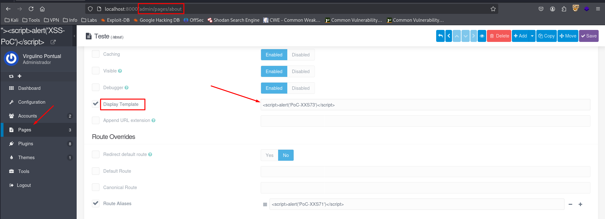
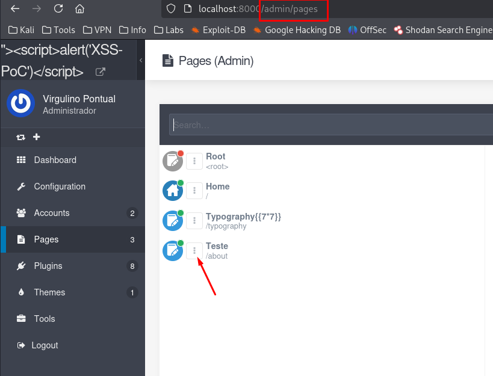
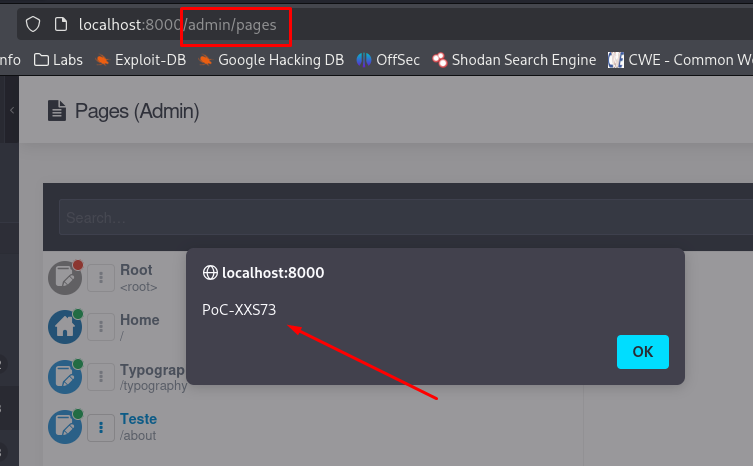

## CVE-2025-66310: Cross-Site Scripting (XSS) Stored endpoint `/admin/pages/[page]` parameter `data[header][template]` in Advanced Tab

> ***CVE Publication: https://www.cve.org/CVERecord?id=CVE-2025-66310***

## Summary

<p style="text-align: justify;">A Stored Cross-Site Scripting (XSS) vulnerability was identified in the <code>/admin/pages/[page]</code> endpoint of the Grav application. This vulnerability allows attackers to inject malicious scripts into the <code>data[header][template]</code> parameter. The script is saved within the page's frontmatter and executed automatically whenever the affected content is rendered in the administrative interface or frontend view.</p>

## Details

Vulnerable Endpoint: `POST /admin/pages/[page]`

Parameter: `data[header][template]`

<p style="text-align: justify;">The application fails to properly sanitize user input in the <code>data[header][template]</code> field, which is stored in the YAML frontmatter of the page. An attacker can inject JavaScript code using this field, and the payload is rendered and executed when the page is accessed, especially within the Admin Panel interface.</p>

## PoC

### Payload

```
<script>alert('PoC-XXS73')</script>
```

### Steps to Reproduce:

<p style="text-align: justify;">
  <ul>
    <li>Log in to the Grav Admin Panel and navigate to <b>Pages</b>.</li>
    <li>Create a new page or edit an existing one.</li>
    <li>In the <b>Advanced > Template</b> field (which maps to <code>data[header][template]</code>), insert the payload:</li>
  </ul>
</p>



<p style="text-align: justify;">
  <ul>
    <li>Save the page.</li>
    <li>Return to the <b>Pages</b> section and click on the <b>three-dot menu</b> of the affected page:</li>
  </ul>
</p>



<p style="text-align: justify;">
  <ul>
    <li>The stored XSS payload is triggered, and the script is executed in the browser:</li>
  </ul>
</p>



## Impact

<p style="text-align: justify;">
  <ul>
    <li>Session hijacking: Stealing cookies or authentication tokens to impersonate users.</li>
    <li>Credential theft: Harvesting usernames and passwords using malicious scripts.</li>
    <li>Malware delivery: Distributing unwanted or harmful code to victims.</li>
    <li>Privilege escalation: Compromising administrative users through persistent scripts.</li>
    <li>Data manipulation or defacement: Changing or disrupting site content.</li>
    <li>Reputation damage: Eroding trust among site users and administrators.</li>
  </ul>
</p>

## Reference

***[https://github.com/getgrav/grav/security/advisories/GHSA-7g78-5g5g-mvfj](https://github.com/getgrav/grav/security/advisories/GHSA-7g78-5g5g-mvfj)***

## Finder

[](http://www.linkedin.com/in/marceloqueirozjr) [Marcelo Queiroz](http://www.linkedin.com/in/marceloqueirozjr)

> ***By: [CVE-Hunters](https://github.com/CVE-Hunters/cve-hunters)***