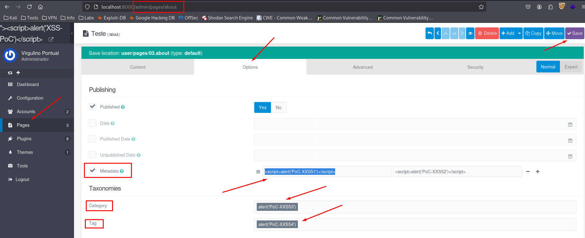
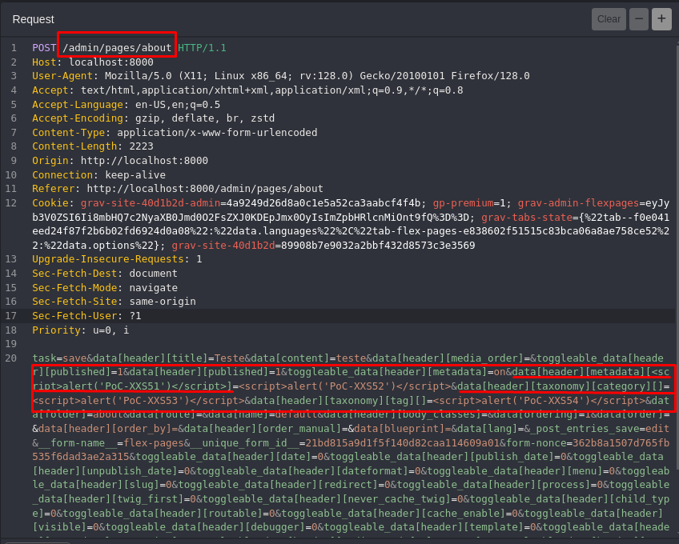
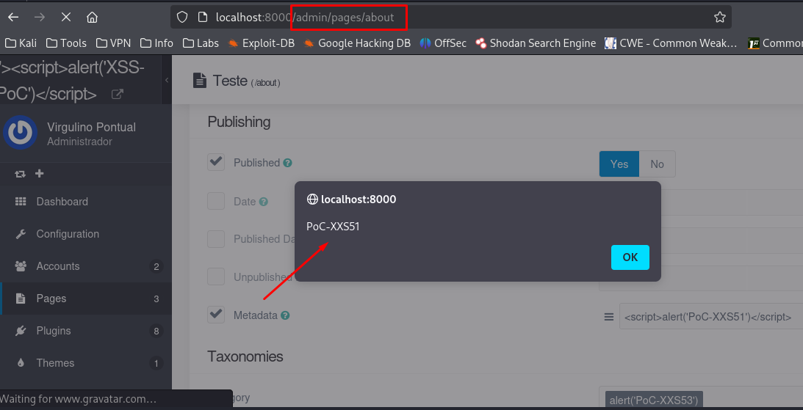

## CVE-2025-66311: Cross-Site Scripting (XSS) Armazenado no Endpoint `/admin/pages/[page]` em Múltiplos Parâmetros

> ***Publicação CVE: https://www.cve.org/CVERecord?id=CVE-2025-66311***

## Resumo

<p style="text-align: justify;">Foi identificada uma vulnerabilidade de Cross-Site Scripting (XSS) armazenada em múltiplos endpoints: <code>/admin/pages/[page]</code> do aplicativo Grav. Essa vulnerabilidade permite que atacantes injetem scripts maliciosos nos parâmetros <code>data[header][metadata]</code>, <code>data[header][taxonomy][category]</code> e <code>data[header][taxonomy][tag]</code>. Esses scripts são armazenados no frontmatter da página e executados automaticamente sempre que a página afetada é acessada ou renderizada na interface administrativa.</p>

## Detalhes

Endpoint Vulnerável: `POST /admin/pages/[page]`

Parâmetros: `data[header][metadata]`, `data[header][taxonomy][category]` and `data[header][taxonomy][tag]`

<p style="text-align: justify;">O aplicativo não consegue higienizar corretamente a entrada do usuário ao salvar metadados da página ou campos de taxonomia por meio do Painel de Administração. Como resultado, um invasor com acesso à interface administrativa pode injetar um script malicioso usando esses parâmetros, e o script será armazenado no frontmatter YAML da página. Quando a página ou os metadados são renderizados (especialmente no Painel de Administração), o payload é executado no navegador de qualquer usuário com acesso.</p>

## PoC

### Payload:

````html
<script>alert('PoC-XXS51')</script>
````

### Passos para Reproduzir:

<p style="text-align: justify;">

<ul>
<li>Faça login no Painel de Administração do Grav e navegue até <b>Páginas</b>.</li>

<li>Crie ou edite uma página.</li>

<li>Insira o código acima em qualquer um dos seguintes campos na aba Opções: <b>Nome da chave de Metadados</b>; <b>Categoria</b> em Taxonomia; <b>Tag</b> em Taxonomia:</li>

</ul>
</p>





<p style="text-align: justify;">
    <ul>
        <li>Salve a página.</li>
    </ul>
</p>



<p style="text-align: justify;">Quando a página é carregada novamente no Painel de Administração ou, potencialmente, no frontend (dependendo de como os metadados são usados), o script é executado, confirmando a vulnerabilidade de XSS armazenado.</p>

## Impacto

<p style="text-align: justify;">
    <ul>
        <li>Roubo de cookies de sessão: Invasores podem usar cookies de sessão roubados para sequestrar a sessão de um usuário e executar ações em seu nome.</li>
        <li>Baixar malware: Invasores podem induzir os usuários a baixar e instalar malware em seus computadores.</li>
        <li>Sequestro de navegadores: Invasores podem sequestrar o navegador de um usuário ou aplicar exploits baseados nele.</li>
        <li>Roubo de credenciais: Invasores podem roubar as credenciais de um usuário.</li>
        <li>Obter informações confidenciais: Invasores podem obter informações confidenciais armazenadas na conta de um usuário ou em seu navegador.</li>
        <li>Desfigurar sites: Invasores podem desfigurar um site alterando seu conteúdo.</li>
        <li>Desorientar usuários: Invasores podem alterar as instruções fornecidas aos usuários que visitam o site alvo, desorientando seu comportamento.</li>
        <li>Prejudicar a reputação de uma empresa: Invasores podem prejudicar a imagem de uma empresa ou espalhar desinformação desfigurando um site corporativo.</li>
    </ul>
</p>

## Referência

***[https://github.com/getgrav/grav/security/advisories/GHSA-mpjj-4688-3fxg](https://github.com/getgrav/grav/security/advisories/GHSA-mpjj-4688-3fxg)***

## Encontrado por

[](http://www.linkedin.com/in/marceloqueirozjr) [Marcelo Queiroz](http://www.linkedin.com/in/marceloqueirozjr)

> ***By: [CVE-Hunters](https://github.com/CVE-Hunters/cve-hunters)***