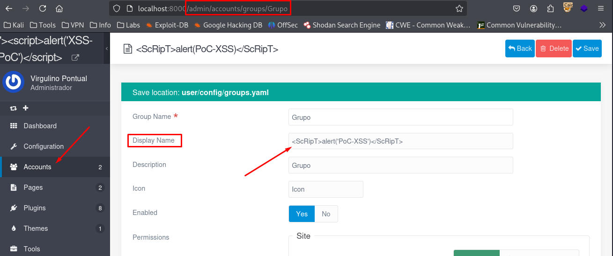
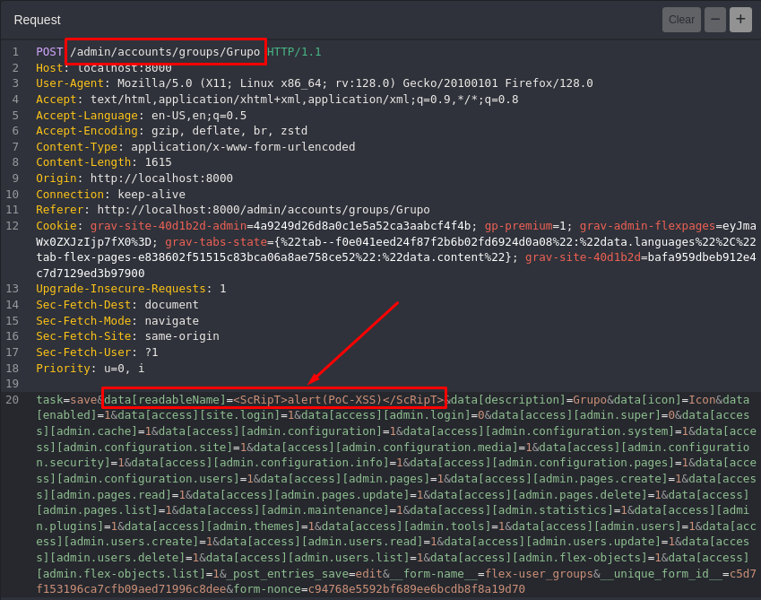
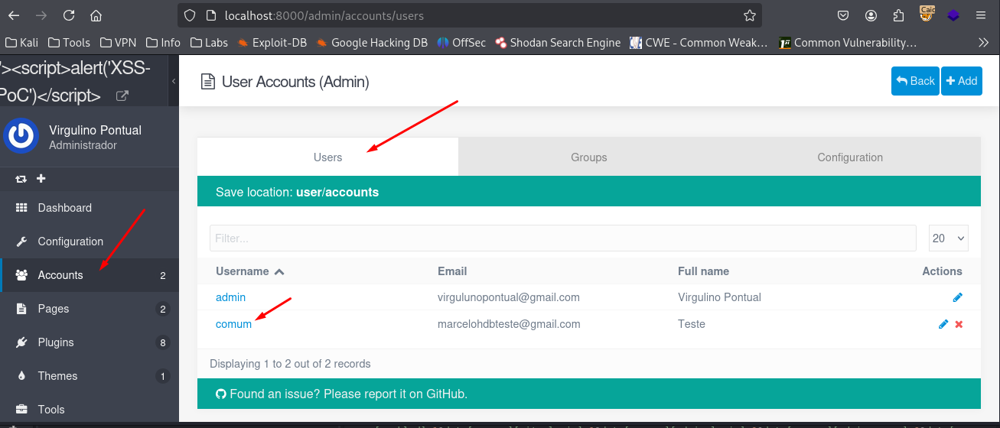
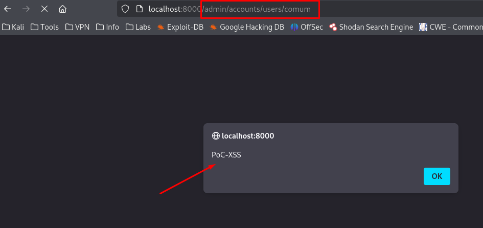

## CVE-2025-66312: Cross-Site Scripting (XSS) Stored endpoint `/admin/accounts/groups/[group]` parameter `data[readableName]`

> ***CVE Publication: https://www.cve.org/CVERecord?id=CVE-2025-66312***

## Summary

<p style="text-align: justify;">A Stored Cross-Site Scripting (XSS) vulnerability was identified in the <code>/admin/accounts/groups/Grupo</code> endpoint of the Grav application. This vulnerability allows attackers to inject malicious scripts into the <code>data[readableName]</code> parameter. The injected scripts are stored on the server and executed automatically whenever the affected page is accessed by users, posing a significant security risk.</p>

## Details

Vulnerable Endpoint: `POST /admin/accounts/groups/Grupo`

Parameter: `data[readableName]`

## PoC

### Payload

```
<ScRipT>alert('PoC-XSS')</ScRipT>
```

### Steps to Reproduce:

<p style="text-align: justify;">
  <ul>
    <li>Navigate to <b>Accounts > Groups</b> in the administrative panel.</li>
    <li>Create a new group or edit an existing one.</li>
    <li>In the <b>Display Name</b> field (which maps to <code>data[readableName]</code>), insert the payload above and save the changes.</li>
  </ul>
</p>



<p style="text-align: justify;">
  <ul>
    <li>The following HTTP request was generated during this action:</li>
  </ul>
</p>



<p style="text-align: justify;">
  <ul>
    <li>Next, go to <b>Accounts > Users</b> and open any user profile.</li>
  </ul>
</p>



<p style="text-align: justify;">
  <ul>
    <li>The malicious script is executed immediately in the browser when the page loads, confirming the existence of a Stored XSS vulnerability.</li>
  </ul>
</p>



## Impact

<p style="text-align: justify;">
  <ul>
    <li>Session hijacking: Stealing cookies or authentication tokens to impersonate users.</li>
    <li>Credential theft: Harvesting usernames and passwords using malicious scripts.</li>
    <li>Malware delivery: Distributing unwanted or harmful code to victims.</li>
    <li>Privilege escalation: Compromising administrative users through persistent scripts.</li>
    <li>Data manipulation or defacement: Changing or disrupting site content.</li>
    <li>Reputation damage: Eroding trust among site users and administrators.</li>
  </ul>
</p>

## Reference

***[https://github.com/getgrav/grav/security/advisories/GHSA-rmw5-f87r-w988](https://github.com/getgrav/grav/security/advisories/GHSA-rmw5-f87r-w988)***

## Finder

[](http://www.linkedin.com/in/marceloqueirozjr) [Marcelo Queiroz](http://www.linkedin.com/in/marceloqueirozjr)

> ***By: [CVE-Hunters](https://github.com/CVE-Hunters/cve-hunters)***