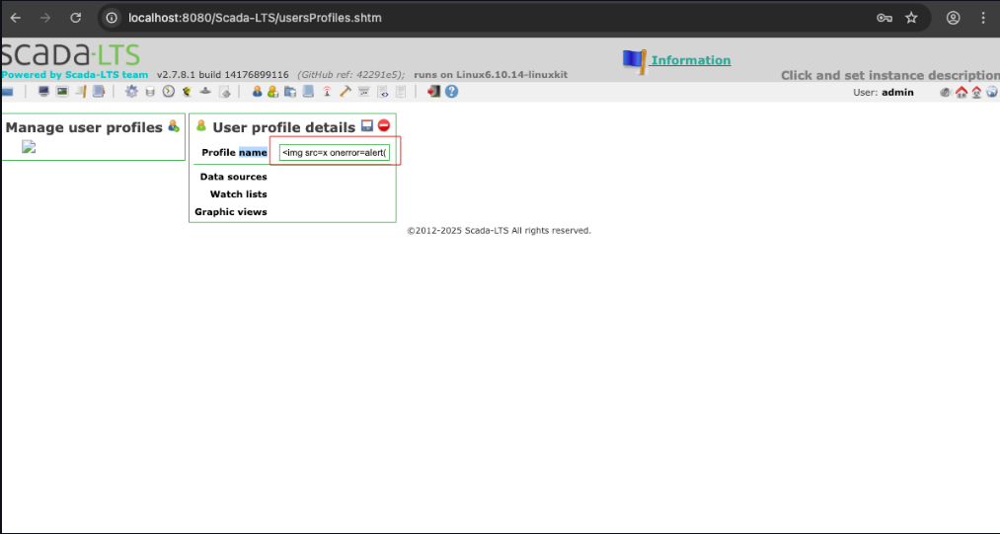
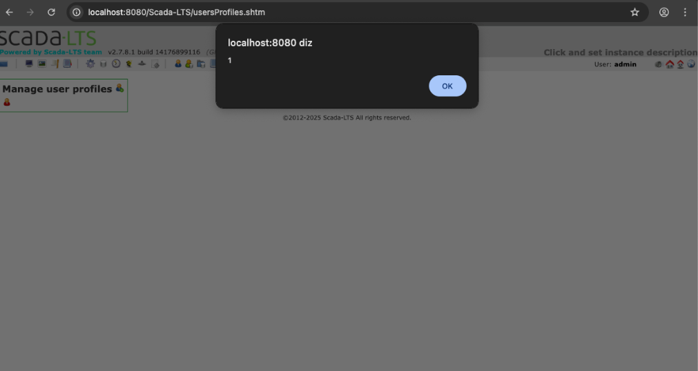

## CVE-2025-7729: Cross-Site Scripting (XSS) Stored endpoint `usersProfiles.shtm` parameter `userprofilename`

> *CVE Publication: https://www.cve.org/CVERecord?id=CVE-2025-7729*

## Summary

<p style="text-align: justify;">A Stored Cross-Site Scripting (XSS) vulnerability was identified in the <code>usersProfiles.shtm</code> endpoint of the Scada-LTS application. This vulnerability allows attackers to inject malicious scripts into the <code>userprofilename</code>parameter. The injected scripts are stored on the server and executed automatically whenever the affected page is accessed by users, posing a significant security risk.</p>

## Details

Vulnerable Endpoint: `usersProfiles.shtm`

Parameter: `userprofilename`

<p style="text-align: justify;">The application fails to properly validate and sanitize user inputs in the <code>userprofilename</code> parameter. This lack of validation allows attackers to inject malicious scripts, which are then stored on the server. Whenever the affected page is accessed, the malicious payload is executed in the victim's browser, potentially compromising the user's data and system.</p>

## PoC

### Payload:

````javascript
  
````





## Impacto

<p style="text-align: justify;">
    <ul>
        <li>Stealing session cookies: Attackers can use stolen session cookies to hijack a user's session and perform actions on their behalf.</li>
        <li>Downloading malware: Attackers can trick users into downloading and installing malware on their computers.</li>
        <li>Hijacking browsers: Attackers can hijack a user's browser or deliver browser-based exploits.</li>
        <li>Stealing credentials: Attackers can steal a user's credentials.</li>
        <li>Obtaining sensitive information: Attackers can obtain sensitive information stored in a user's account or in their browser.</li>
        <li>Defacing websites: Attackers can deface a website by altering its content.</li>
        <li>Misdirecting users: Attackers can change the instructions given to users who visit the target website, misdirecting their behavior.</li>
        <li>Damaging a business's reputation: Attackers can damage a business's image or spread misinformation by defacing a corporate website.</li>
    </ul>
</p>

## Referência

[https://github.com/CVE-Hunters/CVE/blob/main/Scada-LTS/CVE-2025-7729.md](https://github.com/CVE-Hunters/CVE/blob/main/Scada-LTS/CVE-2025-7729.md)

## Encontrado por:

[](https://www.linkedin.com/in/nmmorette/) [Natan Maia Morette](https://www.linkedin.com/in/nmmorette/)

> *By: [CVE-Hunters](https://github.com/Sec-Dojo-Cyber-House/cve-hunters)*