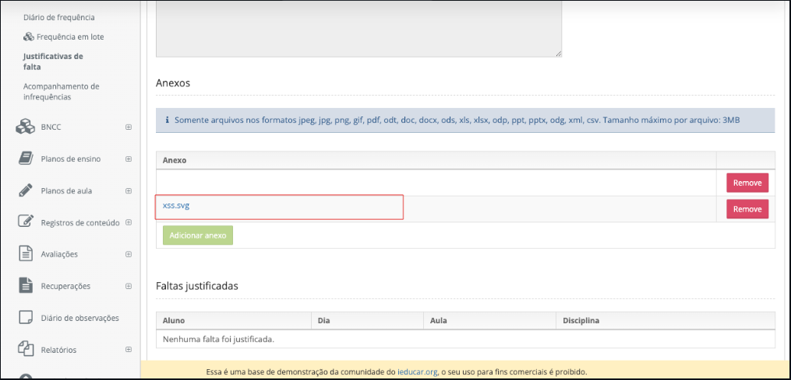
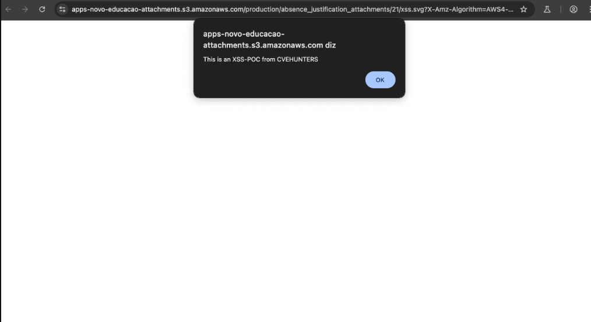

## CVE-2025-7870: Cross-Site Scripting (XSS) Armazenado via Upload de SVG

> *Publicação CVE: https://www.cve.org/CVERecord?id=CVE-2025-7870*

## Resumo

<p style="text-align: justify;">Um invasor pode carregadr um arquivo SVG malicioso contendo JavaScript incorporado que é executado quando o arquivo é acessado diretamente. Isso resulta em Cross-Site Scripting Armazenado (XSS).</p>

## Detalhes

<p style="text-align: justify;">O endpoint <code>justificativas-de-falta</code> permite que os usuários carreguem arquivos após carregarem um SVG criado. O XSS pode ser acionado ao abrir o arquivo.</p>

## Payload:

````html
<svg xmlns="http://www.w3.org/2000/svg" fill="none">
  <script>
    alert("This is an XSS-POC from CVEHUNTERS");
  </script>
</svg>
````

## PoC

<p style="text-align: justify;">Crie o arquivo com o payload e carregue-o no endpoint <code>justificativas-de-falta</code>:</p>



<p style="text-align: justify;">Depois disso, abra o arquivo para acionar o XSS</p>



## Impacto

<p style="text-align: justify;">
    <ul>
        <li>Roubo de cookies de sessão: Invasores podem usar cookies de sessão roubados para sequestrar a sessão de um usuário e executar ações em seu nome.</li>
        <li>Baixar malware: Invasores podem induzir os usuários a baixar e instalar malware em seus computadores.</li>
        <li>Sequestro de navegadores: Invasores podem sequestrar o navegador de um usuário ou aplicar exploits baseados nele.</li>
        <li>Roubo de credenciais: Invasores podem roubar as credenciais de um usuário.</li>
        <li>Obter informações confidenciais: Invasores podem obter informações confidenciais armazenadas na conta de um usuário ou em seu navegador.</li>
        <li>Desfigurar sites: Invasores podem desfigurar um site alterando seu conteúdo.</li>
        <li>Desorientar usuários: Invasores podem alterar as instruções fornecidas aos usuários que visitam o site alvo, desorientando seu comportamento.</li>
        <li>Prejudicar a reputação de uma empresa: Invasores podem prejudicar a imagem de uma empresa ou espalhar desinformação desfigurando um site corporativo.</li>
    </ul>
</p>

## Referência

[https://github.com/CVE-Hunters/CVE/blob/main/i-diario/CVE-2025-7870.md](https://github.com/CVE-Hunters/CVE/blob/main/i-diario/CVE-2025-7870.md)

## Encontrado por:

[](https://www.linkedin.com/in/nmmorette/) [Natan Maia Morette](https://www.linkedin.com/in/nmmorette/)

> *By: [CVE-Hunters](https://github.com/Sec-Dojo-Cyber-House/cve-hunters)*