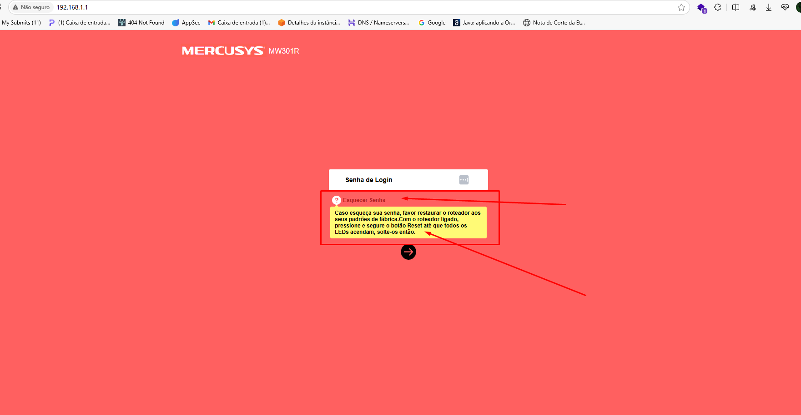
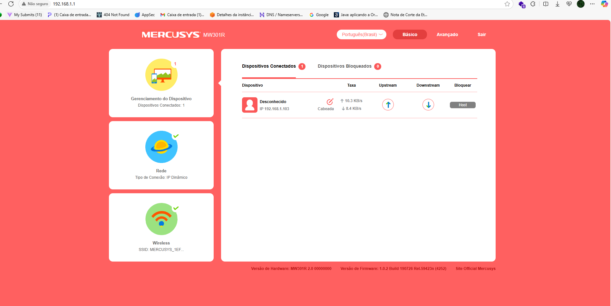
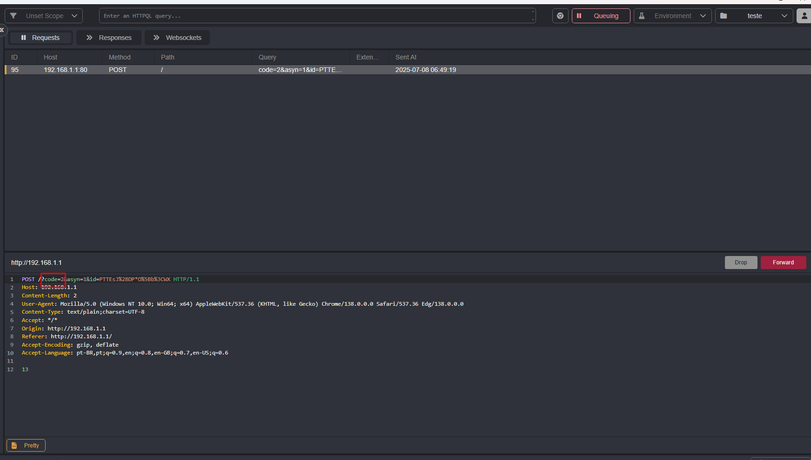
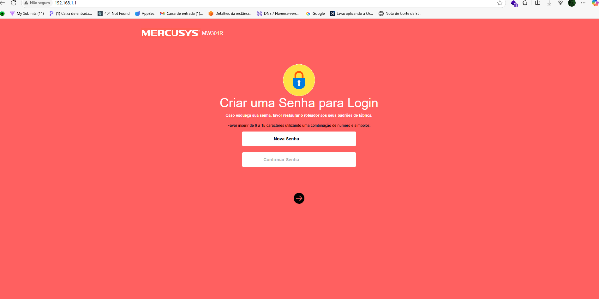

## CVE-2025-7881: Bypass de Autenticação na Redefinição de Senha

> *Publicação CVE: https://www.cve.org/CVERecord?id=CVE-2025-7881*

## Resumo

Em sessões autenticadas, é possível ignorar completamente o fluxo de trabalho de alteração de senha sem saber a senha atual do administrador. No Mercusys MW301R, o método oficial de recuperação de uma senha esquecida é realizar uma redefinição de fábrica — o que requer acesso físico — ou, em uma sessão válida, fornecer a senha existente. O bypass descoberto permite que um invasor já autenticado intercepte a solicitação HTTP e simplesmente modifique o parâmetro de código para invocar o endpoint de redefinição diretamente. Isso permite que a senha do administrador seja alterada remotamente, sem qualquer interação física com o dispositivo ou conhecimento da credencial anterior.

## Detalhes

<ol>
<li>
Acesse a interface web do roteador navegando até <code>http://192.168.1.1/</code> e efetue login com a senha de administrador.
 <strong>Observação:</strong> Se a senha for esquecida, o único método de recuperação é uma redefinição de fábrica usando o botão físico Reset (mantenha-o pressionado até que todos os LEDs acendam).

</li>
<li>
Enquanto estiver conectado, execute qualquer ação que acione uma solicitação POST com os parâmetros <code>code=</code> e <code>id=</code> (por exemplo, keepalive ou verificação de status) e intercepte-a usando um proxy para capturar um ID de sessão válido.
</li>
<li>
Modifique a solicitação interceptada alterando <code>code=</code> para <code>code=5</code> e, em seguida, encaminhe a solicitação alterada para o roteador.
</li>
<li>
Atualize a página em <code>http://192.168.1.1/</code> no seu navegador.
</li>
<li>
A interface agora solicitará uma nova senha sem solicitar a atual. Defina e confirme sua nova senha para redefini-la remotamente.
</li>
</ol>

## PoC

### Video PoC

[https://youtu.be/-mlmTZ-3PzM](https://youtu.be/-mlmTZ-3PzM)

## Impacto

A falta de validação de sessão neste endpoint pode levar a vários riscos de segurança:

<ul>
<li><b>Exposição de Dados Não Autorizada:</b> Usuários não autenticados podem enumerar ou recuperar dados internos confidenciais.</li>
<li><b>Escalonamento de Privilégios:</b> Invasores podem acessar ou inferir informações destinadas apenas a usuários autorizados.</li>
<li><b>Divulgação de Informações:</b> Lógica de negócios e IDs internos (como funções ou permissões de usuário) podem ser vazados.</li>
<li><b>Suporte de Reconhecimento:</b> Facilita o mapeamento de estruturas de backend para ataques mais direcionados.</li>
</ul>

## Referência

[https://github.com/RaulPazemecxas/PoCVulDb/blob/main/CVE-2025-7881.md](https://github.com/RaulPazemecxas/PoCVulDb/blob/main/CVE-2025-7881.md)

## Encontrado por:

 [Raul Pazemécxas](https://github.com/%20%20www.linkedin.com/in/raul-pazem%C3%A9cxas-04882b21a/)

> *Por: [CVE-Hunters](https://github.com/CVE-Hunters/cve-hunters)*